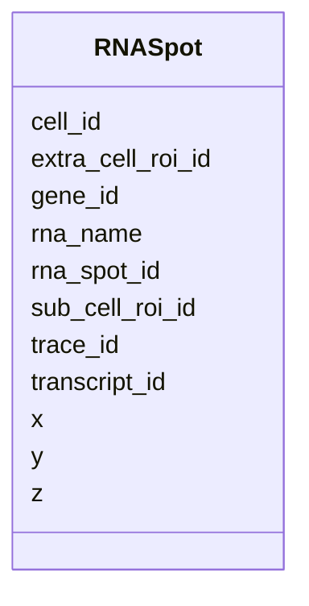

---
search:
  boost: 10.0
---

# Class: RNASpot 


_A single detected RNA bright Spot corresponding to one RNA transcript location detected alongside Chromatin Tracing. Each instance of this class corresponds to one row in the CSV data section of the FOF-CT RNA Spot Data table. The rna_spot_id links each RNASpot to the RNA Quality and RNA Biological Data tables; the trace_id links this RNA Spot to a DNA chromatin Trace in the core table and Trace Data table. This class accepts additional user-defined optional columns via open schema._


<div data-search-exclude markdown="1">


URI: [fof_ct:RNASpot](https://w3id.org/fof-ct/RNASpot)





<!-- no inheritance hierarchy -->

## Slots

| Name | Cardinality and Range | Description | Inheritance |
| ---  | --- | --- | --- |
| [rna_spot_id](rna_spot_id.md) | 1 <br/> [Integer](Integer.md) | Unique integer identifier for an RNA bright Spot, unique across the entire da... | direct |
| [x](x.md) | 1 <br/> [Float](Float.md) | Sub-pixel X coordinate of this detected event (Spot or localisation) in the u... | direct |
| [y](y.md) | 1 <br/> [Float](Float.md) | Sub-pixel Y coordinate of this detected event (Spot or localisation) in the u... | direct |
| [z](z.md) | 1 <br/> [Float](Float.md) | Sub-pixel Z coordinate of this detected event (Spot or localisation) in the u... | direct |
| [rna_name](rna_name.md) | 1 <br/> [String](String.md) | Official name of the gene from which the targeted RNA is transcribed (e | direct |
| [gene_id](gene_id.md) | 1 <br/> [String](String.md) | Official gene identifier corresponding to rna_name | direct |
| [trace_id](trace_id.md) | 1 <br/> [Integer](Integer.md) | Unique identifier for a chromatin Trace | direct |
| [transcript_id](transcript_id.md) | 0..1 <br/> [String](String.md) | Official transcript identifier for the specific transcript targeted by the FI... | direct |
| [sub_cell_roi_id](sub_cell_roi_id.md) | 0..1 <br/> [Integer](Integer.md) | Unique identifier for a sub-cellular structure ROI (e | direct |
| [cell_id](cell_id.md) | 0..1 <br/> [Integer](Integer.md) | Unique identifier for a Cell | direct |
| [extra_cell_roi_id](extra_cell_roi_id.md) | 0..1 <br/> [Integer](Integer.md) | Unique identifier for an extracellular structure ROI (e | direct |


## Usages

| used by | used in | type | used |
| ---  | --- | --- | --- |
| [RNASpot](RNASpot.md) | [rna_name](rna_name.md) | domain | [RNASpot](RNASpot.md) |
| [RNASpot](RNASpot.md) | [gene_id](gene_id.md) | domain | [RNASpot](RNASpot.md) |
| [RNASpot](RNASpot.md) | [transcript_id](transcript_id.md) | domain | [RNASpot](RNASpot.md) |
| [RNASpotTable](RNASpotTable.md) | [rna_spots](rna_spots.md) | range | [RNASpot](RNASpot.md) |


## Identifier and Mapping Information


### Schema Source


* from schema: https://w3id.org/fof-ct/bas


## Mappings

| Mapping Type | Mapped Value |
| ---  | ---  |
| self | fof_ct:RNASpot |
| native | fof_ct:RNASpot |


## LinkML Source

<!-- TODO: investigate https://stackoverflow.com/questions/37606292/how-to-create-tabbed-code-blocks-in-mkdocs-or-sphinx -->

### Direct

<details>
```yaml
name: RNASpot
description: A single detected RNA bright Spot corresponding to one RNA transcript
  location detected alongside Chromatin Tracing. Each instance of this class corresponds
  to one row in the CSV data section of the FOF-CT RNA Spot Data table. The rna_spot_id
  links each RNASpot to the RNA Quality and RNA Biological Data tables; the trace_id
  links this RNA Spot to a DNA chromatin Trace in the core table and Trace Data table.
  This class accepts additional user-defined optional columns via open schema.
from_schema: https://w3id.org/fof-ct/bas
slots:
- rna_spot_id
- x
- y
- z
- rna_name
- gene_id
- trace_id
- transcript_id
- sub_cell_roi_id
- cell_id
- extra_cell_roi_id
slot_usage:
  rna_spot_id:
    name: rna_spot_id
    required: true
  x:
    name: x
    required: true
  y:
    name: y
    required: true
  z:
    name: z
    required: true
  rna_name:
    name: rna_name
    required: true
  gene_id:
    name: gene_id
    required: true
  trace_id:
    name: trace_id
    required: true

```
</details>

### Induced

<details>
```yaml
name: RNASpot
description: A single detected RNA bright Spot corresponding to one RNA transcript
  location detected alongside Chromatin Tracing. Each instance of this class corresponds
  to one row in the CSV data section of the FOF-CT RNA Spot Data table. The rna_spot_id
  links each RNASpot to the RNA Quality and RNA Biological Data tables; the trace_id
  links this RNA Spot to a DNA chromatin Trace in the core table and Trace Data table.
  This class accepts additional user-defined optional columns via open schema.
from_schema: https://w3id.org/fof-ct/bas
slot_usage:
  rna_spot_id:
    name: rna_spot_id
    required: true
  x:
    name: x
    required: true
  y:
    name: y
    required: true
  z:
    name: z
    required: true
  rna_name:
    name: rna_name
    required: true
  gene_id:
    name: gene_id
    required: true
  trace_id:
    name: trace_id
    required: true
attributes:
  rna_spot_id:
    name: rna_spot_id
    description: Unique integer identifier for an RNA bright Spot, unique across the
      entire dataset. Used as a primary key in the RNA Spot Data table and as a foreign
      key in the RNA Quality and RNA Biological Data tables.
    examples:
    - value: '1'
    from_schema: https://w3id.org/fof-ct/bas
    rank: 1000
    owner: RNASpot
    domain_of:
    - RNASpot
    - RNASpotQualityRecord
    - RNASpotBiologicalRecord
    range: integer
    required: true
  x:
    name: x
    description: Sub-pixel X coordinate of this detected event (Spot or localisation)
      in the unit specified by xyz_unit. The reported value is the final position
      after all post-processing corrections (drift correction, chromatic correction,
      etc.).
    examples:
    - value: '14.43'
    from_schema: https://w3id.org/fof-ct/bas
    rank: 1000
    owner: RNASpot
    domain_of:
    - LocalizationMixin
    - Spot
    - RNASpot
    range: float
    required: true
  y:
    name: y
    description: Sub-pixel Y coordinate of this detected event (Spot or localisation)
      in the unit specified by xyz_unit. The reported value is the final position
      after all post-processing corrections.
    examples:
    - value: '41.43'
    from_schema: https://w3id.org/fof-ct/bas
    rank: 1000
    owner: RNASpot
    domain_of:
    - LocalizationMixin
    - Spot
    - RNASpot
    range: float
    required: true
  z:
    name: z
    description: Sub-pixel Z coordinate of this detected event (Spot or localisation)
      in the unit specified by xyz_unit. The reported value is the final position
      after all post-processing corrections.
    examples:
    - value: '1.23'
    from_schema: https://w3id.org/fof-ct/bas
    rank: 1000
    owner: RNASpot
    domain_of:
    - LocalizationMixin
    - Spot
    - RNASpot
    range: float
    required: true
  rna_name:
    name: rna_name
    description: Official name of the gene from which the targeted RNA is transcribed
      (e.g. ACTB, GAPDH). Should follow HGNC (human) or MGI (mouse) gene nomenclature.
    examples:
    - value: ACTB
    - value: GAPDH
    from_schema: https://w3id.org/fof-ct/bas
    rank: 1000
    domain: RNASpot
    owner: RNASpot
    domain_of:
    - RNASpot
    range: string
    required: true
  gene_id:
    name: gene_id
    description: Official gene identifier corresponding to rna_name. The type of identifier
      used (e.g. Ensembl gene ID, NCBI Gene ID) must be declared in the gene_id_type
      header field.
    examples:
    - value: ENSG00000075624
    - value: ENSG00000111640
    from_schema: https://w3id.org/fof-ct/bas
    rank: 1000
    domain: RNASpot
    owner: RNASpot
    domain_of:
    - RNASpot
    range: string
    required: true
  trace_id:
    name: trace_id
    description: Unique identifier for a chromatin Trace. Used as a primary key in
      the Trace Data table and as a foreign key in the RNA Spot Data table.
    examples:
    - value: '1'
    from_schema: https://w3id.org/fof-ct/bas
    rank: 1000
    owner: RNASpot
    domain_of:
    - Spot
    - Trace
    - RNASpot
    range: integer
    required: true
  transcript_id:
    name: transcript_id
    description: Official transcript identifier for the specific transcript targeted
      by the FISH probe. Conditionally required when multiple transcripts share the
      same gene_id and the FISH probe can distinguish among them. The type of identifier
      used must be declared in the transcript_id_type header field.
    examples:
    - value: ENST00000331789
    - value: NM_001101.5
    from_schema: https://w3id.org/fof-ct/bas
    rank: 1000
    domain: RNASpot
    owner: RNASpot
    domain_of:
    - RNASpot
    range: string
  sub_cell_roi_id:
    name: sub_cell_roi_id
    description: Unique identifier for a sub-cellular structure ROI (e.g., nucleus,
      nucleolus). Links to the Sub-Cell ROI Data table.
    examples:
    - value: '1'
    from_schema: https://w3id.org/fof-ct/bas
    rank: 1000
    owner: RNASpot
    domain_of:
    - Spot
    - RNASpot
    - SubCellROI
    - ROIMapping
    range: integer
  cell_id:
    name: cell_id
    description: Unique identifier for a Cell. Links to the Cell Data table.
    examples:
    - value: '1'
    from_schema: https://w3id.org/fof-ct/bas
    rank: 1000
    owner: RNASpot
    domain_of:
    - Spot
    - RNASpot
    - Cell
    - SubCellROI
    - ROIMapping
    range: integer
  extra_cell_roi_id:
    name: extra_cell_roi_id
    description: Unique identifier for an extracellular structure ROI (e.g., tissue,
      organoid). Links to the Extra-Cell ROI Data table.
    examples:
    - value: '1'
    from_schema: https://w3id.org/fof-ct/bas
    rank: 1000
    owner: RNASpot
    domain_of:
    - Spot
    - RNASpot
    - Cell
    - ExtraCellROI
    - ROIMapping
    range: integer

```
</details></div>