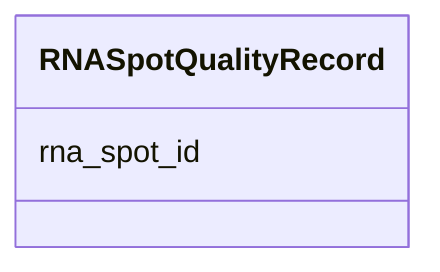

---
search:
  boost: 10.0
---

# Class: RNASpotQualityRecord 


_A single row in the RNA Spot Quality table. Each instance captures one or more quality metrics for a specific RNA bright Spot identified by RNA_Spot_ID. RNA_Spot_ID values must be unique across the dataset, linking to the corresponding record in the RNA Spot Data table (table 4). At least one user-defined quality metric column MUST be present; users declare these via #^ header lines._


<div data-search-exclude markdown="1">


URI: [fof_ct:RNASpotQualityRecord](https://w3id.org/fof-ct/RNASpotQualityRecord)





<!-- no inheritance hierarchy -->

## Slots

| Name | Cardinality and Range | Description | Inheritance |
| ---  | --- | --- | --- |
| [rna_spot_id](rna_spot_id.md) | 1 <br/> [Integer](Integer.md) | Unique integer identifier for an RNA bright Spot, unique across the entire da... | direct |


## Usages

| used by | used in | type | used |
| ---  | --- | --- | --- |
| [RNASpotQualityTable](RNASpotQualityTable.md) | [rna_spot_quality_records](rna_spot_quality_records.md) | range | [RNASpotQualityRecord](RNASpotQualityRecord.md) |


## Identifier and Mapping Information


### Schema Source


* from schema: https://w3id.org/fof-ct/bas


## Mappings

| Mapping Type | Mapped Value |
| ---  | ---  |
| self | fof_ct:RNASpotQualityRecord |
| native | fof_ct:RNASpotQualityRecord |


## LinkML Source

<!-- TODO: investigate https://stackoverflow.com/questions/37606292/how-to-create-tabbed-code-blocks-in-mkdocs-or-sphinx -->

### Direct

<details>
```yaml
name: RNASpotQualityRecord
description: 'A single row in the RNA Spot Quality table. Each instance captures one
  or more quality metrics for a specific RNA bright Spot identified by RNA_Spot_ID.
  RNA_Spot_ID values must be unique across the dataset, linking to the corresponding
  record in the RNA Spot Data table (table 4). At least one user-defined quality metric
  column MUST be present; users declare these via #^ header lines.'
from_schema: https://w3id.org/fof-ct/bas
slots:
- rna_spot_id
slot_usage:
  rna_spot_id:
    name: rna_spot_id
    identifier: true
    required: true

```
</details>

### Induced

<details>
```yaml
name: RNASpotQualityRecord
description: 'A single row in the RNA Spot Quality table. Each instance captures one
  or more quality metrics for a specific RNA bright Spot identified by RNA_Spot_ID.
  RNA_Spot_ID values must be unique across the dataset, linking to the corresponding
  record in the RNA Spot Data table (table 4). At least one user-defined quality metric
  column MUST be present; users declare these via #^ header lines.'
from_schema: https://w3id.org/fof-ct/bas
slot_usage:
  rna_spot_id:
    name: rna_spot_id
    identifier: true
    required: true
attributes:
  rna_spot_id:
    name: rna_spot_id
    description: Unique integer identifier for an RNA bright Spot, unique across the
      entire dataset. Used as a primary key in the RNA Spot Data table and as a foreign
      key in the RNA Quality and RNA Biological Data tables.
    examples:
    - value: '1'
    from_schema: https://w3id.org/fof-ct/bas
    rank: 1000
    identifier: true
    owner: RNASpotQualityRecord
    domain_of:
    - RNASpot
    - RNASpotQualityRecord
    - RNASpotBiologicalRecord
    range: integer
    required: true

```
</details></div>