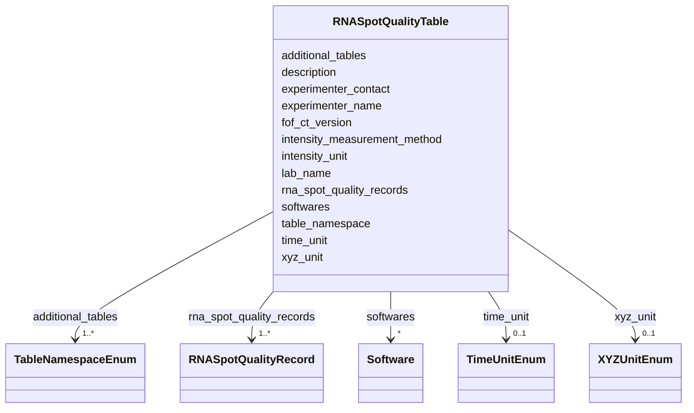

---
search:
  boost: 10.0
---

# Class: RNASpotQualityTable 


_The RNA Spot Quality table of a FOF-bas-CT dataset (namespace: 4dn_FOF-CT_rna_quality). This class represents the entire file: it holds all dataset-level provenance metadata (recorded as header lines in the TSV serialisation) together with the full collection of RNASpotQualityRecord rows. Submission of this table is optional but recommended._


<div data-search-exclude markdown="1">


URI: [fof_ct:RNASpotQualityTable](https://w3id.org/fof-ct/RNASpotQualityTable)





<!-- no inheritance hierarchy -->

## Class Properties

| Property | Value |
| --- | --- |
| Tree Root | Yes |


## Slots

| Name | Cardinality and Range | Description | Inheritance |
| ---  | --- | --- | --- |
| [fof_ct_version](fof_ct_version.md) | 1 <br/> [String](String.md) | Version of the FOF-CT format used in this file | direct |
| [table_namespace](table_namespace.md) | 1 <br/> [String](String.md) | Identifier for this table type | direct |
| [lab_name](lab_name.md) | 1 <br/> [String](String.md) | Name of the laboratory where the experiment was performed | direct |
| [experimenter_name](experimenter_name.md) | 1 <br/> [String](String.md) | Full name of the person who performed the experiment | direct |
| [experimenter_contact](experimenter_contact.md) | 1 <br/> [String](String.md) | Email address of the person who performed the experiment | direct |
| [description](description.md) | 1 <br/> [String](String.md) | Free-text description of the experiment and of the data recorded in this tabl... | direct |
| [additional_tables](additional_tables.md) | 1..* <br/> [TableNamespaceEnum](TableNamespaceEnum.md) | List of additional FOF-CT table namespaces being submitted alongside this tab... | direct |
| [softwares](softwares.md) | * <br/> [Software](Software.md) | One or more Software entries documenting every tool used to produce or proces... | direct |
| [xyz_unit](xyz_unit.md) | 0..1 <br/> [XYZUnitEnum](XYZUnitEnum.md) | Unit used for any spatial coordinate or distance metric reported in user-defi... | direct |
| [time_unit](time_unit.md) | 0..1 <br/> [TimeUnitEnum](TimeUnitEnum.md) | Unit used for any time metric reported in user-defined columns | direct |
| [intensity_unit](intensity_unit.md) | 0..1 <br/> [String](String.md) | Unit used for any intensity metric reported in user-defined columns | direct |
| [intensity_measurement_method](intensity_measurement_method.md) | 0..1 <br/> [String](String.md) | Method used to perform intensity measurements | direct |
| [rna_spot_quality_records](rna_spot_quality_records.md) | 1..* <br/> [RNASpotQualityRecord](RNASpotQualityRecord.md) | The complete collection of RNASpotQualityRecord rows constituting this datase... | direct |


## Usages

| used by | used in | type | used |
| ---  | --- | --- | --- |
| [RNASpotQualityTable](RNASpotQualityTable.md) | [rna_spot_quality_records](rna_spot_quality_records.md) | domain | [RNASpotQualityTable](RNASpotQualityTable.md) |


## Identifier and Mapping Information


### Schema Source


* from schema: https://w3id.org/fof-ct/bas


## Mappings

| Mapping Type | Mapped Value |
| ---  | ---  |
| self | fof_ct:RNASpotQualityTable |
| native | fof_ct:RNASpotQualityTable |


## LinkML Source

<!-- TODO: investigate https://stackoverflow.com/questions/37606292/how-to-create-tabbed-code-blocks-in-mkdocs-or-sphinx -->

### Direct

<details>
```yaml
name: RNASpotQualityTable
description: 'The RNA Spot Quality table of a FOF-bas-CT dataset (namespace: 4dn_FOF-CT_rna_quality).
  This class represents the entire file: it holds all dataset-level provenance metadata
  (recorded as header lines in the TSV serialisation) together with the full collection
  of RNASpotQualityRecord rows. Submission of this table is optional but recommended.'
from_schema: https://w3id.org/fof-ct/bas
slots:
- fof_ct_version
- table_namespace
- lab_name
- experimenter_name
- experimenter_contact
- description
- additional_tables
- softwares
- xyz_unit
- time_unit
- intensity_unit
- intensity_measurement_method
- rna_spot_quality_records
slot_usage:
  fof_ct_version:
    name: fof_ct_version
    required: true
  table_namespace:
    name: table_namespace
    description: 'Identifier for this table type. Must always be ''4dn_FOF-CT_rna_quality''.
      Written as ##Table_Namespace= in the file header.'
    required: true
    equals_string: 4dn_FOF-CT_rna_quality
  lab_name:
    name: lab_name
    required: true
  experimenter_name:
    name: experimenter_name
    required: true
  experimenter_contact:
    name: experimenter_contact
    required: true
  description:
    name: description
    required: true
  additional_tables:
    name: additional_tables
    required: true
  softwares:
    name: softwares
    description: 'One or more Software entries documenting every tool used to produce
      or process data in this table. Required only when software was used; omit the
      block entirely if no software was applied. Written as repeating #Software_*
      blocks in the file header.'
    required: false
  xyz_unit:
    name: xyz_unit
    description: 'Unit used for any spatial coordinate or distance metric reported
      in user-defined columns. Conditionally required when any such metric is present.
      Written as ##XYZ_Unit= in the file header.'
    required: false
  time_unit:
    name: time_unit
    description: 'Unit used for any time metric reported in user-defined columns.
      Conditionally required when any such metric is present. Written as ##Time_Unit=
      in the file header.'
    required: false
  intensity_unit:
    name: intensity_unit
    description: 'Unit used for any intensity metric reported in user-defined columns.
      Conditionally required when any such metric is present. Written as ##Intensity_Unit=
      in the file header.'
    required: false
  intensity_measurement_method:
    name: intensity_measurement_method
    description: 'Method used to perform intensity measurements. Conditionally required
      when any intensity metric is present. Written as #Intensity_Measurement_Method:
      in the file header.'
    required: false
  rna_spot_quality_records:
    name: rna_spot_quality_records
    required: true
tree_root: true

```
</details>

### Induced

<details>
```yaml
name: RNASpotQualityTable
description: 'The RNA Spot Quality table of a FOF-bas-CT dataset (namespace: 4dn_FOF-CT_rna_quality).
  This class represents the entire file: it holds all dataset-level provenance metadata
  (recorded as header lines in the TSV serialisation) together with the full collection
  of RNASpotQualityRecord rows. Submission of this table is optional but recommended.'
from_schema: https://w3id.org/fof-ct/bas
slot_usage:
  fof_ct_version:
    name: fof_ct_version
    required: true
  table_namespace:
    name: table_namespace
    description: 'Identifier for this table type. Must always be ''4dn_FOF-CT_rna_quality''.
      Written as ##Table_Namespace= in the file header.'
    required: true
    equals_string: 4dn_FOF-CT_rna_quality
  lab_name:
    name: lab_name
    required: true
  experimenter_name:
    name: experimenter_name
    required: true
  experimenter_contact:
    name: experimenter_contact
    required: true
  description:
    name: description
    required: true
  additional_tables:
    name: additional_tables
    required: true
  softwares:
    name: softwares
    description: 'One or more Software entries documenting every tool used to produce
      or process data in this table. Required only when software was used; omit the
      block entirely if no software was applied. Written as repeating #Software_*
      blocks in the file header.'
    required: false
  xyz_unit:
    name: xyz_unit
    description: 'Unit used for any spatial coordinate or distance metric reported
      in user-defined columns. Conditionally required when any such metric is present.
      Written as ##XYZ_Unit= in the file header.'
    required: false
  time_unit:
    name: time_unit
    description: 'Unit used for any time metric reported in user-defined columns.
      Conditionally required when any such metric is present. Written as ##Time_Unit=
      in the file header.'
    required: false
  intensity_unit:
    name: intensity_unit
    description: 'Unit used for any intensity metric reported in user-defined columns.
      Conditionally required when any such metric is present. Written as ##Intensity_Unit=
      in the file header.'
    required: false
  intensity_measurement_method:
    name: intensity_measurement_method
    description: 'Method used to perform intensity measurements. Conditionally required
      when any intensity metric is present. Written as #Intensity_Measurement_Method:
      in the file header.'
    required: false
  rna_spot_quality_records:
    name: rna_spot_quality_records
    required: true
attributes:
  fof_ct_version:
    name: fof_ct_version
    description: Version of the FOF-CT format used in this file. Always the first
      line of the file header (##FOF-CT_Version=).
    examples:
    - value: v1.0
    from_schema: https://w3id.org/fof-ct/bas
    rank: 1000
    owner: RNASpotQualityTable
    domain_of:
    - SpotTable
    - DemultiplexingTable
    - TraceTable
    - RNASpotTable
    - SpotQualityTable
    - RNASpotQualityTable
    - SpotBiologicalTable
    - RNASpotBiologicalTable
    - CellTable
    - ExtraCellROITable
    - SubCellROITable
    - ROIMappingTable
    range: string
    required: true
    pattern: ^v[0-9]+\.[0-9]+
  table_namespace:
    name: table_namespace
    description: 'Identifier for this table type. Must always be ''4dn_FOF-CT_rna_quality''.
      Written as ##Table_Namespace= in the file header.'
    from_schema: https://w3id.org/fof-ct/bas
    rank: 1000
    owner: RNASpotQualityTable
    domain_of:
    - SpotTable
    - DemultiplexingTable
    - TraceTable
    - RNASpotTable
    - SpotQualityTable
    - RNASpotQualityTable
    - SpotBiologicalTable
    - RNASpotBiologicalTable
    - CellTable
    - ExtraCellROITable
    - SubCellROITable
    - ROIMappingTable
    range: string
    required: true
    equals_string: 4dn_FOF-CT_rna_quality
  lab_name:
    name: lab_name
    description: 'Name of the laboratory where the experiment was performed. Written
      as #Lab_Name: in the file header.'
    examples:
    - value: Nobel
    from_schema: https://w3id.org/fof-ct/bas
    rank: 1000
    owner: RNASpotQualityTable
    domain_of:
    - SpotTable
    - DemultiplexingTable
    - TraceTable
    - RNASpotTable
    - SpotQualityTable
    - RNASpotQualityTable
    - SpotBiologicalTable
    - RNASpotBiologicalTable
    - CellTable
    - ExtraCellROITable
    - SubCellROITable
    - ROIMappingTable
    range: string
    required: true
  experimenter_name:
    name: experimenter_name
    description: 'Full name of the person who performed the experiment. Written as
      #Experimenter_Name: in the file header.'
    examples:
    - value: John Doe
    from_schema: https://w3id.org/fof-ct/bas
    rank: 1000
    owner: RNASpotQualityTable
    domain_of:
    - SpotTable
    - DemultiplexingTable
    - TraceTable
    - RNASpotTable
    - SpotQualityTable
    - RNASpotQualityTable
    - SpotBiologicalTable
    - RNASpotBiologicalTable
    - CellTable
    - ExtraCellROITable
    - SubCellROITable
    - ROIMappingTable
    range: string
    required: true
  experimenter_contact:
    name: experimenter_contact
    description: 'Email address of the person who performed the experiment. Written
      as #Experimenter_Contact: in the file header.'
    examples:
    - value: john.doe@email.com
    from_schema: https://w3id.org/fof-ct/bas
    rank: 1000
    owner: RNASpotQualityTable
    domain_of:
    - SpotTable
    - DemultiplexingTable
    - TraceTable
    - RNASpotTable
    - SpotQualityTable
    - RNASpotQualityTable
    - SpotBiologicalTable
    - RNASpotBiologicalTable
    - CellTable
    - ExtraCellROITable
    - SubCellROITable
    - ROIMappingTable
    range: string
    required: true
    pattern: ^[^@\s]+@[^@\s]+\.[^@\s]+$
  description:
    name: description
    description: 'Free-text description of the experiment and of the data recorded
      in this table. Should provide sufficient detail for interpretation and reproducibility.
      Written as #Description: in the file header.'
    from_schema: https://w3id.org/fof-ct/bas
    rank: 1000
    owner: RNASpotQualityTable
    domain_of:
    - SpotTable
    - DemultiplexingTable
    - TraceTable
    - RNASpotTable
    - SpotQualityTable
    - RNASpotQualityTable
    - SpotBiologicalTable
    - RNASpotBiologicalTable
    - CellTable
    - ExtraCellROITable
    - SubCellROITable
    - ROIMappingTable
    range: string
    required: true
  additional_tables:
    name: additional_tables
    description: 'List of additional FOF-CT table namespaces being submitted alongside
      this table, separated by commas in the TSV header. Written as #Additional_Tables:
      in the file header.'
    from_schema: https://w3id.org/fof-ct/bas
    rank: 1000
    owner: RNASpotQualityTable
    domain_of:
    - SpotTable
    - DemultiplexingTable
    - TraceTable
    - RNASpotTable
    - SpotQualityTable
    - RNASpotQualityTable
    - SpotBiologicalTable
    - RNASpotBiologicalTable
    - CellTable
    - ExtraCellROITable
    - SubCellROITable
    - ROIMappingTable
    range: TableNamespaceEnum
    required: true
    multivalued: true
  softwares:
    name: softwares
    description: 'One or more Software entries documenting every tool used to produce
      or process data in this table. Required only when software was used; omit the
      block entirely if no software was applied. Written as repeating #Software_*
      blocks in the file header.'
    from_schema: https://w3id.org/fof-ct/bas
    rank: 1000
    owner: RNASpotQualityTable
    domain_of:
    - SpotTable
    - DemultiplexingTable
    - TraceTable
    - RNASpotTable
    - SpotQualityTable
    - RNASpotQualityTable
    - SpotBiologicalTable
    - RNASpotBiologicalTable
    - CellTable
    - ExtraCellROITable
    - SubCellROITable
    - ROIMappingTable
    range: Software
    required: false
    multivalued: true
    inlined: true
    inlined_as_list: true
  xyz_unit:
    name: xyz_unit
    description: 'Unit used for any spatial coordinate or distance metric reported
      in user-defined columns. Conditionally required when any such metric is present.
      Written as ##XYZ_Unit= in the file header.'
    examples:
    - value: micron
    from_schema: https://w3id.org/fof-ct/bas
    rank: 1000
    owner: RNASpotQualityTable
    domain_of:
    - SpotTable
    - DemultiplexingTable
    - TraceTable
    - RNASpotTable
    - SpotQualityTable
    - RNASpotQualityTable
    - SpotBiologicalTable
    - RNASpotBiologicalTable
    - CellTable
    - ExtraCellROITable
    - SubCellROITable
    - ROIMappingTable
    range: XYZUnitEnum
    required: false
  time_unit:
    name: time_unit
    description: 'Unit used for any time metric reported in user-defined columns.
      Conditionally required when any such metric is present. Written as ##Time_Unit=
      in the file header.'
    examples:
    - value: sec
    from_schema: https://w3id.org/fof-ct/bas
    rank: 1000
    owner: RNASpotQualityTable
    domain_of:
    - DemultiplexingTable
    - TraceTable
    - RNASpotTable
    - SpotQualityTable
    - RNASpotQualityTable
    - SpotBiologicalTable
    - RNASpotBiologicalTable
    - CellTable
    - ExtraCellROITable
    - SubCellROITable
    - ROIMappingTable
    range: TimeUnitEnum
    required: false
  intensity_unit:
    name: intensity_unit
    description: 'Unit used for any intensity metric reported in user-defined columns.
      Conditionally required when any such metric is present. Written as ##Intensity_Unit=
      in the file header.'
    examples:
    - value: a.u.
    - value: photons
    from_schema: https://w3id.org/fof-ct/bas
    rank: 1000
    owner: RNASpotQualityTable
    domain_of:
    - DemultiplexingTable
    - TraceTable
    - RNASpotTable
    - SpotQualityTable
    - RNASpotQualityTable
    - SpotBiologicalTable
    - RNASpotBiologicalTable
    - CellTable
    - ExtraCellROITable
    - SubCellROITable
    - ROIMappingTable
    range: string
    required: false
  intensity_measurement_method:
    name: intensity_measurement_method
    description: 'Method used to perform intensity measurements. Conditionally required
      when any intensity metric is present. Written as #Intensity_Measurement_Method:
      in the file header.'
    examples:
    - value: Localization centroid intensity
    - value: Mean Fluorescence Intensity
    from_schema: https://w3id.org/fof-ct/bas
    rank: 1000
    owner: RNASpotQualityTable
    domain_of:
    - DemultiplexingTable
    - TraceTable
    - RNASpotTable
    - SpotQualityTable
    - RNASpotQualityTable
    - SpotBiologicalTable
    - RNASpotBiologicalTable
    - CellTable
    - ExtraCellROITable
    - SubCellROITable
    - ROIMappingTable
    range: string
    required: false
  rna_spot_quality_records:
    name: rna_spot_quality_records
    description: The complete collection of RNASpotQualityRecord rows constituting
      this dataset. Each record corresponds to one data row in the TSV serialisation
      and must include at least one user-defined quality metric column.
    from_schema: https://w3id.org/fof-ct/bas
    rank: 1000
    domain: RNASpotQualityTable
    owner: RNASpotQualityTable
    domain_of:
    - RNASpotQualityTable
    range: RNASpotQualityRecord
    required: true
    multivalued: true
    inlined: true
    inlined_as_list: true
tree_root: true

```
</details></div>