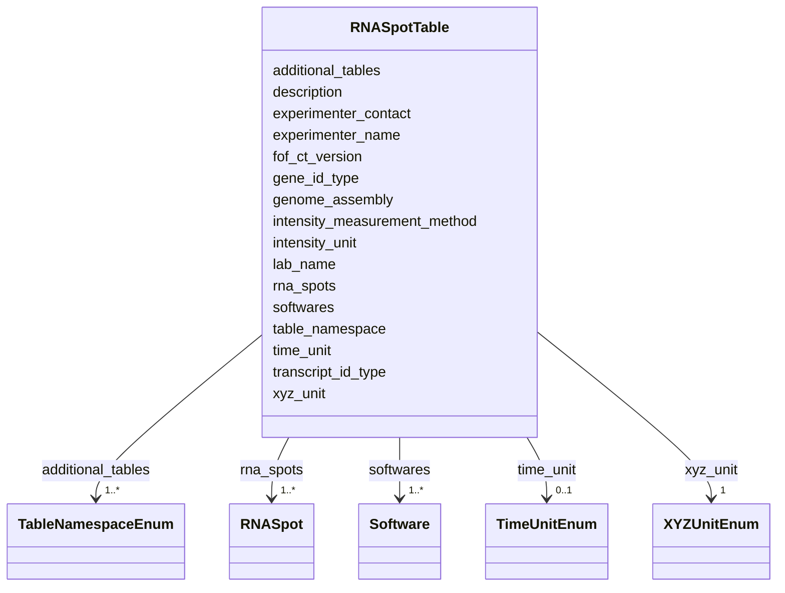

---
search:
  boost: 10.0
---

# Class: RNASpotTable 


_The RNA Spot Data table of a FOF-bas-CT dataset (namespace: 4dn_FOF-CT_rna). This class represents the entire file: it holds all dataset-level provenance metadata (recorded as header lines in the CSV serialisation) together with the full collection of RNA Spots (recorded as data rows). Analogous to the MappingSet class in SSSOM. This table is optional but recommended when RNA data are collected alongside Chromatin Tracing._


<div data-search-exclude markdown="1">


URI: [fof_ct:RNASpotTable](https://w3id.org/fof-ct/RNASpotTable)





<!-- no inheritance hierarchy -->

## Class Properties

| Property | Value |
| --- | --- |
| Tree Root | Yes |


## Slots

| Name | Cardinality and Range | Description | Inheritance |
| ---  | --- | --- | --- |
| [fof_ct_version](fof_ct_version.md) | 1 <br/> [String](String.md) | Version of the FOF-CT format used in this file | direct |
| [table_namespace](table_namespace.md) | 1 <br/> [String](String.md) | Identifier for this table type | direct |
| [genome_assembly](genome_assembly.md) | 1 <br/> [String](String.md) | Genome build used for Chrom, Chrom_Start and Chrom_End coordinates | direct |
| [gene_id_type](gene_id_type.md) | 1 <br/> [String](String.md) | Type of gene identifier used in the gene_id column (e | direct |
| [xyz_unit](xyz_unit.md) | 1 <br/> [XYZUnitEnum](XYZUnitEnum.md) | Unit used to represent X, Y, Z spatial coordinates or distances in this table | direct |
| [lab_name](lab_name.md) | 1 <br/> [String](String.md) | Name of the laboratory where the experiment was performed | direct |
| [experimenter_name](experimenter_name.md) | 1 <br/> [String](String.md) | Full name of the person who performed the experiment | direct |
| [experimenter_contact](experimenter_contact.md) | 1 <br/> [String](String.md) | Email address of the person who performed the experiment | direct |
| [description](description.md) | 1 <br/> [String](String.md) | Free-text description of the experiment and of the data recorded in this tabl... | direct |
| [softwares](softwares.md) | 1..* <br/> [Software](Software.md) | One or more Software entries documenting every tool used to produce or proces... | direct |
| [additional_tables](additional_tables.md) | 1..* <br/> [TableNamespaceEnum](TableNamespaceEnum.md) | List of additional FOF-CT table namespaces being submitted alongside this tab... | direct |
| [transcript_id_type](transcript_id_type.md) | 0..1 <br/> [String](String.md) | Type of transcript identifier used in the transcript_id column (e | direct |
| [time_unit](time_unit.md) | 0..1 <br/> [TimeUnitEnum](TimeUnitEnum.md) | Unit used to represent time intervals in this table | direct |
| [intensity_unit](intensity_unit.md) | 0..1 <br/> [String](String.md) | Unit used to represent intensity measurements in this table | direct |
| [intensity_measurement_method](intensity_measurement_method.md) | 0..1 <br/> [String](String.md) | Method used to perform intensity measurements, including how digital signals ... | direct |
| [rna_spots](rna_spots.md) | 1..* <br/> [RNASpot](RNASpot.md) | The complete collection of RNA Spots constituting this dataset | direct |


## Usages

| used by | used in | type | used |
| ---  | --- | --- | --- |
| [RNASpotTable](RNASpotTable.md) | [gene_id_type](gene_id_type.md) | domain | [RNASpotTable](RNASpotTable.md) |
| [RNASpotTable](RNASpotTable.md) | [transcript_id_type](transcript_id_type.md) | domain | [RNASpotTable](RNASpotTable.md) |
| [RNASpotTable](RNASpotTable.md) | [rna_spots](rna_spots.md) | domain | [RNASpotTable](RNASpotTable.md) |


## Identifier and Mapping Information


### Schema Source


* from schema: https://w3id.org/fof-ct/bas


## Mappings

| Mapping Type | Mapped Value |
| ---  | ---  |
| self | fof_ct:RNASpotTable |
| native | fof_ct:RNASpotTable |


## LinkML Source

<!-- TODO: investigate https://stackoverflow.com/questions/37606292/how-to-create-tabbed-code-blocks-in-mkdocs-or-sphinx -->

### Direct

<details>
```yaml
name: RNASpotTable
description: 'The RNA Spot Data table of a FOF-bas-CT dataset (namespace: 4dn_FOF-CT_rna).
  This class represents the entire file: it holds all dataset-level provenance metadata
  (recorded as header lines in the CSV serialisation) together with the full collection
  of RNA Spots (recorded as data rows). Analogous to the MappingSet class in SSSOM.
  This table is optional but recommended when RNA data are collected alongside Chromatin
  Tracing.'
from_schema: https://w3id.org/fof-ct/bas
slots:
- fof_ct_version
- table_namespace
- genome_assembly
- gene_id_type
- xyz_unit
- lab_name
- experimenter_name
- experimenter_contact
- description
- softwares
- additional_tables
- transcript_id_type
- time_unit
- intensity_unit
- intensity_measurement_method
- rna_spots
slot_usage:
  fof_ct_version:
    name: fof_ct_version
    required: true
  table_namespace:
    name: table_namespace
    required: true
    equals_string: 4dn_FOF-CT_rna
  genome_assembly:
    name: genome_assembly
    required: true
  gene_id_type:
    name: gene_id_type
    required: true
  xyz_unit:
    name: xyz_unit
    required: true
  lab_name:
    name: lab_name
    required: true
  experimenter_name:
    name: experimenter_name
    required: true
  experimenter_contact:
    name: experimenter_contact
    required: true
  description:
    name: description
    required: true
  softwares:
    name: softwares
    range: Software
    required: true
    multivalued: true
  additional_tables:
    name: additional_tables
    required: true
  rna_spots:
    name: rna_spots
    required: true
tree_root: true

```
</details>

### Induced

<details>
```yaml
name: RNASpotTable
description: 'The RNA Spot Data table of a FOF-bas-CT dataset (namespace: 4dn_FOF-CT_rna).
  This class represents the entire file: it holds all dataset-level provenance metadata
  (recorded as header lines in the CSV serialisation) together with the full collection
  of RNA Spots (recorded as data rows). Analogous to the MappingSet class in SSSOM.
  This table is optional but recommended when RNA data are collected alongside Chromatin
  Tracing.'
from_schema: https://w3id.org/fof-ct/bas
slot_usage:
  fof_ct_version:
    name: fof_ct_version
    required: true
  table_namespace:
    name: table_namespace
    required: true
    equals_string: 4dn_FOF-CT_rna
  genome_assembly:
    name: genome_assembly
    required: true
  gene_id_type:
    name: gene_id_type
    required: true
  xyz_unit:
    name: xyz_unit
    required: true
  lab_name:
    name: lab_name
    required: true
  experimenter_name:
    name: experimenter_name
    required: true
  experimenter_contact:
    name: experimenter_contact
    required: true
  description:
    name: description
    required: true
  softwares:
    name: softwares
    range: Software
    required: true
    multivalued: true
  additional_tables:
    name: additional_tables
    required: true
  rna_spots:
    name: rna_spots
    required: true
attributes:
  fof_ct_version:
    name: fof_ct_version
    description: Version of the FOF-CT format used in this file. Always the first
      line of the file header (##FOF-CT_Version=).
    examples:
    - value: v1.0
    from_schema: https://w3id.org/fof-ct/bas
    rank: 1000
    owner: RNASpotTable
    domain_of:
    - SpotTable
    - DemultiplexingTable
    - TraceTable
    - RNASpotTable
    - SpotQualityTable
    - RNASpotQualityTable
    - SpotBiologicalTable
    - RNASpotBiologicalTable
    - CellTable
    - ExtraCellROITable
    - SubCellROITable
    - ROIMappingTable
    range: string
    required: true
    pattern: ^v[0-9]+\.[0-9]+
  table_namespace:
    name: table_namespace
    description: 'Identifier for this table type. The required value is specific to
      each table. Written as ##Table_Namespace= in the file header.'
    from_schema: https://w3id.org/fof-ct/bas
    rank: 1000
    owner: RNASpotTable
    domain_of:
    - SpotTable
    - DemultiplexingTable
    - TraceTable
    - RNASpotTable
    - SpotQualityTable
    - RNASpotQualityTable
    - SpotBiologicalTable
    - RNASpotBiologicalTable
    - CellTable
    - ExtraCellROITable
    - SubCellROITable
    - ROIMappingTable
    range: string
    required: true
    equals_string: 4dn_FOF-CT_rna
  genome_assembly:
    name: genome_assembly
    description: 'Genome build used for Chrom, Chrom_Start and Chrom_End coordinates.
      The 4DN Data Portal accepts GRCh38 (human) and GRCm38 (mouse). When the genome
      under study contains an INSERTION or DELETION the value must use the mandatory
      ''custom-build:'' prefix followed by a descriptive name (e.g., custom-build:GRCm38+pJT039(insertion)).
      Written as ##Genome_Assembly= in the file header.'
    examples:
    - value: GRCh38
    - value: custom-build:GRCm38+pJT039(insertion)
    from_schema: https://w3id.org/fof-ct/bas
    rank: 1000
    owner: RNASpotTable
    domain_of:
    - SpotTable
    - RNASpotTable
    range: string
    required: true
  gene_id_type:
    name: gene_id_type
    description: 'Type of gene identifier used in the gene_id column (e.g. Ensembl_V38,
      NCBI_Gene). Written as ##Gene_ID_Type= in the file header.'
    examples:
    - value: Ensembl_V38
    - value: NCBI_Gene
    from_schema: https://w3id.org/fof-ct/bas
    rank: 1000
    domain: RNASpotTable
    owner: RNASpotTable
    domain_of:
    - RNASpotTable
    range: string
    required: true
  xyz_unit:
    name: xyz_unit
    description: 'Unit used to represent X, Y, Z spatial coordinates or distances
      in this table. Use ''micron'' to avoid issues with Greek symbols. Values should
      be drawn from SI units of length. Written as ##XYZ_Unit= in the file header.
      Conditionally required when any location or distance metric is reported.'
    examples:
    - value: micron
    from_schema: https://w3id.org/fof-ct/bas
    rank: 1000
    owner: RNASpotTable
    domain_of:
    - SpotTable
    - DemultiplexingTable
    - TraceTable
    - RNASpotTable
    - SpotQualityTable
    - RNASpotQualityTable
    - SpotBiologicalTable
    - RNASpotBiologicalTable
    - CellTable
    - ExtraCellROITable
    - SubCellROITable
    - ROIMappingTable
    range: XYZUnitEnum
    required: true
  lab_name:
    name: lab_name
    description: 'Name of the laboratory where the experiment was performed. Written
      as #Lab_Name: in the file header.'
    examples:
    - value: Nobel
    from_schema: https://w3id.org/fof-ct/bas
    rank: 1000
    owner: RNASpotTable
    domain_of:
    - SpotTable
    - DemultiplexingTable
    - TraceTable
    - RNASpotTable
    - SpotQualityTable
    - RNASpotQualityTable
    - SpotBiologicalTable
    - RNASpotBiologicalTable
    - CellTable
    - ExtraCellROITable
    - SubCellROITable
    - ROIMappingTable
    range: string
    required: true
  experimenter_name:
    name: experimenter_name
    description: 'Full name of the person who performed the experiment. Written as
      #Experimenter_Name: in the file header.'
    examples:
    - value: John Doe
    from_schema: https://w3id.org/fof-ct/bas
    rank: 1000
    owner: RNASpotTable
    domain_of:
    - SpotTable
    - DemultiplexingTable
    - TraceTable
    - RNASpotTable
    - SpotQualityTable
    - RNASpotQualityTable
    - SpotBiologicalTable
    - RNASpotBiologicalTable
    - CellTable
    - ExtraCellROITable
    - SubCellROITable
    - ROIMappingTable
    range: string
    required: true
  experimenter_contact:
    name: experimenter_contact
    description: 'Email address of the person who performed the experiment. Written
      as #Experimenter_Contact: in the file header.'
    examples:
    - value: john.doe@email.com
    from_schema: https://w3id.org/fof-ct/bas
    rank: 1000
    owner: RNASpotTable
    domain_of:
    - SpotTable
    - DemultiplexingTable
    - TraceTable
    - RNASpotTable
    - SpotQualityTable
    - RNASpotQualityTable
    - SpotBiologicalTable
    - RNASpotBiologicalTable
    - CellTable
    - ExtraCellROITable
    - SubCellROITable
    - ROIMappingTable
    range: string
    required: true
    pattern: ^[^@\s]+@[^@\s]+\.[^@\s]+$
  description:
    name: description
    description: 'Free-text description of the experiment and of the data recorded
      in this table. Should provide sufficient detail for interpretation and reproducibility.
      Written as #Description: in the file header.'
    from_schema: https://w3id.org/fof-ct/bas
    rank: 1000
    owner: RNASpotTable
    domain_of:
    - SpotTable
    - DemultiplexingTable
    - TraceTable
    - RNASpotTable
    - SpotQualityTable
    - RNASpotQualityTable
    - SpotBiologicalTable
    - RNASpotBiologicalTable
    - CellTable
    - ExtraCellROITable
    - SubCellROITable
    - ROIMappingTable
    range: string
    required: true
  softwares:
    name: softwares
    description: 'One or more Software entries documenting every tool used to produce
      or process data in this table. Written as repeating #Software_* blocks in the
      file header.'
    from_schema: https://w3id.org/fof-ct/bas
    rank: 1000
    owner: RNASpotTable
    domain_of:
    - SpotTable
    - DemultiplexingTable
    - TraceTable
    - RNASpotTable
    - SpotQualityTable
    - RNASpotQualityTable
    - SpotBiologicalTable
    - RNASpotBiologicalTable
    - CellTable
    - ExtraCellROITable
    - SubCellROITable
    - ROIMappingTable
    range: Software
    required: true
    multivalued: true
    inlined: true
    inlined_as_list: true
  additional_tables:
    name: additional_tables
    description: 'List of additional FOF-CT table namespaces being submitted alongside
      this table, separated by commas in the TSV header. Written as #Additional_Tables:
      in the file header.'
    from_schema: https://w3id.org/fof-ct/bas
    rank: 1000
    owner: RNASpotTable
    domain_of:
    - SpotTable
    - DemultiplexingTable
    - TraceTable
    - RNASpotTable
    - SpotQualityTable
    - RNASpotQualityTable
    - SpotBiologicalTable
    - RNASpotBiologicalTable
    - CellTable
    - ExtraCellROITable
    - SubCellROITable
    - ROIMappingTable
    range: TableNamespaceEnum
    required: true
    multivalued: true
  transcript_id_type:
    name: transcript_id_type
    description: 'Type of transcript identifier used in the transcript_id column (e.g.
      Ensembl_V38, RefSeq). Conditionally required when multiple transcripts share
      the same gene_id and the FISH probe can distinguish among them. Written as ##Transcript_ID_Type=
      in the file header.'
    examples:
    - value: Ensembl_V38
    - value: RefSeq
    from_schema: https://w3id.org/fof-ct/bas
    rank: 1000
    domain: RNASpotTable
    owner: RNASpotTable
    domain_of:
    - RNASpotTable
    range: string
  time_unit:
    name: time_unit
    description: 'Unit used to represent time intervals in this table. Allowed values
      are SI time units plus ''min'' and ''hr''. Written as ##Time_Unit= in the file
      header. Conditionally required when any time metric is reported.'
    examples:
    - value: sec
    from_schema: https://w3id.org/fof-ct/bas
    rank: 1000
    owner: RNASpotTable
    domain_of:
    - DemultiplexingTable
    - TraceTable
    - RNASpotTable
    - SpotQualityTable
    - RNASpotQualityTable
    - SpotBiologicalTable
    - RNASpotBiologicalTable
    - CellTable
    - ExtraCellROITable
    - SubCellROITable
    - ROIMappingTable
    range: TimeUnitEnum
  intensity_unit:
    name: intensity_unit
    description: 'Unit used to represent intensity measurements in this table. Written
      as ##Intensity_Unit= in the file header. Conditionally required when any intensity
      metric is reported.'
    examples:
    - value: a.u.
    - value: photons
    from_schema: https://w3id.org/fof-ct/bas
    rank: 1000
    owner: RNASpotTable
    domain_of:
    - DemultiplexingTable
    - TraceTable
    - RNASpotTable
    - SpotQualityTable
    - RNASpotQualityTable
    - SpotBiologicalTable
    - RNASpotBiologicalTable
    - CellTable
    - ExtraCellROITable
    - SubCellROITable
    - ROIMappingTable
    range: string
  intensity_measurement_method:
    name: intensity_measurement_method
    description: 'Method used to perform intensity measurements, including how digital
      signals were converted to photon counts. Written as #Intensity_Measurement_Method:
      in the file header. Conditionally required when any intensity metric is reported.'
    examples:
    - value: Localization centroid intensity
    - value: Mean Fluorescence Intensity
    from_schema: https://w3id.org/fof-ct/bas
    rank: 1000
    owner: RNASpotTable
    domain_of:
    - DemultiplexingTable
    - TraceTable
    - RNASpotTable
    - SpotQualityTable
    - RNASpotQualityTable
    - SpotBiologicalTable
    - RNASpotBiologicalTable
    - CellTable
    - ExtraCellROITable
    - SubCellROITable
    - ROIMappingTable
    range: string
  rna_spots:
    name: rna_spots
    description: The complete collection of RNA Spots constituting this dataset. Each
      RNASpot corresponds to one data row in the TSV serialisation.
    from_schema: https://w3id.org/fof-ct/bas
    rank: 1000
    domain: RNASpotTable
    owner: RNASpotTable
    domain_of:
    - RNASpotTable
    range: RNASpot
    required: true
    multivalued: true
    inlined: true
    inlined_as_list: true
tree_root: true

```
</details></div>