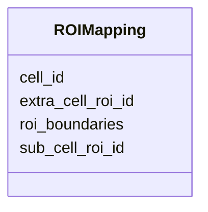

---
search:
  boost: 10.0
---

# Class: ROIMapping 


_A single boundary record for one Cell, Sub-Cell ROI, or Extra-Cell ROI in a FOF-bas-CT experiment. Each instance corresponds to one row in the TSV data section of the FOF-CT Cell/ROI Mapping table. Exactly one of the three identifier slots (sub_cell_roi_id, cell_id, extra_cell_roi_id) must be populated per file; the choice of identifier must be consistent across all rows of a given submission. The roi_boundaries slot holds the boundary coordinates in the format specified by roi_boundaries_format in the table header. This class accepts additional user-defined optional columns._


<div data-search-exclude markdown="1">


URI: [fof_ct:ROIMapping](https://w3id.org/fof-ct/ROIMapping)





<!-- no inheritance hierarchy -->

## Slots

| Name | Cardinality and Range | Description | Inheritance |
| ---  | --- | --- | --- |
| [sub_cell_roi_id](sub_cell_roi_id.md) | 0..1 <br/> [Integer](Integer.md) | Unique identifier for the Sub-Cell ROI whose boundaries are described in this... | direct |
| [cell_id](cell_id.md) | 0..1 <br/> [Integer](Integer.md) | Unique identifier for the Cell whose boundaries are described in this row | direct |
| [extra_cell_roi_id](extra_cell_roi_id.md) | 0..1 <br/> [Integer](Integer.md) | Unique identifier for the extracellular structure ROI whose boundaries are de... | direct |
| [roi_boundaries](roi_boundaries.md) | 1 <br/> [String](String.md) | Boundary coordinates for this Cell or ROI, encoded in the format specified by... | direct |

<details>
<summary>Expressions & Logic</summary>
#### Exactly One Of

The class must satisfy exactly one of:
- AnonymousClassExpression({
  'slot_conditions': {'sub_cell_roi_id': SlotDefinition({'name': 'sub_cell_roi_id', 'value_presence': PresenceEnum(text='PRESENT')}),
    'cell_id': SlotDefinition({'name': 'cell_id', 'value_presence': PresenceEnum(text='ABSENT')}),
    'extra_cell_roi_id': SlotDefinition({'name': 'extra_cell_roi_id', 'value_presence': PresenceEnum(text='ABSENT')})}
})
- AnonymousClassExpression({
  'slot_conditions': {'sub_cell_roi_id': SlotDefinition({'name': 'sub_cell_roi_id', 'value_presence': PresenceEnum(text='ABSENT')}),
    'cell_id': SlotDefinition({'name': 'cell_id', 'value_presence': PresenceEnum(text='PRESENT')}),
    'extra_cell_roi_id': SlotDefinition({'name': 'extra_cell_roi_id', 'value_presence': PresenceEnum(text='ABSENT')})}
})
- AnonymousClassExpression({
  'slot_conditions': {'sub_cell_roi_id': SlotDefinition({'name': 'sub_cell_roi_id', 'value_presence': PresenceEnum(text='ABSENT')}),
    'cell_id': SlotDefinition({'name': 'cell_id', 'value_presence': PresenceEnum(text='ABSENT')}),
    'extra_cell_roi_id': SlotDefinition({'name': 'extra_cell_roi_id', 'value_presence': PresenceEnum(text='PRESENT')})}
})

</details>


## Usages

| used by | used in | type | used |
| ---  | --- | --- | --- |
| [ROIMapping](ROIMapping.md) | [roi_boundaries](roi_boundaries.md) | domain | [ROIMapping](ROIMapping.md) |
| [ROIMappingTable](ROIMappingTable.md) | [roi_mappings](roi_mappings.md) | range | [ROIMapping](ROIMapping.md) |


## Identifier and Mapping Information


### Schema Source


* from schema: https://w3id.org/fof-ct/bas


## Mappings

| Mapping Type | Mapped Value |
| ---  | ---  |
| self | fof_ct:ROIMapping |
| native | fof_ct:ROIMapping |


## LinkML Source

<!-- TODO: investigate https://stackoverflow.com/questions/37606292/how-to-create-tabbed-code-blocks-in-mkdocs-or-sphinx -->

### Direct

<details>
```yaml
name: ROIMapping
description: A single boundary record for one Cell, Sub-Cell ROI, or Extra-Cell ROI
  in a FOF-bas-CT experiment. Each instance corresponds to one row in the TSV data
  section of the FOF-CT Cell/ROI Mapping table. Exactly one of the three identifier
  slots (sub_cell_roi_id, cell_id, extra_cell_roi_id) must be populated per file;
  the choice of identifier must be consistent across all rows of a given submission.
  The roi_boundaries slot holds the boundary coordinates in the format specified by
  roi_boundaries_format in the table header. This class accepts additional user-defined
  optional columns.
from_schema: https://w3id.org/fof-ct/bas
slots:
- sub_cell_roi_id
- cell_id
- extra_cell_roi_id
- roi_boundaries
slot_usage:
  sub_cell_roi_id:
    name: sub_cell_roi_id
    description: Unique identifier for the Sub-Cell ROI whose boundaries are described
      in this row. Conditionally required when this file contains sub- cellular ROI
      boundary data. Exactly one of sub_cell_roi_id, cell_id, or extra_cell_roi_id
      must be used consistently throughout the file.
    range: integer
    required: false
  cell_id:
    name: cell_id
    description: Unique identifier for the Cell whose boundaries are described in
      this row. Conditionally required when this file contains Cell boundary data.
      Exactly one of sub_cell_roi_id, cell_id, or extra_cell_roi_id must be used consistently
      throughout the file.
    range: integer
    required: false
  extra_cell_roi_id:
    name: extra_cell_roi_id
    description: Unique identifier for the extracellular structure ROI whose boundaries
      are described in this row. Conditionally required when this file contains Extra-Cell
      ROI boundary data. Exactly one of sub_cell_roi_id, cell_id, or extra_cell_roi_id
      must be used consistently throughout the file.
    range: integer
    required: false
  roi_boundaries:
    name: roi_boundaries
    required: true
exactly_one_of:
- slot_conditions:
    sub_cell_roi_id:
      name: sub_cell_roi_id
      value_presence: PRESENT
    cell_id:
      name: cell_id
      value_presence: ABSENT
    extra_cell_roi_id:
      name: extra_cell_roi_id
      value_presence: ABSENT
- slot_conditions:
    sub_cell_roi_id:
      name: sub_cell_roi_id
      value_presence: ABSENT
    cell_id:
      name: cell_id
      value_presence: PRESENT
    extra_cell_roi_id:
      name: extra_cell_roi_id
      value_presence: ABSENT
- slot_conditions:
    sub_cell_roi_id:
      name: sub_cell_roi_id
      value_presence: ABSENT
    cell_id:
      name: cell_id
      value_presence: ABSENT
    extra_cell_roi_id:
      name: extra_cell_roi_id
      value_presence: PRESENT

```
</details>

### Induced

<details>
```yaml
name: ROIMapping
description: A single boundary record for one Cell, Sub-Cell ROI, or Extra-Cell ROI
  in a FOF-bas-CT experiment. Each instance corresponds to one row in the TSV data
  section of the FOF-CT Cell/ROI Mapping table. Exactly one of the three identifier
  slots (sub_cell_roi_id, cell_id, extra_cell_roi_id) must be populated per file;
  the choice of identifier must be consistent across all rows of a given submission.
  The roi_boundaries slot holds the boundary coordinates in the format specified by
  roi_boundaries_format in the table header. This class accepts additional user-defined
  optional columns.
from_schema: https://w3id.org/fof-ct/bas
slot_usage:
  sub_cell_roi_id:
    name: sub_cell_roi_id
    description: Unique identifier for the Sub-Cell ROI whose boundaries are described
      in this row. Conditionally required when this file contains sub- cellular ROI
      boundary data. Exactly one of sub_cell_roi_id, cell_id, or extra_cell_roi_id
      must be used consistently throughout the file.
    range: integer
    required: false
  cell_id:
    name: cell_id
    description: Unique identifier for the Cell whose boundaries are described in
      this row. Conditionally required when this file contains Cell boundary data.
      Exactly one of sub_cell_roi_id, cell_id, or extra_cell_roi_id must be used consistently
      throughout the file.
    range: integer
    required: false
  extra_cell_roi_id:
    name: extra_cell_roi_id
    description: Unique identifier for the extracellular structure ROI whose boundaries
      are described in this row. Conditionally required when this file contains Extra-Cell
      ROI boundary data. Exactly one of sub_cell_roi_id, cell_id, or extra_cell_roi_id
      must be used consistently throughout the file.
    range: integer
    required: false
  roi_boundaries:
    name: roi_boundaries
    required: true
attributes:
  sub_cell_roi_id:
    name: sub_cell_roi_id
    description: Unique identifier for the Sub-Cell ROI whose boundaries are described
      in this row. Conditionally required when this file contains sub- cellular ROI
      boundary data. Exactly one of sub_cell_roi_id, cell_id, or extra_cell_roi_id
      must be used consistently throughout the file.
    examples:
    - value: '1'
    from_schema: https://w3id.org/fof-ct/bas
    rank: 1000
    owner: ROIMapping
    domain_of:
    - Spot
    - RNASpot
    - SubCellROI
    - ROIMapping
    range: integer
    required: false
  cell_id:
    name: cell_id
    description: Unique identifier for the Cell whose boundaries are described in
      this row. Conditionally required when this file contains Cell boundary data.
      Exactly one of sub_cell_roi_id, cell_id, or extra_cell_roi_id must be used consistently
      throughout the file.
    examples:
    - value: '1'
    from_schema: https://w3id.org/fof-ct/bas
    rank: 1000
    owner: ROIMapping
    domain_of:
    - Spot
    - RNASpot
    - Cell
    - SubCellROI
    - ROIMapping
    range: integer
    required: false
  extra_cell_roi_id:
    name: extra_cell_roi_id
    description: Unique identifier for the extracellular structure ROI whose boundaries
      are described in this row. Conditionally required when this file contains Extra-Cell
      ROI boundary data. Exactly one of sub_cell_roi_id, cell_id, or extra_cell_roi_id
      must be used consistently throughout the file.
    examples:
    - value: '1'
    from_schema: https://w3id.org/fof-ct/bas
    rank: 1000
    owner: ROIMapping
    domain_of:
    - Spot
    - RNASpot
    - Cell
    - ExtraCellROI
    - ROIMapping
    range: integer
    required: false
  roi_boundaries:
    name: roi_boundaries
    description: Boundary coordinates for this Cell or ROI, encoded in the format
      specified by roi_boundaries_format in the table header. For the OME ROI Polygon
      model, coordinates are provided as a space-separated list of "x,y" pairs (e.g.
      "12.5,40.2 13.1,41.0 ..."). For OBJ 3D mesh format, the field contains the vertex
      and face list for the boundary mesh.
    examples:
    - value: 12.5,40.2 13.1,41.0 14.0,40.5 13.5,39.8
    - value: 'v 1.0 2.0 3.0

        v 4.0 5.0 6.0

        f 1 2 3'
    from_schema: https://w3id.org/fof-ct/bas
    rank: 1000
    domain: ROIMapping
    owner: ROIMapping
    domain_of:
    - ROIMapping
    range: string
    required: true
exactly_one_of:
- slot_conditions:
    sub_cell_roi_id:
      name: sub_cell_roi_id
      value_presence: PRESENT
    cell_id:
      name: cell_id
      value_presence: ABSENT
    extra_cell_roi_id:
      name: extra_cell_roi_id
      value_presence: ABSENT
- slot_conditions:
    sub_cell_roi_id:
      name: sub_cell_roi_id
      value_presence: ABSENT
    cell_id:
      name: cell_id
      value_presence: PRESENT
    extra_cell_roi_id:
      name: extra_cell_roi_id
      value_presence: ABSENT
- slot_conditions:
    sub_cell_roi_id:
      name: sub_cell_roi_id
      value_presence: ABSENT
    cell_id:
      name: cell_id
      value_presence: ABSENT
    extra_cell_roi_id:
      name: extra_cell_roi_id
      value_presence: PRESENT

```
</details></div>