# Entity Relationship Diagram

Entity-Relationship diagrams of the FOF-bas-CT schema, generated using [LinkML's ER Diagram generator](https://linkml.io/linkml/generators/erdiagram.html).

---

## Overview (tables and relationships only)

A high-level view showing the 12 FOF-bas-CT tables, their contained record classes, and the shared `Software` provenance class. Attributes are hidden for clarity.

```mermaid
erDiagram
Cell {

}
CellTable {

}
ExtraCellROI {

}
ExtraCellROITable {

}
Localization {

}
LocalizationTable {

}
RNASpot {

}
RNASpotBiologicalRecord {

}
RNASpotBiologicalTable {

}
RNASpotQualityRecord {

}
RNASpotQualityTable {

}
RNASpotTable {

}
ROIMapping {

}
ROIMappingTable {

}
Software {

}
Spot {

}
SpotBiologicalRecord {

}
SpotBiologicalTable {

}
SpotQualityRecord {

}
SpotQualityTable {

}
SpotTable {

}
SubCellROI {

}
SubCellROITable {

}
Trace {

}
TraceTable {

}

CellTable ||--}o Software : "softwares"
CellTable ||--}| Cell : "cells"
ExtraCellROITable ||--}o Software : "softwares"
ExtraCellROITable ||--}| ExtraCellROI : "extra_cell_rois"
LocalizationTable ||--}| Localization : "localizations"
LocalizationTable ||--}| Software : "softwares"
RNASpotBiologicalTable ||--}o Software : "softwares"
RNASpotBiologicalTable ||--}| RNASpotBiologicalRecord : "rna_spot_biological_records"
RNASpotQualityTable ||--}o Software : "softwares"
RNASpotQualityTable ||--}| RNASpotQualityRecord : "rna_spot_quality_records"
RNASpotTable ||--}| RNASpot : "rna_spots"
RNASpotTable ||--}| Software : "softwares"
ROIMappingTable ||--}o Software : "softwares"
ROIMappingTable ||--}| ROIMapping : "roi_mappings"
SpotBiologicalTable ||--}o Software : "softwares"
SpotBiologicalTable ||--}| SpotBiologicalRecord : "spot_biological_records"
SpotQualityTable ||--}o Software : "softwares"
SpotQualityTable ||--}| SpotQualityRecord : "spot_quality_records"
SpotTable ||--}| Software : "softwares"
SpotTable ||--}| Spot : "spots"
SubCellROITable ||--}o Software : "softwares"
SubCellROITable ||--}| SubCellROI : "sub_cell_rois"
TraceTable ||--}o Software : "softwares"
TraceTable ||--}| Trace : "traces"
```

---

## Full diagram (with all attributes)

A detailed view showing all slots for each class.

```mermaid
erDiagram
Cell {
    integer cell_id  
    integer extra_cell_roi_id  
}
CellTable {
    string description  
    TableNamespaceEnumList additional_tables  
    string cell_type  
    string experimenter_contact  
    string experimenter_name  
    string extra_cell_roi_type  
    string fof_ct_version  
    string intensity_measurement_method  
    string intensity_unit  
    string lab_name  
    string table_namespace  
    TimeUnitEnum time_unit  
    XYZUnitEnum xyz_unit  
}
ExtraCellROI {
    integer extra_cell_roi_id  
}
ExtraCellROITable {
    string description  
    TableNamespaceEnumList additional_tables  
    string experimenter_contact  
    string experimenter_name  
    string extra_cell_roi_type  
    string fof_ct_version  
    string intensity_measurement_method  
    string intensity_unit  
    string lab_name  
    string table_namespace  
    TimeUnitEnum time_unit  
    XYZUnitEnum xyz_unit  
}
Localization {
    string fluor  
    integer loc_id  
    integer spot_id  
    float x  
    float y  
    float z  
}
LocalizationTable {
    string description  
    TableNamespaceEnumList additional_tables  
    string experimenter_contact  
    string experimenter_name  
    string fof_ct_version  
    string intensity_measurement_method  
    string intensity_unit  
    string lab_name  
    string table_namespace  
    TimeUnitEnum time_unit  
    XYZUnitEnum xyz_unit  
}
RNASpot {
    integer cell_id  
    integer extra_cell_roi_id  
    string gene_id  
    string rna_name  
    integer rna_spot_id  
    integer sub_cell_roi_id  
    integer trace_id  
    string transcript_id  
    float x  
    float y  
    float z  
}
RNASpotBiologicalRecord {
    integer rna_spot_id  
}
RNASpotBiologicalTable {
    string description  
    TableNamespaceEnumList additional_tables  
    string experimenter_contact  
    string experimenter_name  
    string fof_ct_version  
    string intensity_measurement_method  
    string intensity_unit  
    string lab_name  
    string table_namespace  
    TimeUnitEnum time_unit  
    XYZUnitEnum xyz_unit  
}
RNASpotQualityRecord {
    integer rna_spot_id  
}
RNASpotQualityTable {
    string description  
    TableNamespaceEnumList additional_tables  
    string experimenter_contact  
    string experimenter_name  
    string fof_ct_version  
    string intensity_measurement_method  
    string intensity_unit  
    string lab_name  
    string table_namespace  
    TimeUnitEnum time_unit  
    XYZUnitEnum xyz_unit  
}
RNASpotTable {
    string description  
    TableNamespaceEnumList additional_tables  
    string experimenter_contact  
    string experimenter_name  
    string fof_ct_version  
    string gene_id_type  
    string genome_assembly  
    string intensity_measurement_method  
    string intensity_unit  
    string lab_name  
    string table_namespace  
    TimeUnitEnum time_unit  
    string transcript_id_type  
    XYZUnitEnum xyz_unit  
}
ROIMapping {
    integer cell_id  
    integer extra_cell_roi_id  
    string roi_boundaries  
    integer sub_cell_roi_id  
}
ROIMappingTable {
    string description  
    TableNamespaceEnumList additional_tables  
    string cell_type  
    string experimenter_contact  
    string experimenter_name  
    string extra_cell_roi_type  
    string fof_ct_version  
    string intensity_measurement_method  
    string intensity_unit  
    string lab_name  
    string roi_boundaries_format  
    string sub_cell_roi_type  
    string table_namespace  
    TimeUnitEnum time_unit  
    XYZUnitEnum xyz_unit  
}
Software {
    string software_authors  
    string software_description  
    uri software_preferred_citation_id  
    uri software_repository  
    string software_title  
    SoftwareTypeEnum software_type  
}
Spot {
    integer cell_id  
    string chrom  
    integer chrom_end  
    integer chrom_start  
    integer extra_cell_roi_id  
    integer spot_id  
    integer sub_cell_roi_id  
    integer trace_id  
    float x  
    float y  
    float z  
}
SpotBiologicalRecord {
    integer spot_id  
}
SpotBiologicalTable {
    string description  
    TableNamespaceEnumList additional_tables  
    string experimenter_contact  
    string experimenter_name  
    string fof_ct_version  
    string intensity_measurement_method  
    string intensity_unit  
    string lab_name  
    string table_namespace  
    TimeUnitEnum time_unit  
    XYZUnitEnum xyz_unit  
}
SpotQualityRecord {
    integer spot_id  
}
SpotQualityTable {
    string description  
    TableNamespaceEnumList additional_tables  
    string experimenter_contact  
    string experimenter_name  
    string fof_ct_version  
    string intensity_measurement_method  
    string intensity_unit  
    string lab_name  
    string table_namespace  
    TimeUnitEnum time_unit  
    XYZUnitEnum xyz_unit  
}
SpotTable {
    string description  
    TableNamespaceEnumList additional_tables  
    string experimenter_contact  
    string experimenter_name  
    string fof_ct_version  
    string genome_assembly  
    string lab_name  
    string modification  
    string table_namespace  
    string vcf_file_name  
    string vcf_version  
    XYZUnitEnum xyz_unit  
}
SubCellROI {
    integer cell_id  
    integer sub_cell_roi_id  
}
SubCellROITable {
    string description  
    TableNamespaceEnumList additional_tables  
    string cell_type  
    string experimenter_contact  
    string experimenter_name  
    string fof_ct_version  
    string intensity_measurement_method  
    string intensity_unit  
    string lab_name  
    string sub_cell_roi_type  
    string table_namespace  
    TimeUnitEnum time_unit  
    XYZUnitEnum xyz_unit  
}
Trace {
    integer trace_id  
}
TraceTable {
    string description  
    TableNamespaceEnumList additional_tables  
    string experimenter_contact  
    string experimenter_name  
    string fof_ct_version  
    string intensity_measurement_method  
    string intensity_unit  
    string lab_name  
    string table_namespace  
    TimeUnitEnum time_unit  
    XYZUnitEnum xyz_unit  
}

CellTable ||--}o Software : "softwares"
CellTable ||--}| Cell : "cells"
ExtraCellROITable ||--}o Software : "softwares"
ExtraCellROITable ||--}| ExtraCellROI : "extra_cell_rois"
LocalizationTable ||--}| Localization : "localizations"
LocalizationTable ||--}| Software : "softwares"
RNASpotBiologicalTable ||--}o Software : "softwares"
RNASpotBiologicalTable ||--}| RNASpotBiologicalRecord : "rna_spot_biological_records"
RNASpotQualityTable ||--}o Software : "softwares"
RNASpotQualityTable ||--}| RNASpotQualityRecord : "rna_spot_quality_records"
RNASpotTable ||--}| RNASpot : "rna_spots"
RNASpotTable ||--}| Software : "softwares"
ROIMappingTable ||--}o Software : "softwares"
ROIMappingTable ||--}| ROIMapping : "roi_mappings"
SpotBiologicalTable ||--}o Software : "softwares"
SpotBiologicalTable ||--}| SpotBiologicalRecord : "spot_biological_records"
SpotQualityTable ||--}o Software : "softwares"
SpotQualityTable ||--}| SpotQualityRecord : "spot_quality_records"
SpotTable ||--}| Software : "softwares"
SpotTable ||--}| Spot : "spots"
SubCellROITable ||--}o Software : "softwares"
SubCellROITable ||--}| SubCellROI : "sub_cell_rois"
TraceTable ||--}o Software : "softwares"
TraceTable ||--}| Trace : "traces"
```

