# ER Diagram — FOF-bas-CT

Entity-Relationship diagrams for the **FOF-bas-CT** (ball-and-stick) modality, generated using [LinkML's ER Diagram generator](https://linkml.io/linkml/generators/erdiagram.html).

FOF-bas-CT comprises **12 tables**. The **DNA-Spot/Trace Data core table** (table 1) is the only mandatory table. All other 11 tables are optional but recommended.

The Spot is the primary data unit. Localization events (from which Spots are extracted) may optionally be reported in the Demultiplexing table.

ID chain: `Loc_ID` (n→1) `Spot_ID` (n→1) `Trace_ID`

---

## FOF-bas-CT overview (all 12 tables, relationships only)

```mermaid
erDiagram
Cell {

}
CellTable {

}
DemultiplexingTable {

}
ExtraCellROI {

}
ExtraCellROITable {

}
Localization {

}
RNASpot {

}
RNASpotBiologicalRecord {

}
RNASpotBiologicalTable {

}
RNASpotQualityRecord {

}
RNASpotQualityTable {

}
RNASpotTable {

}
ROIMapping {

}
ROIMappingTable {

}
Software {

}
Spot {

}
SpotBiologicalRecord {

}
SpotBiologicalTable {

}
SpotQualityRecord {

}
SpotQualityTable {

}
SpotTable {

}
SubCellROI {

}
SubCellROITable {

}
Trace {

}
TraceTable {

}

CellTable ||--}o Software : "softwares"
CellTable ||--}| Cell : "cells"
DemultiplexingTable ||--}| Localization : "localizations"
DemultiplexingTable ||--}| Software : "softwares"
ExtraCellROITable ||--}o Software : "softwares"
ExtraCellROITable ||--}| ExtraCellROI : "extra_cell_rois"
RNASpotBiologicalTable ||--}o Software : "softwares"
RNASpotBiologicalTable ||--}| RNASpotBiologicalRecord : "rna_spot_biological_records"
RNASpotQualityTable ||--}o Software : "softwares"
RNASpotQualityTable ||--}| RNASpotQualityRecord : "rna_spot_quality_records"
RNASpotTable ||--}| RNASpot : "rna_spots"
RNASpotTable ||--}| Software : "softwares"
ROIMappingTable ||--}o Software : "softwares"
ROIMappingTable ||--}| ROIMapping : "roi_mappings"
SpotBiologicalTable ||--}o Software : "softwares"
SpotBiologicalTable ||--}| SpotBiologicalRecord : "spot_biological_records"
SpotQualityTable ||--}o Software : "softwares"
SpotQualityTable ||--}| SpotQualityRecord : "spot_quality_records"
SpotTable ||--}| Software : "softwares"
SpotTable ||--}| Spot : "spots"
SubCellROITable ||--}o Software : "softwares"
SubCellROITable ||--}| SubCellROI : "sub_cell_rois"
TraceTable ||--}o Software : "softwares"
TraceTable ||--}| Trace : "traces"
```

---

## FOF-bas-CT detail (all 12 tables, with attributes)

```mermaid
erDiagram
Cell {
    integer cell_id
    integer extra_cell_roi_id
}
CellTable {
    string description
    TableNamespaceEnumList additional_tables
    string cell_type
    string experimenter_contact
    string experimenter_name
    string extra_cell_roi_type
    string fof_ct_version
    string intensity_measurement_method
    string intensity_unit
    string lab_name
    string table_namespace
    TimeUnitEnum time_unit
    XYZUnitEnum xyz_unit
}
DemultiplexingTable {
    string description
    TableNamespaceEnumList additional_tables
    string experimenter_contact
    string experimenter_name
    string fof_ct_version
    string intensity_measurement_method
    string intensity_unit
    string lab_name
    string table_namespace
    TimeUnitEnum time_unit
    XYZUnitEnum xyz_unit
}
ExtraCellROI {
    integer extra_cell_roi_id
}
ExtraCellROITable {
    string description
    TableNamespaceEnumList additional_tables
    string experimenter_contact
    string experimenter_name
    string extra_cell_roi_type
    string fof_ct_version
    string intensity_measurement_method
    string intensity_unit
    string lab_name
    string table_namespace
    TimeUnitEnum time_unit
    XYZUnitEnum xyz_unit
}
Localization {
    string channel_name
    string fluorophore_name
    integer loc_id
    integer spot_id
    float x
    float y
    float z
}
RNASpot {
    integer cell_id
    integer extra_cell_roi_id
    string gene_id
    string rna_name
    integer rna_spot_id
    integer sub_cell_roi_id
    integer trace_id
    string transcript_id
    float x
    float y
    float z
}
RNASpotBiologicalRecord {
    integer rna_spot_id
}
RNASpotBiologicalTable {
    string description
    TableNamespaceEnumList additional_tables
    string experimenter_contact
    string experimenter_name
    string fof_ct_version
    string intensity_measurement_method
    string intensity_unit
    string lab_name
    string table_namespace
    TimeUnitEnum time_unit
    XYZUnitEnum xyz_unit
}
RNASpotQualityRecord {
    float centroid_intensity
    string channel_name
    string fluorophore_name
    float goodness_of_fit
    float peak_intensity
    integer photon_count
    float raw_x
    float raw_y
    float raw_z
    integer rna_spot_id
    float x_chromatic_shift
    float x_drift
    float x_loc_error
    float x_precision
    float y_chromatic_shift
    float y_drift
    float y_loc_error
    float y_precision
    float z_chromatic_shift
    float z_drift
    float z_loc_error
    float z_precision
}
RNASpotQualityTable {
    string description
    TableNamespaceEnumList additional_tables
    string experimenter_contact
    string experimenter_name
    string fof_ct_version
    string intensity_measurement_method
    string intensity_unit
    string lab_name
    string table_namespace
    TimeUnitEnum time_unit
    XYZUnitEnum xyz_unit
}
RNASpotTable {
    string description
    TableNamespaceEnumList additional_tables
    string experimenter_contact
    string experimenter_name
    string fof_ct_version
    string gene_id_type
    string genome_assembly
    string lab_name
    string table_namespace
    string transcript_id_type
    XYZUnitEnum xyz_unit
}
ROIMapping {
    integer cell_id
    integer extra_cell_roi_id
    string roi_boundaries
    integer sub_cell_roi_id
}
ROIMappingTable {
    string description
    TableNamespaceEnumList additional_tables
    string cell_type
    string experimenter_contact
    string experimenter_name
    string extra_cell_roi_type
    string fof_ct_version
    string intensity_measurement_method
    string intensity_unit
    string lab_name
    string roi_boundaries_format_description
    ROIBoundariesFormatTypeEnum roi_boundaries_format_type
    string sub_cell_roi_type
    string table_namespace
    TimeUnitEnum time_unit
    XYZUnitEnum xyz_unit
}
Software {
    string software_authors
    string software_description
    string software_parameters
    uri software_preferred_citation_id
    uri software_repository
    string software_title
    SoftwareTypeEnum software_type
}
Spot {
    integer cell_id
    string chrom
    integer chrom_end
    integer chrom_start
    integer extra_cell_roi_id
    integer spot_id
    integer sub_cell_roi_id
    integer trace_id
    float x
    float y
    float z
}
SpotBiologicalRecord {
    integer spot_id
}
SpotBiologicalTable {
    string description
    TableNamespaceEnumList additional_tables
    string experimenter_contact
    string experimenter_name
    string fof_ct_version
    string intensity_measurement_method
    string intensity_unit
    string lab_name
    string table_namespace
    TimeUnitEnum time_unit
    XYZUnitEnum xyz_unit
}
SpotQualityRecord {
    float centroid_intensity
    string channel_name
    string fluorophore_name
    float goodness_of_fit
    float peak_intensity
    integer photon_count
    float raw_x
    float raw_y
    float raw_z
    integer spot_id
    float x_chromatic_shift
    float x_drift
    float x_loc_error
    float x_precision
    float y_chromatic_shift
    float y_drift
    float y_loc_error
    float y_precision
    float z_chromatic_shift
    float z_drift
    float z_loc_error
    float z_precision
}
SpotQualityTable {
    string description
    TableNamespaceEnumList additional_tables
    string experimenter_contact
    string experimenter_name
    string fof_ct_version
    string intensity_measurement_method
    string intensity_unit
    string lab_name
    string table_namespace
    TimeUnitEnum time_unit
    XYZUnitEnum xyz_unit
}
SpotTable {
    string description
    TableNamespaceEnumList additional_tables
    string experimenter_contact
    string experimenter_name
    string fof_ct_version
    string genome_assembly
    string lab_name
    string modification
    string table_namespace
    string vcf_file_name
    string vcf_version
    XYZUnitEnum xyz_unit
}
SubCellROI {
    integer cell_id
    integer sub_cell_roi_id
}
SubCellROITable {
    string description
    TableNamespaceEnumList additional_tables
    string cell_type
    string experimenter_contact
    string experimenter_name
    string fof_ct_version
    string intensity_measurement_method
    string intensity_unit
    string lab_name
    string sub_cell_roi_type
    string table_namespace
    TimeUnitEnum time_unit
    XYZUnitEnum xyz_unit
}
Trace {
    integer trace_id
}
TraceTable {
    string description
    TableNamespaceEnumList additional_tables
    string experimenter_contact
    string experimenter_name
    string fof_ct_version
    string intensity_measurement_method
    string intensity_unit
    string lab_name
    string table_namespace
    TimeUnitEnum time_unit
    XYZUnitEnum xyz_unit
}

CellTable ||--}o Software : "softwares"
CellTable ||--}| Cell : "cells"
DemultiplexingTable ||--}| Localization : "localizations"
DemultiplexingTable ||--}| Software : "softwares"
ExtraCellROITable ||--}o Software : "softwares"
ExtraCellROITable ||--}| ExtraCellROI : "extra_cell_rois"
RNASpotBiologicalTable ||--}o Software : "softwares"
RNASpotBiologicalTable ||--}| RNASpotBiologicalRecord : "rna_spot_biological_records"
RNASpotQualityTable ||--}o Software : "softwares"
RNASpotQualityTable ||--}| RNASpotQualityRecord : "rna_spot_quality_records"
RNASpotTable ||--}| RNASpot : "rna_spots"
RNASpotTable ||--}| Software : "softwares"
ROIMappingTable ||--}o Software : "softwares"
ROIMappingTable ||--}| ROIMapping : "roi_mappings"
SpotBiologicalTable ||--}o Software : "softwares"
SpotBiologicalTable ||--}| SpotBiologicalRecord : "spot_biological_records"
SpotQualityTable ||--}o Software : "softwares"
SpotQualityTable ||--}| SpotQualityRecord : "spot_quality_records"
SpotTable ||--}| Software : "softwares"
SpotTable ||--}| Spot : "spots"
SubCellROITable ||--}o Software : "softwares"
SubCellROITable ||--}| SubCellROI : "sub_cell_rois"
TraceTable ||--}o Software : "softwares"
TraceTable ||--}| Trace : "traces"
```

