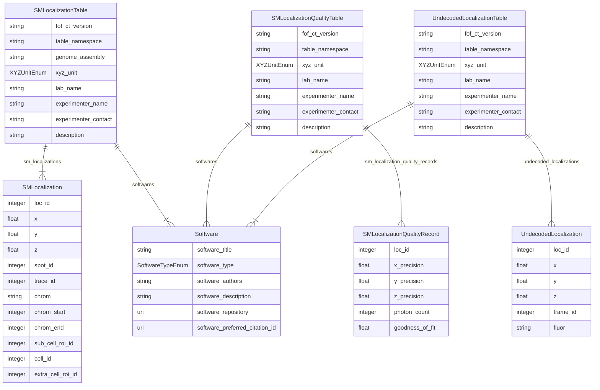

# ER Diagram — FOF-vol-CT

Entity-Relationship diagrams for the **FOF-vol-CT** (volumetric) modality, generated using [LinkML's ER Diagram generator](https://linkml.io/linkml/generators/erdiagram.html).

FOF-vol-CT comprises **15 tables**: all 12 FOF-bas-CT tables plus 3 volumetric-specific tables. The **SM Localization Data table** (table 13) and **SM Localization Quality table** (table 14) are mandatory. The Undecoded SM Localization table (table 15) is optional.

The SM Localization event is the primary data unit. Spots and Traces are optional post-processing outputs.

ID chain: `Loc_ID` (n→1) `Spot_ID` (n→1) `Trace_ID`

---

## Overview (all 15 tables, relationships only)

```mermaid
erDiagram
Cell {

}
CellTable {

}
DemultiplexingTable {

}
ExtraCellROI {

}
ExtraCellROITable {

}
Localization {

}
RNASpot {

}
RNASpotBiologicalRecord {

}
RNASpotBiologicalTable {

}
RNASpotQualityRecord {

}
RNASpotQualityTable {

}
RNASpotTable {

}
ROIMapping {

}
ROIMappingTable {

}
SMLocalization {

}
SMLocalizationQualityRecord {

}
SMLocalizationQualityTable {

}
SMLocalizationTable {

}
Software {

}
Spot {

}
SpotBiologicalRecord {

}
SpotBiologicalTable {

}
SpotQualityRecord {

}
SpotQualityTable {

}
SpotTable {

}
SubCellROI {

}
SubCellROITable {

}
Trace {

}
TraceTable {

}
UndecodedLocalization {

}
UndecodedLocalizationTable {

}

CellTable ||--}o Software : "softwares"
CellTable ||--}| Cell : "cells"
DemultiplexingTable ||--}| Localization : "localizations"
DemultiplexingTable ||--}| Software : "softwares"
ExtraCellROITable ||--}o Software : "softwares"
ExtraCellROITable ||--}| ExtraCellROI : "extra_cell_rois"
RNASpotBiologicalTable ||--}o Software : "softwares"
RNASpotBiologicalTable ||--}| RNASpotBiologicalRecord : "rna_spot_biological_records"
RNASpotQualityTable ||--}o Software : "softwares"
RNASpotQualityTable ||--}| RNASpotQualityRecord : "rna_spot_quality_records"
RNASpotTable ||--}| RNASpot : "rna_spots"
RNASpotTable ||--}| Software : "softwares"
ROIMappingTable ||--}o Software : "softwares"
ROIMappingTable ||--}| ROIMapping : "roi_mappings"
SMLocalizationQualityTable ||--}| SMLocalizationQualityRecord : "sm_localization_quality_records"
SMLocalizationQualityTable ||--}| Software : "softwares"
SMLocalizationTable ||--}| SMLocalization : "sm_localizations"
SMLocalizationTable ||--}| Software : "softwares"
SpotBiologicalTable ||--}o Software : "softwares"
SpotBiologicalTable ||--}| SpotBiologicalRecord : "spot_biological_records"
SpotQualityTable ||--}o Software : "softwares"
SpotQualityTable ||--}| SpotQualityRecord : "spot_quality_records"
SpotTable ||--}| Software : "softwares"
SpotTable ||--}| Spot : "spots"
SubCellROITable ||--}o Software : "softwares"
SubCellROITable ||--}| SubCellROI : "sub_cell_rois"
TraceTable ||--}o Software : "softwares"
TraceTable ||--}| Trace : "traces"
UndecodedLocalizationTable ||--}| Software : "softwares"
UndecodedLocalizationTable ||--}| UndecodedLocalization : "undecoded_localizations"
```

---

## FOF-vol-CT additions (tables 13–15, with attributes)

