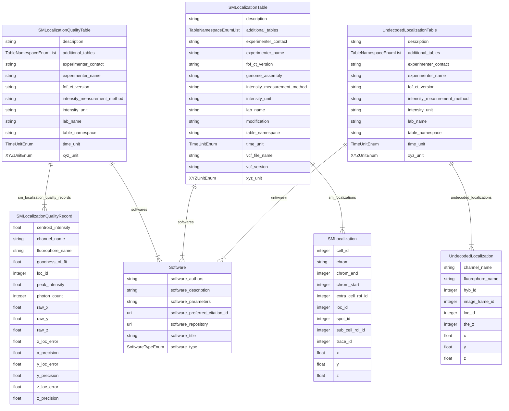

# ER Diagram — FOF-vol-CT

Entity-Relationship diagrams for the **FOF-vol-CT** (volumetric) modality, generated using [LinkML's ER Diagram generator](https://linkml.io/linkml/generators/erdiagram.html).

FOF-vol-CT comprises **15 tables**: all 12 FOF-bas-CT tables plus 3 volumetric-specific tables. The **SM Localization Data table** (table 13) is the only mandatory FOF-vol-CT-exclusive table. The SM Localization Quality table (table 14) and the Undecoded SM Localization table (table 15) are both optional but recommended.

The SM Localization event is the primary data unit. Spots and Traces are optional post-processing outputs.

ID chain: `Loc_ID` (n→1) `Spot_ID` (n→1) `Trace_ID`

---

## Overview (all 15 tables, relationships only)

```mermaid
erDiagram
Cell {

}
CellTable {

}
DemultiplexingTable {

}
ExtraCellROI {

}
ExtraCellROITable {

}
Localization {

}
RNASpot {

}
RNASpotBiologicalRecord {

}
RNASpotBiologicalTable {

}
RNASpotQualityRecord {

}
RNASpotQualityTable {

}
RNASpotTable {

}
ROIMapping {

}
ROIMappingTable {

}
SMLocalization {

}
SMLocalizationQualityRecord {

}
SMLocalizationQualityTable {

}
SMLocalizationTable {

}
Software {

}
Spot {

}
SpotBiologicalRecord {

}
SpotBiologicalTable {

}
SpotQualityRecord {

}
SpotQualityTable {

}
SpotTable {

}
SubCellROI {

}
SubCellROITable {

}
Trace {

}
TraceTable {

}
UndecodedLocalization {

}
UndecodedLocalizationTable {

}

CellTable ||--}o Software : "softwares"
CellTable ||--}| Cell : "cells"
DemultiplexingTable ||--}| Localization : "localizations"
DemultiplexingTable ||--}| Software : "softwares"
ExtraCellROITable ||--}o Software : "softwares"
ExtraCellROITable ||--}| ExtraCellROI : "extra_cell_rois"
RNASpotBiologicalTable ||--}o Software : "softwares"
RNASpotBiologicalTable ||--}| RNASpotBiologicalRecord : "rna_spot_biological_records"
RNASpotQualityTable ||--}o Software : "softwares"
RNASpotQualityTable ||--}| RNASpotQualityRecord : "rna_spot_quality_records"
RNASpotTable ||--}| RNASpot : "rna_spots"
RNASpotTable ||--}| Software : "softwares"
ROIMappingTable ||--}o Software : "softwares"
ROIMappingTable ||--}| ROIMapping : "roi_mappings"
SMLocalizationQualityTable ||--}| SMLocalizationQualityRecord : "sm_localization_quality_records"
SMLocalizationQualityTable ||--}| Software : "softwares"
SMLocalizationTable ||--}| SMLocalization : "sm_localizations"
SMLocalizationTable ||--}| Software : "softwares"
SpotBiologicalTable ||--}o Software : "softwares"
SpotBiologicalTable ||--}| SpotBiologicalRecord : "spot_biological_records"
SpotQualityTable ||--}o Software : "softwares"
SpotQualityTable ||--}| SpotQualityRecord : "spot_quality_records"
SpotTable ||--}| Software : "softwares"
SpotTable ||--}| Spot : "spots"
SubCellROITable ||--}o Software : "softwares"
SubCellROITable ||--}| SubCellROI : "sub_cell_rois"
TraceTable ||--}o Software : "softwares"
TraceTable ||--}| Trace : "traces"
UndecodedLocalizationTable ||--}| Software : "softwares"
UndecodedLocalizationTable ||--}| UndecodedLocalization : "undecoded_localizations"
```

---

## FOF-vol-CT additions (tables 13–15, with attributes)

