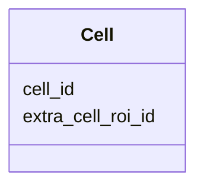

---
search:
  boost: 10.0
---

# Class: Cell 


_A single Cell identified in a FOF-bas-CT experiment. Each instance of this class corresponds to one row in the TSV data section of the FOF-CT Cell Data table. The cell_id field uniquely identifies each Cell and links to the core table, the Sub-Cell ROI Data table, and the Cell/ROI Mapping table. This class accepts additional user-defined optional columns (e.g. Cell_Size, Cell_Volume, Cell_Cycle_State, RNA_Spot_Count) via open schema. At least one such user-defined column MUST be present per submission._


<div data-search-exclude markdown="1">


URI: [fof_ct:Cell](https://w3id.org/fof-ct/Cell)





<!-- no inheritance hierarchy -->

## Slots

| Name | Cardinality and Range | Description | Inheritance |
| ---  | --- | --- | --- |
| [cell_id](cell_id.md) | 1 <br/> [Integer](Integer.md) | Unique integer identifier for this Cell | direct |
| [extra_cell_roi_id](extra_cell_roi_id.md) | 0..1 <br/> [Integer](Integer.md) | Identifier of the extracellular structure ROI (e | direct |


## Usages

| used by | used in | type | used |
| ---  | --- | --- | --- |
| [CellTable](CellTable.md) | [cells](cells.md) | range | [Cell](Cell.md) |


## Identifier and Mapping Information


### Schema Source


* from schema: https://w3id.org/fof-ct/vol


## Mappings

| Mapping Type | Mapped Value |
| ---  | ---  |
| self | fof_ct:Cell |
| native | fof_ct:Cell |


## LinkML Source

<!-- TODO: investigate https://stackoverflow.com/questions/37606292/how-to-create-tabbed-code-blocks-in-mkdocs-or-sphinx -->

### Direct

<details>
```yaml
name: Cell
description: A single Cell identified in a FOF-bas-CT experiment. Each instance of
  this class corresponds to one row in the TSV data section of the FOF-CT Cell Data
  table. The cell_id field uniquely identifies each Cell and links to the core table,
  the Sub-Cell ROI Data table, and the Cell/ROI Mapping table. This class accepts
  additional user-defined optional columns (e.g. Cell_Size, Cell_Volume, Cell_Cycle_State,
  RNA_Spot_Count) via open schema. At least one such user-defined column MUST be present
  per submission.
from_schema: https://w3id.org/fof-ct/vol
slots:
- cell_id
- extra_cell_roi_id
slot_usage:
  cell_id:
    name: cell_id
    description: Unique integer identifier for this Cell. Cell_ID values are unique
      across the entire dataset, enabling unambiguous cross-referencing with the core
      table, the Sub-Cell ROI Data table, and the Cell/ROI Mapping table.
    identifier: true
    range: integer
    required: true
  extra_cell_roi_id:
    name: extra_cell_roi_id
    description: Identifier of the extracellular structure ROI (e.g. tissue section,
      organoid) that contains this Cell. Conditionally required when this Cell can
      be associated with an extracellular ROI identified as part of this experiment
      and reported in a dedicated Extra-Cell ROI Data table.
    range: integer
    required: false

```
</details>

### Induced

<details>
```yaml
name: Cell
description: A single Cell identified in a FOF-bas-CT experiment. Each instance of
  this class corresponds to one row in the TSV data section of the FOF-CT Cell Data
  table. The cell_id field uniquely identifies each Cell and links to the core table,
  the Sub-Cell ROI Data table, and the Cell/ROI Mapping table. This class accepts
  additional user-defined optional columns (e.g. Cell_Size, Cell_Volume, Cell_Cycle_State,
  RNA_Spot_Count) via open schema. At least one such user-defined column MUST be present
  per submission.
from_schema: https://w3id.org/fof-ct/vol
slot_usage:
  cell_id:
    name: cell_id
    description: Unique integer identifier for this Cell. Cell_ID values are unique
      across the entire dataset, enabling unambiguous cross-referencing with the core
      table, the Sub-Cell ROI Data table, and the Cell/ROI Mapping table.
    identifier: true
    range: integer
    required: true
  extra_cell_roi_id:
    name: extra_cell_roi_id
    description: Identifier of the extracellular structure ROI (e.g. tissue section,
      organoid) that contains this Cell. Conditionally required when this Cell can
      be associated with an extracellular ROI identified as part of this experiment
      and reported in a dedicated Extra-Cell ROI Data table.
    range: integer
    required: false
attributes:
  cell_id:
    name: cell_id
    description: Unique integer identifier for this Cell. Cell_ID values are unique
      across the entire dataset, enabling unambiguous cross-referencing with the core
      table, the Sub-Cell ROI Data table, and the Cell/ROI Mapping table.
    examples:
    - value: '1'
    from_schema: https://w3id.org/fof-ct/vol
    rank: 1000
    identifier: true
    owner: Cell
    domain_of:
    - Spot
    - RNASpot
    - Cell
    - SubCellROI
    - ROIMapping
    - SMLocalization
    range: integer
    required: true
  extra_cell_roi_id:
    name: extra_cell_roi_id
    description: Identifier of the extracellular structure ROI (e.g. tissue section,
      organoid) that contains this Cell. Conditionally required when this Cell can
      be associated with an extracellular ROI identified as part of this experiment
      and reported in a dedicated Extra-Cell ROI Data table.
    examples:
    - value: '1'
    from_schema: https://w3id.org/fof-ct/vol
    rank: 1000
    owner: Cell
    domain_of:
    - Spot
    - RNASpot
    - Cell
    - ExtraCellROI
    - ROIMapping
    - SMLocalization
    range: integer
    required: false

```
</details></div>