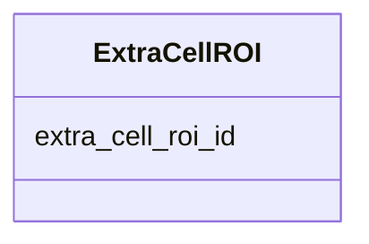

---
search:
  boost: 10.0
---

# Class: ExtraCellROI 


_A single extracellular structure ROI (e.g. a tissue section or organoid) identified in a FOF-bas-CT experiment. Each instance of this class corresponds to one row in the TSV data section of the FOF-CT Extra-Cell ROI Data table. The extra_cell_roi_id field uniquely identifies each ROI and links to the core table, the RNA Spot Data table, and the Cell Data table. This class accepts additional user-defined optional columns (e.g. ROI_Volume, Cell_Count). At least one such user-defined column MUST be present per submission._


<div data-search-exclude markdown="1">


URI: [fof_ct:ExtraCellROI](https://w3id.org/fof-ct/ExtraCellROI)





<!-- no inheritance hierarchy -->

## Slots

| Name | Cardinality and Range | Description | Inheritance |
| ---  | --- | --- | --- |
| [extra_cell_roi_id](extra_cell_roi_id.md) | 1 <br/> [Integer](Integer.md) | Unique integer identifier for this extracellular structure ROI | direct |


## Usages

| used by | used in | type | used |
| ---  | --- | --- | --- |
| [ExtraCellROITable](ExtraCellROITable.md) | [extra_cell_rois](extra_cell_rois.md) | range | [ExtraCellROI](ExtraCellROI.md) |


## Identifier and Mapping Information


### Schema Source


* from schema: https://w3id.org/fof-ct/vol


## Mappings

| Mapping Type | Mapped Value |
| ---  | ---  |
| self | fof_ct:ExtraCellROI |
| native | fof_ct:ExtraCellROI |


## LinkML Source

<!-- TODO: investigate https://stackoverflow.com/questions/37606292/how-to-create-tabbed-code-blocks-in-mkdocs-or-sphinx -->

### Direct

<details>
```yaml
name: ExtraCellROI
description: A single extracellular structure ROI (e.g. a tissue section or organoid)
  identified in a FOF-bas-CT experiment. Each instance of this class corresponds to
  one row in the TSV data section of the FOF-CT Extra-Cell ROI Data table. The extra_cell_roi_id
  field uniquely identifies each ROI and links to the core table, the RNA Spot Data
  table, and the Cell Data table. This class accepts additional user-defined optional
  columns (e.g. ROI_Volume, Cell_Count). At least one such user-defined column MUST
  be present per submission.
from_schema: https://w3id.org/fof-ct/vol
slots:
- extra_cell_roi_id
slot_usage:
  extra_cell_roi_id:
    name: extra_cell_roi_id
    description: Unique integer identifier for this extracellular structure ROI. Extra_Cell_ROI_ID
      values are unique across the entire dataset, enabling unambiguous cross-referencing
      with the core table, the RNA Spot Data table, and the Cell Data table.
    identifier: true
    range: integer
    required: true

```
</details>

### Induced

<details>
```yaml
name: ExtraCellROI
description: A single extracellular structure ROI (e.g. a tissue section or organoid)
  identified in a FOF-bas-CT experiment. Each instance of this class corresponds to
  one row in the TSV data section of the FOF-CT Extra-Cell ROI Data table. The extra_cell_roi_id
  field uniquely identifies each ROI and links to the core table, the RNA Spot Data
  table, and the Cell Data table. This class accepts additional user-defined optional
  columns (e.g. ROI_Volume, Cell_Count). At least one such user-defined column MUST
  be present per submission.
from_schema: https://w3id.org/fof-ct/vol
slot_usage:
  extra_cell_roi_id:
    name: extra_cell_roi_id
    description: Unique integer identifier for this extracellular structure ROI. Extra_Cell_ROI_ID
      values are unique across the entire dataset, enabling unambiguous cross-referencing
      with the core table, the RNA Spot Data table, and the Cell Data table.
    identifier: true
    range: integer
    required: true
attributes:
  extra_cell_roi_id:
    name: extra_cell_roi_id
    description: Unique integer identifier for this extracellular structure ROI. Extra_Cell_ROI_ID
      values are unique across the entire dataset, enabling unambiguous cross-referencing
      with the core table, the RNA Spot Data table, and the Cell Data table.
    examples:
    - value: '1'
    from_schema: https://w3id.org/fof-ct/vol
    rank: 1000
    identifier: true
    owner: ExtraCellROI
    domain_of:
    - Spot
    - RNASpot
    - Cell
    - ExtraCellROI
    - ROIMapping
    - SMLocalization
    range: integer
    required: true

```
</details></div>