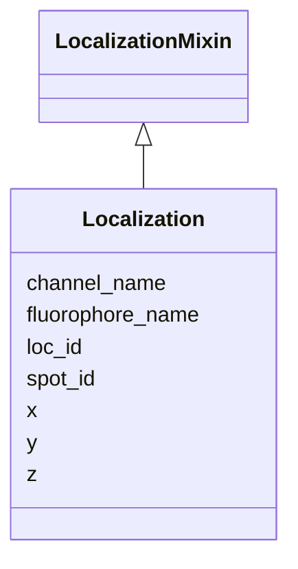

---
search:
  boost: 10.0
---

# Class: Localization 


_A single individual localisation event contributing to the final position of a bright DNA Spot in a multiplexed FISH experiment (e.g. MERFISH). Each instance of this class corresponds to one row in the CSV data section of the FOF-CT Spot Demultiplexing table. The spot_id field links each Localization to its parent Spot in the core table (or RNA Spot Data table); it may be NA when the localisation could not be assigned to any Spot. This class accepts additional user-defined optional columns (e.g. Hyb, Brightness, Fit_Quality)._


<div data-search-exclude markdown="1">


URI: [fof_ct:Localization](https://w3id.org/fof-ct/Localization)





## Inheritance
* **Localization** [ [LocalizationMixin](LocalizationMixin.md)]


## Slots

| Name | Cardinality and Range | Description | Inheritance |
| ---  | --- | --- | --- |
| [spot_id](spot_id.md) | 1 <br/> [Integer](Integer.md) | Unique identifier for a bright DNA Spot | direct |
| [channel_name](channel_name.md) | 1 <br/> [String](String.md) | The wavelength characteristics of the emission channel used to image this Spo... | direct |
| [fluorophore_name](fluorophore_name.md) | 1 <br/> [String](String.md) | The name of the fluorophore whose emission was used to detect this Spot / RNA... | direct |
| [loc_id](loc_id.md) | 1 <br/> [Integer](Integer.md) | A unique integer identifier for an individual localization event | [LocalizationMixin](LocalizationMixin.md) |
| [x](x.md) | 1 <br/> [Float](Float.md) | Sub-pixel X coordinate of this detected event (Spot or localisation) in the u... | [LocalizationMixin](LocalizationMixin.md) |
| [y](y.md) | 1 <br/> [Float](Float.md) | Sub-pixel Y coordinate of this detected event (Spot or localisation) in the u... | [LocalizationMixin](LocalizationMixin.md) |
| [z](z.md) | 1 <br/> [Float](Float.md) | Sub-pixel Z coordinate of this detected event (Spot or localisation) in the u... | [LocalizationMixin](LocalizationMixin.md) |


## Usages

| used by | used in | type | used |
| ---  | --- | --- | --- |
| [DemultiplexingTable](DemultiplexingTable.md) | [localizations](localizations.md) | range | [Localization](Localization.md) |


## Identifier and Mapping Information


### Schema Source


* from schema: https://w3id.org/fof-ct/vol


## Mappings

| Mapping Type | Mapped Value |
| ---  | ---  |
| self | fof_ct:Localization |
| native | fof_ct:Localization |


## LinkML Source

<!-- TODO: investigate https://stackoverflow.com/questions/37606292/how-to-create-tabbed-code-blocks-in-mkdocs-or-sphinx -->

### Direct

<details>
```yaml
name: Localization
description: A single individual localisation event contributing to the final position
  of a bright DNA Spot in a multiplexed FISH experiment (e.g. MERFISH). Each instance
  of this class corresponds to one row in the CSV data section of the FOF-CT Spot
  Demultiplexing table. The spot_id field links each Localization to its parent Spot
  in the core table (or RNA Spot Data table); it may be NA when the localisation could
  not be assigned to any Spot. This class accepts additional user-defined optional
  columns (e.g. Hyb, Brightness, Fit_Quality).
from_schema: https://w3id.org/fof-ct/vol
mixins:
- LocalizationMixin
slots:
- spot_id
- channel_name
- fluorophore_name
slot_usage:
  loc_id:
    name: loc_id
    identifier: true
    required: true
  spot_id:
    name: spot_id
    required: true
  x:
    name: x
    required: true
  y:
    name: y
    required: true
  z:
    name: z
    required: true
  channel_name:
    name: channel_name
    required: true
  fluorophore_name:
    name: fluorophore_name
    required: true

```
</details>

### Induced

<details>
```yaml
name: Localization
description: A single individual localisation event contributing to the final position
  of a bright DNA Spot in a multiplexed FISH experiment (e.g. MERFISH). Each instance
  of this class corresponds to one row in the CSV data section of the FOF-CT Spot
  Demultiplexing table. The spot_id field links each Localization to its parent Spot
  in the core table (or RNA Spot Data table); it may be NA when the localisation could
  not be assigned to any Spot. This class accepts additional user-defined optional
  columns (e.g. Hyb, Brightness, Fit_Quality).
from_schema: https://w3id.org/fof-ct/vol
mixins:
- LocalizationMixin
slot_usage:
  loc_id:
    name: loc_id
    identifier: true
    required: true
  spot_id:
    name: spot_id
    required: true
  x:
    name: x
    required: true
  y:
    name: y
    required: true
  z:
    name: z
    required: true
  channel_name:
    name: channel_name
    required: true
  fluorophore_name:
    name: fluorophore_name
    required: true
attributes:
  spot_id:
    name: spot_id
    description: Unique identifier for a bright DNA Spot. Used as a primary key in
      quality and biological data tables, and as a foreign key linking localization
      events to their parent Spot in the demultiplexing table. In FOF-vol-CT (table
      13, SM Localization Data), this same Spot_ID concept is derived by clustering
      Single-Molecule (SM) Localization events rather than by direct optical detection,
      and every SM Localization event MUST report its associated Spot_ID.
    examples:
    - value: '1'
    from_schema: https://w3id.org/fof-ct/vol
    rank: 1000
    owner: Localization
    domain_of:
    - Spot
    - Localization
    - SpotQualityRecord
    - SpotBiologicalRecord
    - SMLocalization
    range: integer
    required: true
  channel_name:
    name: channel_name
    description: The wavelength characteristics of the emission channel used to image
      this Spot / RNA Spot / localization event (e.g. '510/25', '695/81'). Mandatory
      in the Spot Demultiplexing, Spot Quality, RNA Spot Quality, SM Localization
      Quality, and Undecoded SM Localization tables. Written as the Channel column.
    examples:
    - value: 510/25
    - value: 695/81
    from_schema: https://w3id.org/fof-ct/vol
    rank: 1000
    owner: Localization
    domain_of:
    - Localization
    - SpotQualityRecord
    - RNASpotQualityRecord
    - SMLocalizationQualityRecord
    - UndecodedLocalization
    range: string
    required: true
  fluorophore_name:
    name: fluorophore_name
    description: The name of the fluorophore whose emission was used to detect this
      Spot / RNA Spot / localization event (e.g. AlexaFluor_488, Cy5). Mandatory in
      the Spot Demultiplexing, Spot Quality, RNA Spot Quality, SM Localization Quality,
      and Undecoded SM Localization tables. Written as the Fluor column.
    examples:
    - value: AlexaFluor_488
    - value: Cy5
    from_schema: https://w3id.org/fof-ct/vol
    rank: 1000
    owner: Localization
    domain_of:
    - Localization
    - SpotQualityRecord
    - RNASpotQualityRecord
    - SMLocalizationQualityRecord
    - UndecodedLocalization
    range: string
    required: true
  loc_id:
    name: loc_id
    description: A unique integer identifier for an individual localization event.
      Loc_ID values are unique across the entire dataset. Serves as primary key in
      the Spot Demultiplexing, SM Localization Data, SM Localization Quality, and
      Undecoded SM Localization tables.
    examples:
    - value: '1'
    from_schema: https://w3id.org/fof-ct/vol
    rank: 1000
    identifier: true
    owner: Localization
    domain_of:
    - LocalizationMixin
    - SMLocalizationQualityRecord
    range: integer
    required: true
  x:
    name: x
    description: Sub-pixel X coordinate of this detected event (Spot or localisation)
      in the unit specified by xyz_unit. The reported value is the final position
      after all post-processing corrections (drift correction, chromatic correction,
      etc.).
    examples:
    - value: '14.43'
    from_schema: https://w3id.org/fof-ct/vol
    rank: 1000
    owner: Localization
    domain_of:
    - LocalizationMixin
    - Spot
    - RNASpot
    range: float
    required: true
  y:
    name: y
    description: Sub-pixel Y coordinate of this detected event (Spot or localisation)
      in the unit specified by xyz_unit. The reported value is the final position
      after all post-processing corrections.
    examples:
    - value: '41.43'
    from_schema: https://w3id.org/fof-ct/vol
    rank: 1000
    owner: Localization
    domain_of:
    - LocalizationMixin
    - Spot
    - RNASpot
    range: float
    required: true
  z:
    name: z
    description: Sub-pixel Z coordinate of this detected event (Spot or localisation)
      in the unit specified by xyz_unit. The reported value is the final position
      after all post-processing corrections.
    examples:
    - value: '1.23'
    from_schema: https://w3id.org/fof-ct/vol
    rank: 1000
    owner: Localization
    domain_of:
    - LocalizationMixin
    - Spot
    - RNASpot
    range: float
    required: true

```
</details></div>