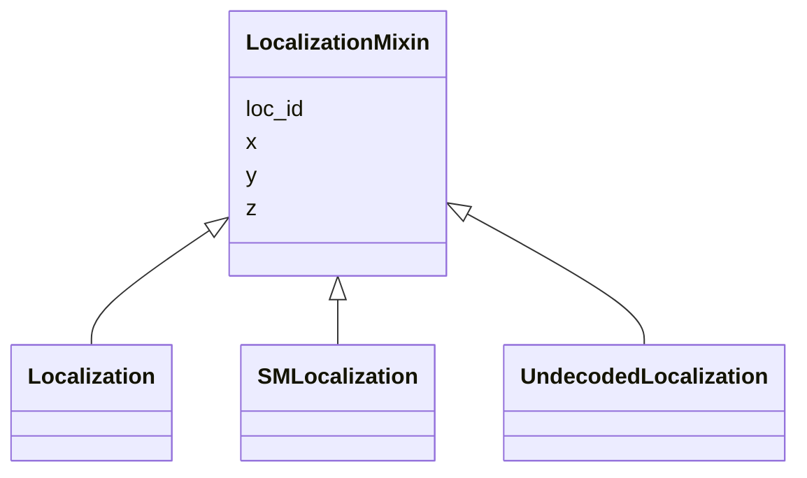

---
search:
  boost: 10.0
---

# Class: LocalizationMixin 


_Mixin capturing the shared concept of a single localization event across FOF-CT modalities. Used by Localization (demultiplexing), SMLocalization (vol_core), and UndecodedLocalization (undecoded). All three classes represent the same atomic measurement unit — the sub-pixel position of a detected fluorescence emission event — but differ in context, mandatory columns, and table role._


<div data-search-exclude markdown="1">


URI: [fof_ct:LocalizationMixin](https://w3id.org/fof-ct/LocalizationMixin)





<!-- no inheritance hierarchy -->

## Class Properties

| Property | Value |
| --- | --- |
| Mixin | Yes |


## Slots

| Name | Cardinality and Range | Description | Inheritance |
| ---  | --- | --- | --- |
| [loc_id](loc_id.md) | 0..1 <br/> [Integer](Integer.md) | A unique integer identifier for an individual localization event | direct |
| [x](x.md) | 0..1 <br/> [Float](Float.md) | Sub-pixel X coordinate of this detected event (Spot or localisation) in the u... | direct |
| [y](y.md) | 0..1 <br/> [Float](Float.md) | Sub-pixel Y coordinate of this detected event (Spot or localisation) in the u... | direct |
| [z](z.md) | 0..1 <br/> [Float](Float.md) | Sub-pixel Z coordinate of this detected event (Spot or localisation) in the u... | direct |


## Mixin Usage

| mixed into | description |
| --- | --- |
| [Localization](Localization.md) | A single individual localisation event contributing to the final position of ... |
| [SMLocalization](SMLocalization.md) | A single individual single-molecule (SM) localization event in a FOF-vol-CT d... |
| [UndecodedLocalization](UndecodedLocalization.md) | A single raw, undecoded SM localization event in a FOF-vol-CT dataset |


## Identifier and Mapping Information


### Schema Source


* from schema: https://w3id.org/fof-ct/vol


## Mappings

| Mapping Type | Mapped Value |
| ---  | ---  |
| self | fof_ct:LocalizationMixin |
| native | fof_ct:LocalizationMixin |


## LinkML Source

<!-- TODO: investigate https://stackoverflow.com/questions/37606292/how-to-create-tabbed-code-blocks-in-mkdocs-or-sphinx -->

### Direct

<details>
```yaml
name: LocalizationMixin
description: Mixin capturing the shared concept of a single localization event across
  FOF-CT modalities. Used by Localization (demultiplexing), SMLocalization (vol_core),
  and UndecodedLocalization (undecoded). All three classes represent the same atomic
  measurement unit — the sub-pixel position of a detected fluorescence emission event
  — but differ in context, mandatory columns, and table role.
from_schema: https://w3id.org/fof-ct/vol
mixin: true
slots:
- loc_id
- x
- y
- z

```
</details>

### Induced

<details>
```yaml
name: LocalizationMixin
description: Mixin capturing the shared concept of a single localization event across
  FOF-CT modalities. Used by Localization (demultiplexing), SMLocalization (vol_core),
  and UndecodedLocalization (undecoded). All three classes represent the same atomic
  measurement unit — the sub-pixel position of a detected fluorescence emission event
  — but differ in context, mandatory columns, and table role.
from_schema: https://w3id.org/fof-ct/vol
mixin: true
attributes:
  loc_id:
    name: loc_id
    description: A unique integer identifier for an individual localization event.
      Loc_ID values are unique across the entire dataset. Serves as primary key in
      the Spot Demultiplexing, SM Localization Data, and Undecoded SM Localization
      tables, and as a foreign key in the SM Localization Quality table.
    examples:
    - value: '1'
    from_schema: https://w3id.org/fof-ct/vol
    rank: 1000
    owner: LocalizationMixin
    domain_of:
    - LocalizationMixin
    - SMLocalizationQualityRecord
    range: integer
  x:
    name: x
    description: Sub-pixel X coordinate of this detected event (Spot or localisation)
      in the unit specified by xyz_unit. The reported value is the final position
      after all post-processing corrections (drift correction, chromatic correction,
      etc.).
    examples:
    - value: '14.43'
    from_schema: https://w3id.org/fof-ct/vol
    rank: 1000
    owner: LocalizationMixin
    domain_of:
    - LocalizationMixin
    - Spot
    - RNASpot
    range: float
  y:
    name: y
    description: Sub-pixel Y coordinate of this detected event (Spot or localisation)
      in the unit specified by xyz_unit. The reported value is the final position
      after all post-processing corrections.
    examples:
    - value: '41.43'
    from_schema: https://w3id.org/fof-ct/vol
    rank: 1000
    owner: LocalizationMixin
    domain_of:
    - LocalizationMixin
    - Spot
    - RNASpot
    range: float
  z:
    name: z
    description: Sub-pixel Z coordinate of this detected event (Spot or localisation)
      in the unit specified by xyz_unit. The reported value is the final position
      after all post-processing corrections.
    examples:
    - value: '1.23'
    from_schema: https://w3id.org/fof-ct/vol
    rank: 1000
    owner: LocalizationMixin
    domain_of:
    - LocalizationMixin
    - Spot
    - RNASpot
    range: float

```
</details></div>