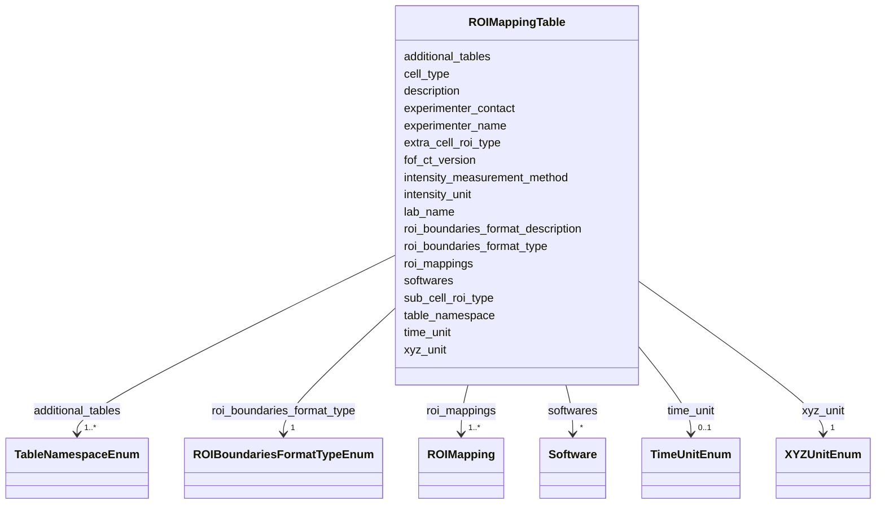

---
search:
  boost: 10.0
---

# Class: ROIMappingTable 


_The Cell/ROI Mapping table of a FOF-bas-CT dataset (namespace: 4dn_FOF-CT_mapping). This class represents the entire file: it holds all dataset-level provenance metadata (recorded as header lines in the TSV serialisation) together with the full collection of ROI boundary records (recorded as data rows). This table is conditionally required whenever a Cell Data table, a Sub-Cell ROI Data table, or an Extra-Cell ROI Data table is deposited. Analogous to the MappingSet class in SSSOM._


<div data-search-exclude markdown="1">


URI: [fof_ct:ROIMappingTable](https://w3id.org/fof-ct/ROIMappingTable)





<!-- no inheritance hierarchy -->

## Class Properties

| Property | Value |
| --- | --- |
| Tree Root | Yes |


## Slots

| Name | Cardinality and Range | Description | Inheritance |
| ---  | --- | --- | --- |
| [fof_ct_version](fof_ct_version.md) | 1 <br/> [String](String.md) | Version of the FOF-CT format used in this file | direct |
| [table_namespace](table_namespace.md) | 1 <br/> [String](String.md) | Identifier for this table type | direct |
| [roi_boundaries_format_type](roi_boundaries_format_type.md) | 1 <br/> [ROIBoundariesFormatTypeEnum](ROIBoundariesFormatTypeEnum.md) | Controlled-vocabulary identifier of the standard used to encode ROI boundarie... | direct |
| [xyz_unit](xyz_unit.md) | 1 <br/> [XYZUnitEnum](XYZUnitEnum.md) | Unit used to represent X, Y, Z spatial coordinates or distances in this table | direct |
| [lab_name](lab_name.md) | 1 <br/> [String](String.md) | Name of the laboratory where the experiment was performed | direct |
| [experimenter_name](experimenter_name.md) | 1 <br/> [String](String.md) | Full name of the person who performed the experiment | direct |
| [experimenter_contact](experimenter_contact.md) | 1 <br/> [String](String.md) | Email address of the person who performed the experiment | direct |
| [description](description.md) | 1 <br/> [String](String.md) | Free-text description of the experiment and of the data recorded in this tabl... | direct |
| [additional_tables](additional_tables.md) | 1..* <br/> [TableNamespaceEnum](TableNamespaceEnum.md) | List of additional FOF-CT table namespaces being submitted alongside this tab... | direct |
| [roi_boundaries_format_description](roi_boundaries_format_description.md) | 0..1 <br/> [String](String.md) | Free-text description of how ROI boundaries are encoded, beyond what the form... | direct |
| [cell_type](cell_type.md) | 0..1 <br/> [String](String.md) | The type of cells present in this dataset, expressed using an ontology term f... | direct |
| [sub_cell_roi_type](sub_cell_roi_type.md) | 0..1 <br/> [String](String.md) | The type of sub-cellular structure ROI documented in this table or mapping fi... | direct |
| [extra_cell_roi_type](extra_cell_roi_type.md) | 0..1 <br/> [String](String.md) | The type of extracellular structure ROI within which cells are embedded, expr... | direct |
| [softwares](softwares.md) | * <br/> [Software](Software.md) | One or more Software entries documenting every tool used to produce or proces... | direct |
| [time_unit](time_unit.md) | 0..1 <br/> [TimeUnitEnum](TimeUnitEnum.md) | Unit used to represent time intervals in this table | direct |
| [intensity_unit](intensity_unit.md) | 0..1 <br/> [String](String.md) | Unit used to represent intensity measurements in this table | direct |
| [intensity_measurement_method](intensity_measurement_method.md) | 0..1 <br/> [String](String.md) | Method used to perform intensity measurements, including how digital signals ... | direct |
| [roi_mappings](roi_mappings.md) | 1..* <br/> [ROIMapping](ROIMapping.md) | The complete collection of ROI boundary records constituting this dataset | direct |


## Usages

| used by | used in | type | used |
| ---  | --- | --- | --- |
| [ROIMappingTable](ROIMappingTable.md) | [roi_boundaries_format_type](roi_boundaries_format_type.md) | domain | [ROIMappingTable](ROIMappingTable.md) |
| [ROIMappingTable](ROIMappingTable.md) | [roi_boundaries_format_description](roi_boundaries_format_description.md) | domain | [ROIMappingTable](ROIMappingTable.md) |
| [ROIMappingTable](ROIMappingTable.md) | [roi_mappings](roi_mappings.md) | domain | [ROIMappingTable](ROIMappingTable.md) |


## Identifier and Mapping Information


### Schema Source


* from schema: https://w3id.org/fof-ct/vol


## Mappings

| Mapping Type | Mapped Value |
| ---  | ---  |
| self | fof_ct:ROIMappingTable |
| native | fof_ct:ROIMappingTable |


## LinkML Source

<!-- TODO: investigate https://stackoverflow.com/questions/37606292/how-to-create-tabbed-code-blocks-in-mkdocs-or-sphinx -->

### Direct

<details>
```yaml
name: ROIMappingTable
description: 'The Cell/ROI Mapping table of a FOF-bas-CT dataset (namespace: 4dn_FOF-CT_mapping).
  This class represents the entire file: it holds all dataset-level provenance metadata
  (recorded as header lines in the TSV serialisation) together with the full collection
  of ROI boundary records (recorded as data rows). This table is conditionally required
  whenever a Cell Data table, a Sub-Cell ROI Data table, or an Extra-Cell ROI Data
  table is deposited. Analogous to the MappingSet class in SSSOM.'
from_schema: https://w3id.org/fof-ct/vol
slots:
- fof_ct_version
- table_namespace
- roi_boundaries_format_type
- xyz_unit
- lab_name
- experimenter_name
- experimenter_contact
- description
- additional_tables
- roi_boundaries_format_description
- cell_type
- sub_cell_roi_type
- extra_cell_roi_type
- softwares
- time_unit
- intensity_unit
- intensity_measurement_method
- roi_mappings
slot_usage:
  fof_ct_version:
    name: fof_ct_version
    required: true
  table_namespace:
    name: table_namespace
    required: true
    equals_string: 4dn_FOF-CT_mapping
  roi_boundaries_format_type:
    name: roi_boundaries_format_type
    required: true
  roi_boundaries_format_description:
    name: roi_boundaries_format_description
    description: 'Free-text description of how ROI boundaries are encoded, beyond
      what the format name alone conveys (e.g. coordinate order, dimensionality, or
      an external file reference). Conditionally required (content-triggered): MANDATORY
      when roi_boundaries_format_type is ''Other''; otherwise recommended.'
    required: false
  xyz_unit:
    name: xyz_unit
    required: true
  lab_name:
    name: lab_name
    required: true
  experimenter_name:
    name: experimenter_name
    required: true
  experimenter_contact:
    name: experimenter_contact
    required: true
  description:
    name: description
    required: true
  additional_tables:
    name: additional_tables
    required: true
  cell_type:
    name: cell_type
    required: false
  sub_cell_roi_type:
    name: sub_cell_roi_type
    required: false
  extra_cell_roi_type:
    name: extra_cell_roi_type
    required: false
  softwares:
    name: softwares
    range: Software
    required: false
    multivalued: true
  time_unit:
    name: time_unit
    required: false
  intensity_unit:
    name: intensity_unit
    required: false
  intensity_measurement_method:
    name: intensity_measurement_method
    required: false
  roi_mappings:
    name: roi_mappings
    required: true
tree_root: true

```
</details>

### Induced

<details>
```yaml
name: ROIMappingTable
description: 'The Cell/ROI Mapping table of a FOF-bas-CT dataset (namespace: 4dn_FOF-CT_mapping).
  This class represents the entire file: it holds all dataset-level provenance metadata
  (recorded as header lines in the TSV serialisation) together with the full collection
  of ROI boundary records (recorded as data rows). This table is conditionally required
  whenever a Cell Data table, a Sub-Cell ROI Data table, or an Extra-Cell ROI Data
  table is deposited. Analogous to the MappingSet class in SSSOM.'
from_schema: https://w3id.org/fof-ct/vol
slot_usage:
  fof_ct_version:
    name: fof_ct_version
    required: true
  table_namespace:
    name: table_namespace
    required: true
    equals_string: 4dn_FOF-CT_mapping
  roi_boundaries_format_type:
    name: roi_boundaries_format_type
    required: true
  roi_boundaries_format_description:
    name: roi_boundaries_format_description
    description: 'Free-text description of how ROI boundaries are encoded, beyond
      what the format name alone conveys (e.g. coordinate order, dimensionality, or
      an external file reference). Conditionally required (content-triggered): MANDATORY
      when roi_boundaries_format_type is ''Other''; otherwise recommended.'
    required: false
  xyz_unit:
    name: xyz_unit
    required: true
  lab_name:
    name: lab_name
    required: true
  experimenter_name:
    name: experimenter_name
    required: true
  experimenter_contact:
    name: experimenter_contact
    required: true
  description:
    name: description
    required: true
  additional_tables:
    name: additional_tables
    required: true
  cell_type:
    name: cell_type
    required: false
  sub_cell_roi_type:
    name: sub_cell_roi_type
    required: false
  extra_cell_roi_type:
    name: extra_cell_roi_type
    required: false
  softwares:
    name: softwares
    range: Software
    required: false
    multivalued: true
  time_unit:
    name: time_unit
    required: false
  intensity_unit:
    name: intensity_unit
    required: false
  intensity_measurement_method:
    name: intensity_measurement_method
    required: false
  roi_mappings:
    name: roi_mappings
    required: true
attributes:
  fof_ct_version:
    name: fof_ct_version
    description: Version of the FOF-CT format used in this file. Always the first
      line of the file header (##FOF-CT_Version=).
    examples:
    - value: v1.0
    from_schema: https://w3id.org/fof-ct/vol
    rank: 1000
    owner: ROIMappingTable
    domain_of:
    - SpotTable
    - DemultiplexingTable
    - TraceTable
    - RNASpotTable
    - SpotQualityTable
    - RNASpotQualityTable
    - SpotBiologicalTable
    - RNASpotBiologicalTable
    - CellTable
    - ExtraCellROITable
    - SubCellROITable
    - ROIMappingTable
    - SMLocalizationTable
    - SMLocalizationQualityTable
    - UndecodedLocalizationTable
    range: string
    required: true
    pattern: ^v[0-9]+\.[0-9]+
  table_namespace:
    name: table_namespace
    description: 'Identifier for this table type. The required value is specific to
      each table. Written as ##Table_Namespace= in the file header.'
    from_schema: https://w3id.org/fof-ct/vol
    rank: 1000
    owner: ROIMappingTable
    domain_of:
    - SpotTable
    - DemultiplexingTable
    - TraceTable
    - RNASpotTable
    - SpotQualityTable
    - RNASpotQualityTable
    - SpotBiologicalTable
    - RNASpotBiologicalTable
    - CellTable
    - ExtraCellROITable
    - SubCellROITable
    - ROIMappingTable
    - SMLocalizationTable
    - SMLocalizationQualityTable
    - UndecodedLocalizationTable
    range: string
    required: true
    equals_string: 4dn_FOF-CT_mapping
  roi_boundaries_format_type:
    name: roi_boundaries_format_type
    description: 'Controlled-vocabulary identifier of the standard used to encode
      ROI boundaries in global coordinates (e.g. OME_Polygon for the OME ROI data
      model, or Mesh_OBJ for a 3D OBJ mesh). Written as ##ROI_Boundaries_Format_Type=
      in the file header. Default value is OME_Polygon.'
    examples:
    - value: OME_Polygon
    - value: Mesh_OBJ
    from_schema: https://w3id.org/fof-ct/vol
    rank: 1000
    domain: ROIMappingTable
    owner: ROIMappingTable
    domain_of:
    - ROIMappingTable
    range: ROIBoundariesFormatTypeEnum
    required: true
  xyz_unit:
    name: xyz_unit
    description: 'Unit used to represent X, Y, Z spatial coordinates or distances
      in this table. Use ''micron'' to avoid issues with Greek symbols. Values should
      be drawn from SI units of length. Written as ##XYZ_Unit= in the file header.
      Mandatory in every FOF-CT table.'
    examples:
    - value: micron
    from_schema: https://w3id.org/fof-ct/vol
    rank: 1000
    owner: ROIMappingTable
    domain_of:
    - SpotTable
    - DemultiplexingTable
    - TraceTable
    - RNASpotTable
    - SpotQualityTable
    - RNASpotQualityTable
    - SpotBiologicalTable
    - RNASpotBiologicalTable
    - CellTable
    - ExtraCellROITable
    - SubCellROITable
    - ROIMappingTable
    - SMLocalizationTable
    - SMLocalizationQualityTable
    - UndecodedLocalizationTable
    range: XYZUnitEnum
    required: true
  lab_name:
    name: lab_name
    description: 'Name of the laboratory where the experiment was performed. Written
      as #Lab_Name: in the file header.'
    examples:
    - value: Nobel
    from_schema: https://w3id.org/fof-ct/vol
    rank: 1000
    owner: ROIMappingTable
    domain_of:
    - SpotTable
    - DemultiplexingTable
    - TraceTable
    - RNASpotTable
    - SpotQualityTable
    - RNASpotQualityTable
    - SpotBiologicalTable
    - RNASpotBiologicalTable
    - CellTable
    - ExtraCellROITable
    - SubCellROITable
    - ROIMappingTable
    - SMLocalizationTable
    - SMLocalizationQualityTable
    - UndecodedLocalizationTable
    range: string
    required: true
  experimenter_name:
    name: experimenter_name
    description: 'Full name of the person who performed the experiment. Written as
      #Experimenter_Name: in the file header.'
    examples:
    - value: John Doe
    from_schema: https://w3id.org/fof-ct/vol
    rank: 1000
    owner: ROIMappingTable
    domain_of:
    - SpotTable
    - DemultiplexingTable
    - TraceTable
    - RNASpotTable
    - SpotQualityTable
    - RNASpotQualityTable
    - SpotBiologicalTable
    - RNASpotBiologicalTable
    - CellTable
    - ExtraCellROITable
    - SubCellROITable
    - ROIMappingTable
    - SMLocalizationTable
    - SMLocalizationQualityTable
    - UndecodedLocalizationTable
    range: string
    required: true
  experimenter_contact:
    name: experimenter_contact
    description: 'Email address of the person who performed the experiment. Written
      as #Experimenter_Contact: in the file header.'
    examples:
    - value: john.doe@email.com
    from_schema: https://w3id.org/fof-ct/vol
    rank: 1000
    owner: ROIMappingTable
    domain_of:
    - SpotTable
    - DemultiplexingTable
    - TraceTable
    - RNASpotTable
    - SpotQualityTable
    - RNASpotQualityTable
    - SpotBiologicalTable
    - RNASpotBiologicalTable
    - CellTable
    - ExtraCellROITable
    - SubCellROITable
    - ROIMappingTable
    - SMLocalizationTable
    - SMLocalizationQualityTable
    - UndecodedLocalizationTable
    range: string
    required: true
    pattern: ^[^@\s]+@[^@\s]+\.[^@\s]+$
  description:
    name: description
    description: 'Free-text description of the experiment and of the data recorded
      in this table. Should provide sufficient detail for interpretation and reproducibility.
      Written as #Description: in the file header.'
    from_schema: https://w3id.org/fof-ct/vol
    rank: 1000
    owner: ROIMappingTable
    domain_of:
    - SpotTable
    - DemultiplexingTable
    - TraceTable
    - RNASpotTable
    - SpotQualityTable
    - RNASpotQualityTable
    - SpotBiologicalTable
    - RNASpotBiologicalTable
    - CellTable
    - ExtraCellROITable
    - SubCellROITable
    - ROIMappingTable
    - SMLocalizationTable
    - SMLocalizationQualityTable
    - UndecodedLocalizationTable
    range: string
    required: true
  additional_tables:
    name: additional_tables
    description: 'List of additional FOF-CT table namespaces being submitted alongside
      this table, separated by commas in the TSV header. Written as #Additional_Tables:
      in the file header.'
    from_schema: https://w3id.org/fof-ct/vol
    rank: 1000
    owner: ROIMappingTable
    domain_of:
    - SpotTable
    - DemultiplexingTable
    - TraceTable
    - RNASpotTable
    - SpotQualityTable
    - RNASpotQualityTable
    - SpotBiologicalTable
    - RNASpotBiologicalTable
    - CellTable
    - ExtraCellROITable
    - SubCellROITable
    - ROIMappingTable
    - SMLocalizationTable
    - SMLocalizationQualityTable
    - UndecodedLocalizationTable
    range: TableNamespaceEnum
    required: true
    multivalued: true
  roi_boundaries_format_description:
    name: roi_boundaries_format_description
    description: 'Free-text description of how ROI boundaries are encoded, beyond
      what the format name alone conveys (e.g. coordinate order, dimensionality, or
      an external file reference). Conditionally required (content-triggered): MANDATORY
      when roi_boundaries_format_type is ''Other''; otherwise recommended.'
    examples:
    - value: Cell boundaries are reported in global coordinates as lists of comma
        separated x,y coordinates separated by spaces like "x1,y1 x2,y2 x3,y3" (e.g.
        "0,0 1,2 3,5").
    from_schema: https://w3id.org/fof-ct/vol
    rank: 1000
    domain: ROIMappingTable
    owner: ROIMappingTable
    domain_of:
    - ROIMappingTable
    range: string
    required: false
  cell_type:
    name: cell_type
    description: 'The type of cells present in this dataset, expressed using an ontology
      term from the Experimental Factor Ontology (EFO). Examples include "Primary
      cell line", "Immortal cell line", "Induced pluripotent stem (IPS) cell", "Cell
      in tissue", "Cell in organoid", "Other". Written as #Cell_Type: in the file
      header.'
    examples:
    - value: Cell in tissue
    - value: Cell in organoid
    from_schema: https://w3id.org/fof-ct/vol
    rank: 1000
    owner: ROIMappingTable
    domain_of:
    - CellTable
    - SubCellROITable
    - ROIMappingTable
    range: string
    required: false
  sub_cell_roi_type:
    name: sub_cell_roi_type
    description: 'The type of sub-cellular structure ROI documented in this table
      or mapping file. It is recommended to use a GO ''cellular_component'' child
      term. Examples include Nucleolus, Nuclear Lamina (NL), Nuclear Pore Complex
      (NPC), PML_body, Cajal_body, Chromosome_Domain. Written as #Sub_Cell_ROI_Type:
      in the file header.'
    examples:
    - value: Nucleolus
    - value: Nuclear Lamina (NL)
    - value: Nuclear Pore Complex (NPC)
    - value: Chromosome_Domain
    from_schema: https://w3id.org/fof-ct/vol
    rank: 1000
    owner: ROIMappingTable
    domain_of:
    - SubCellROITable
    - ROIMappingTable
    range: string
    required: false
  extra_cell_roi_type:
    name: extra_cell_roi_type
    description: 'The type of extracellular structure ROI within which cells are embedded,
      expressed using an EFO ''organism part'' child term (e.g. Tissue, Organoid).
      Conditionally required when extracellular structure ROIs are identified and
      reported in a dedicated Extra-Cell ROI Data table. Written as #Extra_Cell_ROI_Type:
      in the file header.'
    examples:
    - value: Tissue
    - value: Organoid
    from_schema: https://w3id.org/fof-ct/vol
    rank: 1000
    owner: ROIMappingTable
    domain_of:
    - CellTable
    - ExtraCellROITable
    - ROIMappingTable
    range: string
    required: false
  softwares:
    name: softwares
    description: 'One or more Software entries documenting every tool used to produce
      or process data in this table. Written as repeating #Software_* blocks in the
      file header.'
    from_schema: https://w3id.org/fof-ct/vol
    rank: 1000
    owner: ROIMappingTable
    domain_of:
    - SpotTable
    - DemultiplexingTable
    - TraceTable
    - RNASpotTable
    - SpotQualityTable
    - RNASpotQualityTable
    - SpotBiologicalTable
    - RNASpotBiologicalTable
    - CellTable
    - ExtraCellROITable
    - SubCellROITable
    - ROIMappingTable
    - SMLocalizationTable
    - SMLocalizationQualityTable
    - UndecodedLocalizationTable
    range: Software
    required: false
    multivalued: true
    inlined: true
    inlined_as_list: true
  time_unit:
    name: time_unit
    description: 'Unit used to represent time intervals in this table. Allowed values
      are SI time units plus ''min'' and ''hr''. Written as ##Time_Unit= in the file
      header. Conditionally required (metric- triggered) when any time metric is reported
      in an optional column.'
    examples:
    - value: sec
    from_schema: https://w3id.org/fof-ct/vol
    rank: 1000
    owner: ROIMappingTable
    domain_of:
    - DemultiplexingTable
    - TraceTable
    - SpotQualityTable
    - RNASpotQualityTable
    - SpotBiologicalTable
    - RNASpotBiologicalTable
    - CellTable
    - ExtraCellROITable
    - SubCellROITable
    - ROIMappingTable
    - SMLocalizationTable
    - SMLocalizationQualityTable
    - UndecodedLocalizationTable
    range: TimeUnitEnum
    required: false
  intensity_unit:
    name: intensity_unit
    description: 'Unit used to represent intensity measurements in this table. Written
      as ##Intensity_Unit= in the file header. Conditionally required (metric-triggered)
      when any intensity metric is reported in an optional column.'
    examples:
    - value: a.u.
    - value: photons
    from_schema: https://w3id.org/fof-ct/vol
    rank: 1000
    owner: ROIMappingTable
    domain_of:
    - DemultiplexingTable
    - TraceTable
    - SpotQualityTable
    - RNASpotQualityTable
    - SpotBiologicalTable
    - RNASpotBiologicalTable
    - CellTable
    - ExtraCellROITable
    - SubCellROITable
    - ROIMappingTable
    - SMLocalizationTable
    - SMLocalizationQualityTable
    - UndecodedLocalizationTable
    range: string
    required: false
  intensity_measurement_method:
    name: intensity_measurement_method
    description: 'Method used to perform intensity measurements, including how digital
      signals were converted to photon counts. Written as #Intensity_Measurement_Method:
      in the file header. Conditionally required (metric-triggered) when any intensity
      metric is reported.'
    examples:
    - value: Localization centroid intensity
    - value: Mean Fluorescence Intensity
    from_schema: https://w3id.org/fof-ct/vol
    rank: 1000
    owner: ROIMappingTable
    domain_of:
    - DemultiplexingTable
    - TraceTable
    - SpotQualityTable
    - RNASpotQualityTable
    - SpotBiologicalTable
    - RNASpotBiologicalTable
    - CellTable
    - ExtraCellROITable
    - SubCellROITable
    - ROIMappingTable
    - SMLocalizationTable
    - SMLocalizationQualityTable
    - UndecodedLocalizationTable
    range: string
    required: false
  roi_mappings:
    name: roi_mappings
    description: The complete collection of ROI boundary records constituting this
      dataset. Each ROIMapping corresponds to one data row in the TSV serialisation.
    from_schema: https://w3id.org/fof-ct/vol
    rank: 1000
    domain: ROIMappingTable
    owner: ROIMappingTable
    domain_of:
    - ROIMappingTable
    range: ROIMapping
    required: true
    multivalued: true
    inlined: true
    inlined_as_list: true
tree_root: true

```
</details></div>