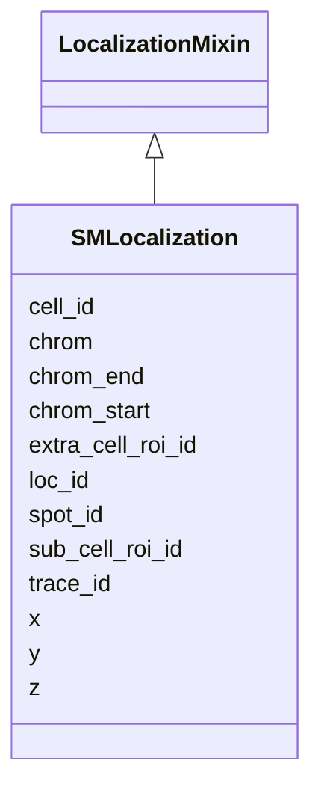

---
search:
  boost: 10.0
---

# Class: SMLocalization 


_A single individual single-molecule (SM) localization event in a FOF-vol-CT dataset. Each instance corresponds to one row in the TSV data section of the SM Localization Data table. The loc_id field is the primary key; spot_id links this localization to its parent Spot (if Spot/Trace post-processing was performed); trace_id links it to its parent Trace. Sub_Cell_ROI_ID, Cell_ID and Extra_Cell_ROI_ID optionally link the localization to spatial context tables._


<div data-search-exclude markdown="1">


URI: [fof_ct:SMLocalization](https://w3id.org/fof-ct/SMLocalization)





## Inheritance
* **SMLocalization** [ [LocalizationMixin](LocalizationMixin.md)]


## Slots

| Name | Cardinality and Range | Description | Inheritance |
| ---  | --- | --- | --- |
| [spot_id](spot_id.md) | 0..1 <br/> [Integer](Integer.md) | Identifier of the Spot (centroid of the SM localization cloud) to which this ... | direct |
| [trace_id](trace_id.md) | 0..1 <br/> [Integer](Integer.md) | Identifier of the chromatin Trace to which this localization belongs | direct |
| [chrom](chrom.md) | 1 <br/> [String](String.md) | Chromosome name using BED (Browser Extensible Data) convention (e | direct |
| [chrom_start](chrom_start.md) | 1 <br/> [Integer](Integer.md) | 0-based start coordinate on the chromosome for the genomic target sequence as... | direct |
| [chrom_end](chrom_end.md) | 1 <br/> [Integer](Integer.md) | Non-inclusive end coordinate on the chromosome for the genomic target sequenc... | direct |
| [sub_cell_roi_id](sub_cell_roi_id.md) | 0..1 <br/> [Integer](Integer.md) | Unique identifier for a sub-cellular structure ROI (e | direct |
| [cell_id](cell_id.md) | 0..1 <br/> [Integer](Integer.md) | Unique identifier for a Cell | direct |
| [extra_cell_roi_id](extra_cell_roi_id.md) | 0..1 <br/> [Integer](Integer.md) | Unique identifier for an extracellular structure ROI (e | direct |
| [loc_id](loc_id.md) | 1 <br/> [Integer](Integer.md) | Unique integer identifier for this SM localization event | [LocalizationMixin](LocalizationMixin.md) |
| [x](x.md) | 1 <br/> [Float](Float.md) | Sub-pixel X coordinate of this SM localization event in the unit specified by... | [LocalizationMixin](LocalizationMixin.md) |
| [y](y.md) | 1 <br/> [Float](Float.md) | Sub-pixel Y coordinate of this detected event (Spot or localisation) in the u... | [LocalizationMixin](LocalizationMixin.md) |
| [z](z.md) | 1 <br/> [Float](Float.md) | Sub-pixel Z coordinate of this detected event (Spot or localisation) in the u... | [LocalizationMixin](LocalizationMixin.md) |


## Usages

| used by | used in | type | used |
| ---  | --- | --- | --- |
| [SMLocalizationTable](SMLocalizationTable.md) | [sm_localizations](sm_localizations.md) | range | [SMLocalization](SMLocalization.md) |


## Identifier and Mapping Information


### Schema Source


* from schema: https://w3id.org/fof-ct/vol


## Mappings

| Mapping Type | Mapped Value |
| ---  | ---  |
| self | fof_ct:SMLocalization |
| native | fof_ct:SMLocalization |


## LinkML Source

<!-- TODO: investigate https://stackoverflow.com/questions/37606292/how-to-create-tabbed-code-blocks-in-mkdocs-or-sphinx -->

### Direct

<details>
```yaml
name: SMLocalization
description: A single individual single-molecule (SM) localization event in a FOF-vol-CT
  dataset. Each instance corresponds to one row in the TSV data section of the SM
  Localization Data table. The loc_id field is the primary key; spot_id links this
  localization to its parent Spot (if Spot/Trace post-processing was performed); trace_id
  links it to its parent Trace. Sub_Cell_ROI_ID, Cell_ID and Extra_Cell_ROI_ID optionally
  link the localization to spatial context tables.
from_schema: https://w3id.org/fof-ct/vol
mixins:
- LocalizationMixin
slots:
- spot_id
- trace_id
- chrom
- chrom_start
- chrom_end
- sub_cell_roi_id
- cell_id
- extra_cell_roi_id
slot_usage:
  loc_id:
    name: loc_id
    description: Unique integer identifier for this SM localization event. Loc_ID
      values are unique across the entire dataset.
    identifier: true
    required: true
  x:
    name: x
    description: Sub-pixel X coordinate of this SM localization event in the unit
      specified by xyz_unit. The reported value is the final position after all post-processing
      corrections.
    required: true
  y:
    name: y
    required: true
  z:
    name: z
    required: true
  spot_id:
    name: spot_id
    description: Identifier of the Spot (centroid of the SM localization cloud) to
      which this localization belongs. Conditionally required when Spot/Trace post-processing
      results are reported.
    required: false
  trace_id:
    name: trace_id
    description: Identifier of the chromatin Trace to which this localization belongs.
      Conditionally required when Trace results are reported.
    required: false
  chrom:
    name: chrom
    required: true
  chrom_start:
    name: chrom_start
    required: true
  chrom_end:
    name: chrom_end
    required: true
  sub_cell_roi_id:
    name: sub_cell_roi_id
    required: false
  cell_id:
    name: cell_id
    required: false
  extra_cell_roi_id:
    name: extra_cell_roi_id
    required: false

```
</details>

### Induced

<details>
```yaml
name: SMLocalization
description: A single individual single-molecule (SM) localization event in a FOF-vol-CT
  dataset. Each instance corresponds to one row in the TSV data section of the SM
  Localization Data table. The loc_id field is the primary key; spot_id links this
  localization to its parent Spot (if Spot/Trace post-processing was performed); trace_id
  links it to its parent Trace. Sub_Cell_ROI_ID, Cell_ID and Extra_Cell_ROI_ID optionally
  link the localization to spatial context tables.
from_schema: https://w3id.org/fof-ct/vol
mixins:
- LocalizationMixin
slot_usage:
  loc_id:
    name: loc_id
    description: Unique integer identifier for this SM localization event. Loc_ID
      values are unique across the entire dataset.
    identifier: true
    required: true
  x:
    name: x
    description: Sub-pixel X coordinate of this SM localization event in the unit
      specified by xyz_unit. The reported value is the final position after all post-processing
      corrections.
    required: true
  y:
    name: y
    required: true
  z:
    name: z
    required: true
  spot_id:
    name: spot_id
    description: Identifier of the Spot (centroid of the SM localization cloud) to
      which this localization belongs. Conditionally required when Spot/Trace post-processing
      results are reported.
    required: false
  trace_id:
    name: trace_id
    description: Identifier of the chromatin Trace to which this localization belongs.
      Conditionally required when Trace results are reported.
    required: false
  chrom:
    name: chrom
    required: true
  chrom_start:
    name: chrom_start
    required: true
  chrom_end:
    name: chrom_end
    required: true
  sub_cell_roi_id:
    name: sub_cell_roi_id
    required: false
  cell_id:
    name: cell_id
    required: false
  extra_cell_roi_id:
    name: extra_cell_roi_id
    required: false
attributes:
  spot_id:
    name: spot_id
    description: Identifier of the Spot (centroid of the SM localization cloud) to
      which this localization belongs. Conditionally required when Spot/Trace post-processing
      results are reported.
    examples:
    - value: '1'
    from_schema: https://w3id.org/fof-ct/vol
    rank: 1000
    owner: SMLocalization
    domain_of:
    - Spot
    - Localization
    - SpotQualityRecord
    - SpotBiologicalRecord
    - SMLocalization
    range: integer
    required: false
  trace_id:
    name: trace_id
    description: Identifier of the chromatin Trace to which this localization belongs.
      Conditionally required when Trace results are reported.
    examples:
    - value: '1'
    from_schema: https://w3id.org/fof-ct/vol
    rank: 1000
    owner: SMLocalization
    domain_of:
    - Spot
    - Trace
    - RNASpot
    - SMLocalization
    range: integer
    required: false
  chrom:
    name: chrom
    description: Chromosome name using BED (Browser Extensible Data) convention (e.g.,
      chr3, chrY, chr2_random).
    examples:
    - value: chr3
    - value: chrY
    - value: chr2_random
    from_schema: https://w3id.org/fof-ct/vol
    rank: 1000
    domain: Spot
    owner: SMLocalization
    domain_of:
    - Spot
    - SMLocalization
    range: string
    required: true
  chrom_start:
    name: chrom_start
    description: 0-based start coordinate on the chromosome for the genomic target
      sequence associated with this Spot, following BED convention.
    examples:
    - value: '0'
    from_schema: https://w3id.org/fof-ct/vol
    rank: 1000
    domain: Spot
    owner: SMLocalization
    domain_of:
    - Spot
    - SMLocalization
    range: integer
    required: true
    minimum_value: 0
  chrom_end:
    name: chrom_end
    description: Non-inclusive end coordinate on the chromosome for the genomic target
      sequence associated with this Spot, following BED convention.
    examples:
    - value: '1000'
    from_schema: https://w3id.org/fof-ct/vol
    rank: 1000
    domain: Spot
    owner: SMLocalization
    domain_of:
    - Spot
    - SMLocalization
    range: integer
    required: true
    minimum_value: 0
  sub_cell_roi_id:
    name: sub_cell_roi_id
    description: Unique identifier for a sub-cellular structure ROI (e.g., nucleus,
      nucleolus). Links to the Sub-Cell ROI Data table.
    examples:
    - value: '1'
    from_schema: https://w3id.org/fof-ct/vol
    rank: 1000
    owner: SMLocalization
    domain_of:
    - Spot
    - RNASpot
    - SubCellROI
    - ROIMapping
    - SMLocalization
    range: integer
    required: false
  cell_id:
    name: cell_id
    description: Unique identifier for a Cell. Links to the Cell Data table.
    examples:
    - value: '1'
    from_schema: https://w3id.org/fof-ct/vol
    rank: 1000
    owner: SMLocalization
    domain_of:
    - Spot
    - RNASpot
    - Cell
    - SubCellROI
    - ROIMapping
    - SMLocalization
    range: integer
    required: false
  extra_cell_roi_id:
    name: extra_cell_roi_id
    description: Unique identifier for an extracellular structure ROI (e.g., tissue,
      organoid). Links to the Extra-Cell ROI Data table.
    examples:
    - value: '1'
    from_schema: https://w3id.org/fof-ct/vol
    rank: 1000
    owner: SMLocalization
    domain_of:
    - Spot
    - RNASpot
    - Cell
    - ExtraCellROI
    - ROIMapping
    - SMLocalization
    range: integer
    required: false
  loc_id:
    name: loc_id
    description: Unique integer identifier for this SM localization event. Loc_ID
      values are unique across the entire dataset.
    examples:
    - value: '1'
    from_schema: https://w3id.org/fof-ct/vol
    rank: 1000
    identifier: true
    owner: SMLocalization
    domain_of:
    - LocalizationMixin
    - SMLocalizationQualityRecord
    range: integer
    required: true
  x:
    name: x
    description: Sub-pixel X coordinate of this SM localization event in the unit
      specified by xyz_unit. The reported value is the final position after all post-processing
      corrections.
    examples:
    - value: '14.43'
    from_schema: https://w3id.org/fof-ct/vol
    rank: 1000
    owner: SMLocalization
    domain_of:
    - LocalizationMixin
    - Spot
    - RNASpot
    range: float
    required: true
  y:
    name: y
    description: Sub-pixel Y coordinate of this detected event (Spot or localisation)
      in the unit specified by xyz_unit. The reported value is the final position
      after all post-processing corrections.
    examples:
    - value: '41.43'
    from_schema: https://w3id.org/fof-ct/vol
    rank: 1000
    owner: SMLocalization
    domain_of:
    - LocalizationMixin
    - Spot
    - RNASpot
    range: float
    required: true
  z:
    name: z
    description: Sub-pixel Z coordinate of this detected event (Spot or localisation)
      in the unit specified by xyz_unit. The reported value is the final position
      after all post-processing corrections.
    examples:
    - value: '1.23'
    from_schema: https://w3id.org/fof-ct/vol
    rank: 1000
    owner: SMLocalization
    domain_of:
    - LocalizationMixin
    - Spot
    - RNASpot
    range: float
    required: true

```
</details></div>