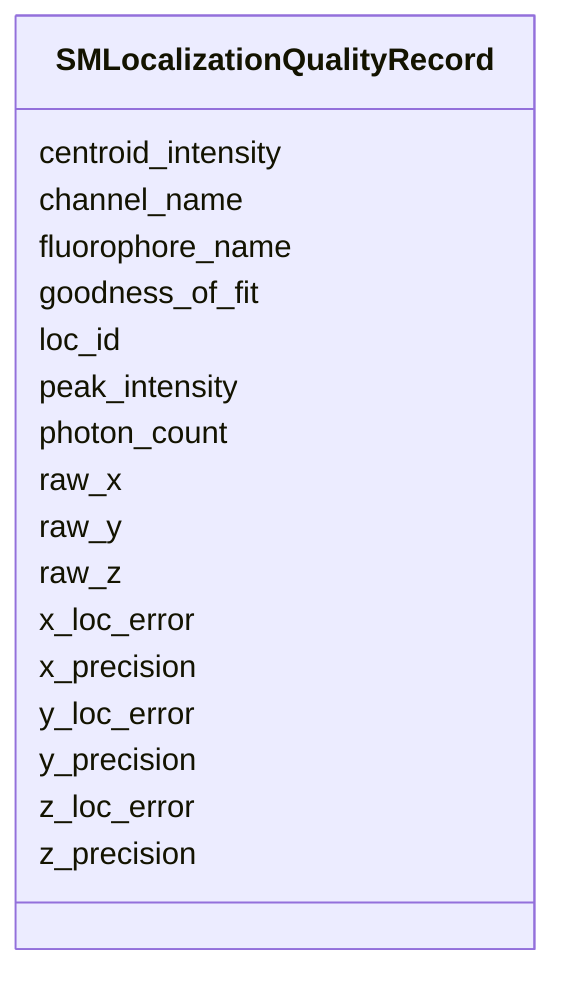

---
search:
  boost: 10.0
---

# Class: SMLocalizationQualityRecord 


_A single row in the SM Localization Quality table. Each instance captures quality metrics for one SM localization event identified by Loc_ID. Loc_ID, Channel and Fluor are mandatory. X_Loc_Precision, Y_Loc_Precision, Z_Loc_Precision and Photon_Count are highly recommended but not literally mandatory. All other reserved metric columns are conditionally required (use of the reserved name is optional, but mandatory if that metric is reported). Additional user-defined optional columns must be described in the file header._


<div data-search-exclude markdown="1">


URI: [fof_ct:SMLocalizationQualityRecord](https://w3id.org/fof-ct/SMLocalizationQualityRecord)





<!-- no inheritance hierarchy -->

## Slots

| Name | Cardinality and Range | Description | Inheritance |
| ---  | --- | --- | --- |
| [loc_id](loc_id.md) | 1 <br/> [Integer](Integer.md) | Unique integer identifier for the SM localization event to which these qualit... | direct |
| [channel_name](channel_name.md) | 1 <br/> [String](String.md) | The wavelength characteristics of the emission channel used to image this Spo... | direct |
| [fluorophore_name](fluorophore_name.md) | 1 <br/> [String](String.md) | The name of the fluorophore whose emission was used to detect this Spot / RNA... | direct |
| [x_precision](x_precision.md) | 0..1 <br/> [Float](Float.md) | Highly recommended (not literally mandatory): X_Loc_Precision | direct |
| [y_precision](y_precision.md) | 0..1 <br/> [Float](Float.md) | Highly recommended (not literally mandatory): Y_Loc_Precision | direct |
| [z_precision](z_precision.md) | 0..1 <br/> [Float](Float.md) | Highly recommended (not literally mandatory): Z_Loc_Precision | direct |
| [photon_count](photon_count.md) | 0..1 <br/> [Integer](Integer.md) | Highly recommended: number of photons detected for this localization | direct |
| [goodness_of_fit](goodness_of_fit.md) | 0..1 <br/> [Float](Float.md) | Metric quantifying how well the fitted model matches the observed signal (e | direct |
| [centroid_intensity](centroid_intensity.md) | 0..1 <br/> [Float](Float.md) | Signal intensity of the centroid pixel of the Spot / localization | direct |
| [peak_intensity](peak_intensity.md) | 0..1 <br/> [Float](Float.md) | Signal intensity of the brightest pixel within the Spot / localization bounda... | direct |
| [raw_x](raw_x.md) | 0..1 <br/> [Float](Float.md) | X coordinate before any post-processing corrections (drift correction, chroma... | direct |
| [raw_y](raw_y.md) | 0..1 <br/> [Float](Float.md) | Y coordinate before any post-processing corrections | direct |
| [raw_z](raw_z.md) | 0..1 <br/> [Float](Float.md) | Z coordinate before any post-processing corrections | direct |
| [x_loc_error](x_loc_error.md) | 0..1 <br/> [Float](Float.md) | Localization error estimate for the X coordinate (e | direct |
| [y_loc_error](y_loc_error.md) | 0..1 <br/> [Float](Float.md) | Localization error estimate for the Y coordinate | direct |
| [z_loc_error](z_loc_error.md) | 0..1 <br/> [Float](Float.md) | Localization error estimate for the Z coordinate | direct |


## Usages

| used by | used in | type | used |
| ---  | --- | --- | --- |
| [SMLocalizationQualityTable](SMLocalizationQualityTable.md) | [sm_localization_quality_records](sm_localization_quality_records.md) | range | [SMLocalizationQualityRecord](SMLocalizationQualityRecord.md) |


## Identifier and Mapping Information


### Schema Source


* from schema: https://w3id.org/fof-ct/vol


## Mappings

| Mapping Type | Mapped Value |
| ---  | ---  |
| self | fof_ct:SMLocalizationQualityRecord |
| native | fof_ct:SMLocalizationQualityRecord |


## LinkML Source

<!-- TODO: investigate https://stackoverflow.com/questions/37606292/how-to-create-tabbed-code-blocks-in-mkdocs-or-sphinx -->

### Direct

<details>
```yaml
name: SMLocalizationQualityRecord
description: A single row in the SM Localization Quality table. Each instance captures
  quality metrics for one SM localization event identified by Loc_ID. Loc_ID, Channel
  and Fluor are mandatory. X_Loc_Precision, Y_Loc_Precision, Z_Loc_Precision and Photon_Count
  are highly recommended but not literally mandatory. All other reserved metric columns
  are conditionally required (use of the reserved name is optional, but mandatory
  if that metric is reported). Additional user-defined optional columns must be described
  in the file header.
from_schema: https://w3id.org/fof-ct/vol
slots:
- loc_id
- channel_name
- fluorophore_name
- x_precision
- y_precision
- z_precision
- photon_count
- goodness_of_fit
- centroid_intensity
- peak_intensity
- raw_x
- raw_y
- raw_z
- x_loc_error
- y_loc_error
- z_loc_error
slot_usage:
  loc_id:
    name: loc_id
    description: Unique integer identifier for the SM localization event to which
      these quality metrics belong. Links to the corresponding SMLocalization record
      in the SM Localization Data table (table 13).
    identifier: true
    required: true
  channel_name:
    name: channel_name
    required: true
  fluorophore_name:
    name: fluorophore_name
    required: true
  x_precision:
    name: x_precision
    description: 'Highly recommended (not literally mandatory): X_Loc_Precision.'
    required: false
  y_precision:
    name: y_precision
    description: 'Highly recommended (not literally mandatory): Y_Loc_Precision.'
    required: false
  z_precision:
    name: z_precision
    description: 'Highly recommended (not literally mandatory): Z_Loc_Precision.'
    required: false
  photon_count:
    name: photon_count
    description: 'Highly recommended: number of photons detected for this localization.'
    required: false
  goodness_of_fit:
    name: goodness_of_fit
    required: false
  centroid_intensity:
    name: centroid_intensity
    required: false
  peak_intensity:
    name: peak_intensity
    required: false
  raw_x:
    name: raw_x
    required: false
  raw_y:
    name: raw_y
    required: false
  raw_z:
    name: raw_z
    required: false
  x_loc_error:
    name: x_loc_error
    required: false
  y_loc_error:
    name: y_loc_error
    required: false
  z_loc_error:
    name: z_loc_error
    required: false

```
</details>

### Induced

<details>
```yaml
name: SMLocalizationQualityRecord
description: A single row in the SM Localization Quality table. Each instance captures
  quality metrics for one SM localization event identified by Loc_ID. Loc_ID, Channel
  and Fluor are mandatory. X_Loc_Precision, Y_Loc_Precision, Z_Loc_Precision and Photon_Count
  are highly recommended but not literally mandatory. All other reserved metric columns
  are conditionally required (use of the reserved name is optional, but mandatory
  if that metric is reported). Additional user-defined optional columns must be described
  in the file header.
from_schema: https://w3id.org/fof-ct/vol
slot_usage:
  loc_id:
    name: loc_id
    description: Unique integer identifier for the SM localization event to which
      these quality metrics belong. Links to the corresponding SMLocalization record
      in the SM Localization Data table (table 13).
    identifier: true
    required: true
  channel_name:
    name: channel_name
    required: true
  fluorophore_name:
    name: fluorophore_name
    required: true
  x_precision:
    name: x_precision
    description: 'Highly recommended (not literally mandatory): X_Loc_Precision.'
    required: false
  y_precision:
    name: y_precision
    description: 'Highly recommended (not literally mandatory): Y_Loc_Precision.'
    required: false
  z_precision:
    name: z_precision
    description: 'Highly recommended (not literally mandatory): Z_Loc_Precision.'
    required: false
  photon_count:
    name: photon_count
    description: 'Highly recommended: number of photons detected for this localization.'
    required: false
  goodness_of_fit:
    name: goodness_of_fit
    required: false
  centroid_intensity:
    name: centroid_intensity
    required: false
  peak_intensity:
    name: peak_intensity
    required: false
  raw_x:
    name: raw_x
    required: false
  raw_y:
    name: raw_y
    required: false
  raw_z:
    name: raw_z
    required: false
  x_loc_error:
    name: x_loc_error
    required: false
  y_loc_error:
    name: y_loc_error
    required: false
  z_loc_error:
    name: z_loc_error
    required: false
attributes:
  loc_id:
    name: loc_id
    description: Unique integer identifier for the SM localization event to which
      these quality metrics belong. Links to the corresponding SMLocalization record
      in the SM Localization Data table (table 13).
    examples:
    - value: '1'
    from_schema: https://w3id.org/fof-ct/vol
    rank: 1000
    identifier: true
    owner: SMLocalizationQualityRecord
    domain_of:
    - LocalizationMixin
    - SMLocalizationQualityRecord
    range: integer
    required: true
  channel_name:
    name: channel_name
    description: The wavelength characteristics of the emission channel used to image
      this Spot / RNA Spot / localization event (e.g. '510/25', '695/81'). Mandatory
      in the Spot Demultiplexing, Spot Quality, RNA Spot Quality, SM Localization
      Quality, and Undecoded SM Localization tables. Written as the Channel column.
    examples:
    - value: 510/25
    - value: 695/81
    from_schema: https://w3id.org/fof-ct/vol
    rank: 1000
    owner: SMLocalizationQualityRecord
    domain_of:
    - Localization
    - SpotQualityRecord
    - RNASpotQualityRecord
    - SMLocalizationQualityRecord
    - UndecodedLocalization
    range: string
    required: true
  fluorophore_name:
    name: fluorophore_name
    description: The name of the fluorophore whose emission was used to detect this
      Spot / RNA Spot / localization event (e.g. AlexaFluor_488, Cy5). Mandatory in
      the Spot Demultiplexing, Spot Quality, RNA Spot Quality, SM Localization Quality,
      and Undecoded SM Localization tables. Written as the Fluor column.
    examples:
    - value: AlexaFluor_488
    - value: Cy5
    from_schema: https://w3id.org/fof-ct/vol
    rank: 1000
    owner: SMLocalizationQualityRecord
    domain_of:
    - Localization
    - SpotQualityRecord
    - RNASpotQualityRecord
    - SMLocalizationQualityRecord
    - UndecodedLocalization
    range: string
    required: true
  x_precision:
    name: x_precision
    description: 'Highly recommended (not literally mandatory): X_Loc_Precision.'
    examples:
    - value: '0.01'
    from_schema: https://w3id.org/fof-ct/vol
    rank: 1000
    owner: SMLocalizationQualityRecord
    domain_of:
    - SpotQualityRecord
    - RNASpotQualityRecord
    - SMLocalizationQualityRecord
    range: float
    required: false
  y_precision:
    name: y_precision
    description: 'Highly recommended (not literally mandatory): Y_Loc_Precision.'
    examples:
    - value: '0.01'
    from_schema: https://w3id.org/fof-ct/vol
    rank: 1000
    owner: SMLocalizationQualityRecord
    domain_of:
    - SpotQualityRecord
    - RNASpotQualityRecord
    - SMLocalizationQualityRecord
    range: float
    required: false
  z_precision:
    name: z_precision
    description: 'Highly recommended (not literally mandatory): Z_Loc_Precision.'
    examples:
    - value: '0.02'
    from_schema: https://w3id.org/fof-ct/vol
    rank: 1000
    owner: SMLocalizationQualityRecord
    domain_of:
    - SpotQualityRecord
    - RNASpotQualityRecord
    - SMLocalizationQualityRecord
    range: float
    required: false
  photon_count:
    name: photon_count
    description: 'Highly recommended: number of photons detected for this localization.'
    examples:
    - value: '1500'
    from_schema: https://w3id.org/fof-ct/vol
    rank: 1000
    owner: SMLocalizationQualityRecord
    domain_of:
    - SpotQualityRecord
    - RNASpotQualityRecord
    - SMLocalizationQualityRecord
    range: integer
    required: false
  goodness_of_fit:
    name: goodness_of_fit
    description: Metric quantifying how well the fitted model matches the observed
      signal (e.g. chi-squared, R-squared). Reserved, conditionally-required column
      name (Goodness_of_Fit) in the Spot Quality, RNA Spot Quality, and SM Localization
      Quality tables.
    examples:
    - value: '0.95'
    from_schema: https://w3id.org/fof-ct/vol
    rank: 1000
    owner: SMLocalizationQualityRecord
    domain_of:
    - SpotQualityRecord
    - RNASpotQualityRecord
    - SMLocalizationQualityRecord
    range: float
    required: false
  centroid_intensity:
    name: centroid_intensity
    description: Signal intensity of the centroid pixel of the Spot / localization.
      Reserved, conditionally-required column name (Centroid_Intensity) in the Spot
      Quality, RNA Spot Quality, and SM Localization Quality tables.
    examples:
    - value: '2500.0'
    from_schema: https://w3id.org/fof-ct/vol
    rank: 1000
    owner: SMLocalizationQualityRecord
    domain_of:
    - SpotQualityRecord
    - RNASpotQualityRecord
    - SMLocalizationQualityRecord
    range: float
    required: false
  peak_intensity:
    name: peak_intensity
    description: Signal intensity of the brightest pixel within the Spot / localization
      boundary. Reserved, conditionally-required column name (Peak_Intensity) in the
      Spot Quality, RNA Spot Quality, and SM Localization Quality tables.
    examples:
    - value: '3200.0'
    from_schema: https://w3id.org/fof-ct/vol
    rank: 1000
    owner: SMLocalizationQualityRecord
    domain_of:
    - SpotQualityRecord
    - RNASpotQualityRecord
    - SMLocalizationQualityRecord
    range: float
    required: false
  raw_x:
    name: raw_x
    description: X coordinate before any post-processing corrections (drift correction,
      chromatic correction, etc.). Same unit as X. Reserved, conditionally-required
      column name (Raw_X) in the Spot Quality, RNA Spot Quality, and SM Localization
      Quality tables.
    examples:
    - value: '14.30'
    from_schema: https://w3id.org/fof-ct/vol
    rank: 1000
    owner: SMLocalizationQualityRecord
    domain_of:
    - SpotQualityRecord
    - RNASpotQualityRecord
    - SMLocalizationQualityRecord
    range: float
    required: false
  raw_y:
    name: raw_y
    description: Y coordinate before any post-processing corrections. Same unit as
      Y. Reserved, conditionally-required column name (Raw_Y) in the Spot Quality,
      RNA Spot Quality, and SM Localization Quality tables.
    examples:
    - value: '41.20'
    from_schema: https://w3id.org/fof-ct/vol
    rank: 1000
    owner: SMLocalizationQualityRecord
    domain_of:
    - SpotQualityRecord
    - RNASpotQualityRecord
    - SMLocalizationQualityRecord
    range: float
    required: false
  raw_z:
    name: raw_z
    description: Z coordinate before any post-processing corrections. Same unit as
      Z. Reserved, conditionally-required column name (Raw_Z) in the Spot Quality,
      RNA Spot Quality, and SM Localization Quality tables.
    examples:
    - value: '1.10'
    from_schema: https://w3id.org/fof-ct/vol
    rank: 1000
    owner: SMLocalizationQualityRecord
    domain_of:
    - SpotQualityRecord
    - RNASpotQualityRecord
    - SMLocalizationQualityRecord
    range: float
    required: false
  x_loc_error:
    name: x_loc_error
    description: Localization error estimate for the X coordinate (e.g. standard deviation
      of repeated measurements). Same unit as X. Reserved, conditionally-required
      column name (X_Loc_Error) in the Spot Quality, RNA Spot Quality, and SM Localization
      Quality tables.
    examples:
    - value: '0.02'
    from_schema: https://w3id.org/fof-ct/vol
    rank: 1000
    owner: SMLocalizationQualityRecord
    domain_of:
    - SpotQualityRecord
    - RNASpotQualityRecord
    - SMLocalizationQualityRecord
    range: float
    required: false
  y_loc_error:
    name: y_loc_error
    description: Localization error estimate for the Y coordinate. Same unit as Y.
      Reserved, conditionally-required column name (Y_Loc_Error) in the Spot Quality,
      RNA Spot Quality, and SM Localization Quality tables.
    examples:
    - value: '0.02'
    from_schema: https://w3id.org/fof-ct/vol
    rank: 1000
    owner: SMLocalizationQualityRecord
    domain_of:
    - SpotQualityRecord
    - RNASpotQualityRecord
    - SMLocalizationQualityRecord
    range: float
    required: false
  z_loc_error:
    name: z_loc_error
    description: Localization error estimate for the Z coordinate. Same unit as Z.
      Reserved, conditionally-required column name (Z_Loc_Error) in the Spot Quality,
      RNA Spot Quality, and SM Localization Quality tables.
    examples:
    - value: '0.05'
    from_schema: https://w3id.org/fof-ct/vol
    rank: 1000
    owner: SMLocalizationQualityRecord
    domain_of:
    - SpotQualityRecord
    - RNASpotQualityRecord
    - SMLocalizationQualityRecord
    range: float
    required: false

```
</details></div>