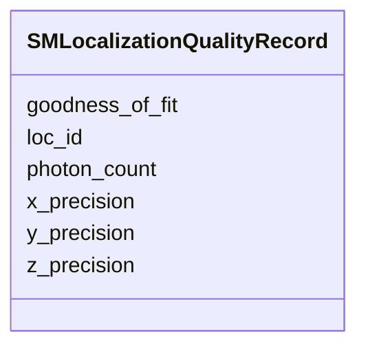

---
search:
  boost: 10.0
---

# Class: SMLocalizationQualityRecord 


_A single row in the SM Localization Quality table. Each instance captures quality metrics for one SM localization event identified by Loc_ID. X_Precision, Y_Precision and Z_Precision are mandatory. Photon_Count and Goodness_of_Fit are recommended. Additional user-defined optional columns must be described in the file header._


<div data-search-exclude markdown="1">


URI: [fof_ct:SMLocalizationQualityRecord](https://w3id.org/fof-ct/SMLocalizationQualityRecord)





<!-- no inheritance hierarchy -->

## Slots

| Name | Cardinality and Range | Description | Inheritance |
| ---  | --- | --- | --- |
| [loc_id](loc_id.md) | 1 <br/> [Integer](Integer.md) | Unique integer identifier for the SM localization event to which these qualit... | direct |
| [x_precision](x_precision.md) | 1 <br/> [Float](Float.md) | Metric quantifying the precision of the X-axis localization estimate | direct |
| [y_precision](y_precision.md) | 1 <br/> [Float](Float.md) | Metric quantifying the precision of the Y-axis localization estimate | direct |
| [z_precision](z_precision.md) | 1 <br/> [Float](Float.md) | Metric quantifying the precision of the Z-axis localization estimate | direct |
| [photon_count](photon_count.md) | 0..1 <br/> [Integer](Integer.md) | Recommended: number of photons detected for this localization | direct |
| [goodness_of_fit](goodness_of_fit.md) | 0..1 <br/> [Float](Float.md) | Recommended: goodness-of-fit metric for the localization model | direct |


## Usages

| used by | used in | type | used |
| ---  | --- | --- | --- |
| [SMLocalizationQualityTable](SMLocalizationQualityTable.md) | [sm_localization_quality_records](sm_localization_quality_records.md) | range | [SMLocalizationQualityRecord](SMLocalizationQualityRecord.md) |


## Identifier and Mapping Information


### Schema Source


* from schema: https://w3id.org/fof-ct/vol


## Mappings

| Mapping Type | Mapped Value |
| ---  | ---  |
| self | fof_ct:SMLocalizationQualityRecord |
| native | fof_ct:SMLocalizationQualityRecord |


## LinkML Source

<!-- TODO: investigate https://stackoverflow.com/questions/37606292/how-to-create-tabbed-code-blocks-in-mkdocs-or-sphinx -->

### Direct

<details>
```yaml
name: SMLocalizationQualityRecord
description: A single row in the SM Localization Quality table. Each instance captures
  quality metrics for one SM localization event identified by Loc_ID. X_Precision,
  Y_Precision and Z_Precision are mandatory. Photon_Count and Goodness_of_Fit are
  recommended. Additional user-defined optional columns must be described in the file
  header.
from_schema: https://w3id.org/fof-ct/vol
slots:
- loc_id
- x_precision
- y_precision
- z_precision
- photon_count
- goodness_of_fit
slot_usage:
  loc_id:
    name: loc_id
    description: Unique integer identifier for the SM localization event to which
      these quality metrics belong. Links to the corresponding SMLocalization record
      in the SM Localization Data table (table 13).
    identifier: true
    required: true
  x_precision:
    name: x_precision
    required: true
  y_precision:
    name: y_precision
    required: true
  z_precision:
    name: z_precision
    required: true
  photon_count:
    name: photon_count
    description: 'Recommended: number of photons detected for this localization.'
    required: false
  goodness_of_fit:
    name: goodness_of_fit
    description: 'Recommended: goodness-of-fit metric for the localization model.'
    required: false

```
</details>

### Induced

<details>
```yaml
name: SMLocalizationQualityRecord
description: A single row in the SM Localization Quality table. Each instance captures
  quality metrics for one SM localization event identified by Loc_ID. X_Precision,
  Y_Precision and Z_Precision are mandatory. Photon_Count and Goodness_of_Fit are
  recommended. Additional user-defined optional columns must be described in the file
  header.
from_schema: https://w3id.org/fof-ct/vol
slot_usage:
  loc_id:
    name: loc_id
    description: Unique integer identifier for the SM localization event to which
      these quality metrics belong. Links to the corresponding SMLocalization record
      in the SM Localization Data table (table 13).
    identifier: true
    required: true
  x_precision:
    name: x_precision
    required: true
  y_precision:
    name: y_precision
    required: true
  z_precision:
    name: z_precision
    required: true
  photon_count:
    name: photon_count
    description: 'Recommended: number of photons detected for this localization.'
    required: false
  goodness_of_fit:
    name: goodness_of_fit
    description: 'Recommended: goodness-of-fit metric for the localization model.'
    required: false
attributes:
  loc_id:
    name: loc_id
    description: Unique integer identifier for the SM localization event to which
      these quality metrics belong. Links to the corresponding SMLocalization record
      in the SM Localization Data table (table 13).
    examples:
    - value: '1'
    from_schema: https://w3id.org/fof-ct/vol
    rank: 1000
    identifier: true
    owner: SMLocalizationQualityRecord
    domain_of:
    - LocalizationMixin
    - SMLocalizationQualityRecord
    range: integer
    required: true
  x_precision:
    name: x_precision
    description: Metric quantifying the precision of the X-axis localization estimate.
      Typically the Cramer-Rao lower bound or Thompson method estimate. Recommended
      in the Spot Quality table; mandatory in the SM Localization Quality table. Must
      be accompanied by a description in the file header.
    examples:
    - value: '0.01'
    from_schema: https://w3id.org/fof-ct/vol
    rank: 1000
    owner: SMLocalizationQualityRecord
    domain_of:
    - SpotQualityRecord
    - SMLocalizationQualityRecord
    range: float
    required: true
  y_precision:
    name: y_precision
    description: Metric quantifying the precision of the Y-axis localization estimate.
      Recommended in the Spot Quality table; mandatory in the SM Localization Quality
      table.
    examples:
    - value: '0.01'
    from_schema: https://w3id.org/fof-ct/vol
    rank: 1000
    owner: SMLocalizationQualityRecord
    domain_of:
    - SpotQualityRecord
    - SMLocalizationQualityRecord
    range: float
    required: true
  z_precision:
    name: z_precision
    description: Metric quantifying the precision of the Z-axis localization estimate.
      Recommended in the Spot Quality table; mandatory in the SM Localization Quality
      table.
    examples:
    - value: '0.02'
    from_schema: https://w3id.org/fof-ct/vol
    rank: 1000
    owner: SMLocalizationQualityRecord
    domain_of:
    - SpotQualityRecord
    - SMLocalizationQualityRecord
    range: float
    required: true
  photon_count:
    name: photon_count
    description: 'Recommended: number of photons detected for this localization.'
    examples:
    - value: '1500'
    from_schema: https://w3id.org/fof-ct/vol
    rank: 1000
    owner: SMLocalizationQualityRecord
    domain_of:
    - SpotQualityRecord
    - SMLocalizationQualityRecord
    range: integer
    required: false
  goodness_of_fit:
    name: goodness_of_fit
    description: 'Recommended: goodness-of-fit metric for the localization model.'
    examples:
    - value: '0.95'
    from_schema: https://w3id.org/fof-ct/vol
    rank: 1000
    owner: SMLocalizationQualityRecord
    domain_of:
    - SpotQualityRecord
    - SMLocalizationQualityRecord
    range: float
    required: false

```
</details></div>