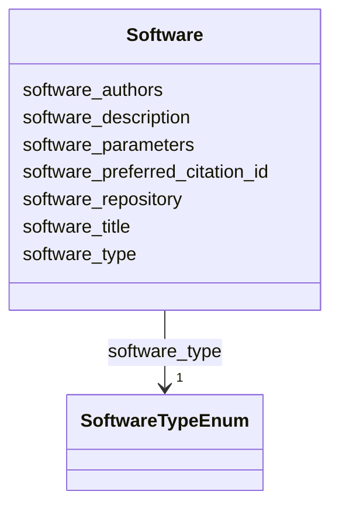

---
search:
  boost: 10.0
---

# Class: Software 


_Provenance metadata for a single software tool used to produce or process data in a FOF-CT table. If more than one tool was used, a separate Software entry must be provided for each. Written as a repeating block of #Software_* fields in the file header._


<div data-search-exclude markdown="1">


URI: [fof_ct:Software](https://w3id.org/fof-ct/Software)





<!-- no inheritance hierarchy -->

## Slots

| Name | Cardinality and Range | Description | Inheritance |
| ---  | --- | --- | --- |
| [software_title](software_title.md) | 1 <br/> [String](String.md) | Name of the software tool | direct |
| [software_type](software_type.md) | 1 <br/> [SoftwareTypeEnum](SoftwareTypeEnum.md) | Functional category of the software tool | direct |
| [software_authors](software_authors.md) | 1 <br/> [String](String.md) | Author name(s) in 'Surname, Firstname' format, multiple authors separated by ... | direct |
| [software_description](software_description.md) | 1 <br/> [String](String.md) | Free-text description of the algorithm used, sufficient to guarantee reproduc... | direct |
| [software_parameters](software_parameters.md) | 1 <br/> [String](String.md) | Free-text description of the input parameters used for the specific analysis ... | direct |
| [software_repository](software_repository.md) | 1 <br/> [Uri](Uri.md) | URL of the repository where the software release can be obtained | direct |
| [software_preferred_citation_id](software_preferred_citation_id.md) | 1 <br/> [Uri](Uri.md) | Unique identifier (DOI, PMCID, ArXiv ID, etc | direct |


## Usages

| used by | used in | type | used |
| ---  | --- | --- | --- |
| [SpotTable](SpotTable.md) | [softwares](softwares.md) | range | [Software](Software.md) |
| [DemultiplexingTable](DemultiplexingTable.md) | [softwares](softwares.md) | range | [Software](Software.md) |
| [TraceTable](TraceTable.md) | [softwares](softwares.md) | range | [Software](Software.md) |
| [RNASpotTable](RNASpotTable.md) | [softwares](softwares.md) | range | [Software](Software.md) |
| [SpotQualityTable](SpotQualityTable.md) | [softwares](softwares.md) | range | [Software](Software.md) |
| [RNASpotQualityTable](RNASpotQualityTable.md) | [softwares](softwares.md) | range | [Software](Software.md) |
| [SpotBiologicalTable](SpotBiologicalTable.md) | [softwares](softwares.md) | range | [Software](Software.md) |
| [RNASpotBiologicalTable](RNASpotBiologicalTable.md) | [softwares](softwares.md) | range | [Software](Software.md) |
| [CellTable](CellTable.md) | [softwares](softwares.md) | range | [Software](Software.md) |
| [ExtraCellROITable](ExtraCellROITable.md) | [softwares](softwares.md) | range | [Software](Software.md) |
| [SubCellROITable](SubCellROITable.md) | [softwares](softwares.md) | range | [Software](Software.md) |
| [ROIMappingTable](ROIMappingTable.md) | [softwares](softwares.md) | range | [Software](Software.md) |
| [SMLocalizationTable](SMLocalizationTable.md) | [softwares](softwares.md) | range | [Software](Software.md) |
| [SMLocalizationQualityTable](SMLocalizationQualityTable.md) | [softwares](softwares.md) | range | [Software](Software.md) |
| [UndecodedLocalizationTable](UndecodedLocalizationTable.md) | [softwares](softwares.md) | range | [Software](Software.md) |


## Identifier and Mapping Information


### Schema Source


* from schema: https://w3id.org/fof-ct/vol


## Mappings

| Mapping Type | Mapped Value |
| ---  | ---  |
| self | fof_ct:Software |
| native | fof_ct:Software |


## LinkML Source

<!-- TODO: investigate https://stackoverflow.com/questions/37606292/how-to-create-tabbed-code-blocks-in-mkdocs-or-sphinx -->

### Direct

<details>
```yaml
name: Software
description: 'Provenance metadata for a single software tool used to produce or process
  data in a FOF-CT table. If more than one tool was used, a separate Software entry
  must be provided for each. Written as a repeating block of #Software_* fields in
  the file header.'
from_schema: https://w3id.org/fof-ct/vol
slots:
- software_title
- software_type
- software_authors
- software_description
- software_parameters
- software_repository
- software_preferred_citation_id

```
</details>

### Induced

<details>
```yaml
name: Software
description: 'Provenance metadata for a single software tool used to produce or process
  data in a FOF-CT table. If more than one tool was used, a separate Software entry
  must be provided for each. Written as a repeating block of #Software_* fields in
  the file header.'
from_schema: https://w3id.org/fof-ct/vol
attributes:
  software_title:
    name: software_title
    description: 'Name of the software tool. Written as #Software_Title:.'
    examples:
    - value: ChrTracer3
    from_schema: https://w3id.org/fof-ct/vol
    rank: 1000
    owner: Software
    domain_of:
    - Software
    range: string
    required: true
  software_type:
    name: software_type
    description: 'Functional category of the software tool. Written as #Software_Type:.'
    examples:
    - value: SpotLoc+Tracing
    from_schema: https://w3id.org/fof-ct/vol
    rank: 1000
    owner: Software
    domain_of:
    - Software
    range: SoftwareTypeEnum
    required: true
  software_authors:
    name: software_authors
    description: 'Author name(s) in ''Surname, Firstname'' format, multiple authors
      separated by semicolons. Written as #Software_Authors:.'
    examples:
    - value: Mateo, LJ; Sinnott-Armstrong, N; Boettiger, AN
    from_schema: https://w3id.org/fof-ct/vol
    rank: 1000
    owner: Software
    domain_of:
    - Software
    range: string
    required: true
  software_description:
    name: software_description
    description: 'Free-text description of the algorithm used, sufficient to guarantee
      reproducibility. Written as #Software_Description:.'
    from_schema: https://w3id.org/fof-ct/vol
    rank: 1000
    owner: Software
    domain_of:
    - Software
    range: string
    required: true
  software_parameters:
    name: software_parameters
    description: 'Free-text description of the input parameters used for the specific
      analysis run performed using this Software. Should provide sufficient detail
      about the analysis parameters used to guarantee interpretation and reproducibility
      (e.g. input parameters used for assessing the precision of single molecule localization
      or drift correction in X, Y and Z). Written as #Software_Parameters:.'
    examples:
    - value: X_Loc_Precision Parameter = 1.01
    from_schema: https://w3id.org/fof-ct/vol
    rank: 1000
    owner: Software
    domain_of:
    - Software
    range: string
    required: true
  software_repository:
    name: software_repository
    description: 'URL of the repository where the software release can be obtained.
      Written as #Software_Repository:.'
    examples:
    - value: https://github.com/BoettigerLab/ORCA-public
    from_schema: https://w3id.org/fof-ct/vol
    rank: 1000
    owner: Software
    domain_of:
    - Software
    range: uri
    required: true
  software_preferred_citation_id:
    name: software_preferred_citation_id
    description: 'Unique identifier (DOI, PMCID, ArXiv ID, etc.) for the primary publication
      describing this software. Written as #Software_PreferredCitationID:.'
    examples:
    - value: https://doi.org/10.1038/s41596-020-00478-x
    from_schema: https://w3id.org/fof-ct/vol
    rank: 1000
    owner: Software
    domain_of:
    - Software
    range: uri
    required: true

```
</details></div>