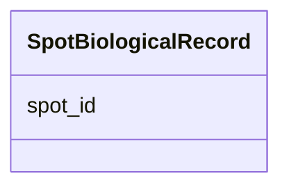

---
search:
  boost: 10.0
---

# Class: SpotBiologicalRecord 


_A single row in the Spot Biological Data table. Each instance captures one or more user-defined biological properties for a specific DNA bright Spot identified by Spot_ID. Spot_ID values must be unique across the dataset, linking to the corresponding Spot record in the core table (table 1). At least one user-defined biological property column MUST be present; users declare these via #^ header lines._


<div data-search-exclude markdown="1">


URI: [fof_ct:SpotBiologicalRecord](https://w3id.org/fof-ct/SpotBiologicalRecord)





<!-- no inheritance hierarchy -->

## Slots

| Name | Cardinality and Range | Description | Inheritance |
| ---  | --- | --- | --- |
| [spot_id](spot_id.md) | 1 <br/> [Integer](Integer.md) | Unique integer identifier for the DNA bright Spot to which these biological p... | direct |


## Usages

| used by | used in | type | used |
| ---  | --- | --- | --- |
| [SpotBiologicalTable](SpotBiologicalTable.md) | [spot_biological_records](spot_biological_records.md) | range | [SpotBiologicalRecord](SpotBiologicalRecord.md) |


## Identifier and Mapping Information


### Schema Source


* from schema: https://w3id.org/fof-ct/vol


## Mappings

| Mapping Type | Mapped Value |
| ---  | ---  |
| self | fof_ct:SpotBiologicalRecord |
| native | fof_ct:SpotBiologicalRecord |


## LinkML Source

<!-- TODO: investigate https://stackoverflow.com/questions/37606292/how-to-create-tabbed-code-blocks-in-mkdocs-or-sphinx -->

### Direct

<details>
```yaml
name: SpotBiologicalRecord
description: 'A single row in the Spot Biological Data table. Each instance captures
  one or more user-defined biological properties for a specific DNA bright Spot identified
  by Spot_ID. Spot_ID values must be unique across the dataset, linking to the corresponding
  Spot record in the core table (table 1). At least one user-defined biological property
  column MUST be present; users declare these via #^ header lines.'
from_schema: https://w3id.org/fof-ct/vol
slots:
- spot_id
slot_usage:
  spot_id:
    name: spot_id
    description: Unique integer identifier for the DNA bright Spot to which these
      biological properties belong. Links to the corresponding Spot record in the
      core table (table 1). Must be unique within this table and across the entire
      dataset.
    identifier: true
    required: true

```
</details>

### Induced

<details>
```yaml
name: SpotBiologicalRecord
description: 'A single row in the Spot Biological Data table. Each instance captures
  one or more user-defined biological properties for a specific DNA bright Spot identified
  by Spot_ID. Spot_ID values must be unique across the dataset, linking to the corresponding
  Spot record in the core table (table 1). At least one user-defined biological property
  column MUST be present; users declare these via #^ header lines.'
from_schema: https://w3id.org/fof-ct/vol
slot_usage:
  spot_id:
    name: spot_id
    description: Unique integer identifier for the DNA bright Spot to which these
      biological properties belong. Links to the corresponding Spot record in the
      core table (table 1). Must be unique within this table and across the entire
      dataset.
    identifier: true
    required: true
attributes:
  spot_id:
    name: spot_id
    description: Unique integer identifier for the DNA bright Spot to which these
      biological properties belong. Links to the corresponding Spot record in the
      core table (table 1). Must be unique within this table and across the entire
      dataset.
    examples:
    - value: '1'
    from_schema: https://w3id.org/fof-ct/vol
    rank: 1000
    identifier: true
    owner: SpotBiologicalRecord
    domain_of:
    - Spot
    - Localization
    - SpotQualityRecord
    - SpotBiologicalRecord
    - SMLocalization
    range: integer
    required: true

```
</details></div>