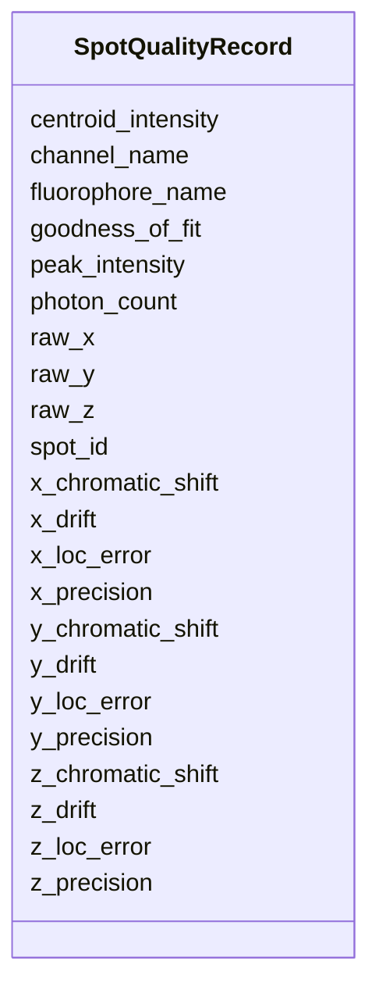

---
search:
  boost: 10.0
---

# Class: SpotQualityRecord 


_A single row in the Spot Quality table. Each instance captures one or more quality metrics for a specific DNA bright Spot identified by Spot_ID. At least one user-defined quality metric column MUST be present; users declare these via #^ header lines._


<div data-search-exclude markdown="1">


URI: [fof_ct:SpotQualityRecord](https://w3id.org/fof-ct/SpotQualityRecord)





<!-- no inheritance hierarchy -->

## Slots

| Name | Cardinality and Range | Description | Inheritance |
| ---  | --- | --- | --- |
| [spot_id](spot_id.md) | 1 <br/> [Integer](Integer.md) | Unique integer identifier for the DNA bright Spot to which these quality metr... | direct |
| [channel_name](channel_name.md) | 1 <br/> [String](String.md) | The name of the imaging channel used for this Spot (e | direct |
| [fluorophore_name](fluorophore_name.md) | 1 <br/> [String](String.md) | The name of the fluorophore used for this Spot (e | direct |
| [x_precision](x_precision.md) | 0..1 <br/> [Float](Float.md) | Recommended: metric for X localization precision | direct |
| [y_precision](y_precision.md) | 0..1 <br/> [Float](Float.md) | Metric quantifying the precision of the Y-axis localization estimate | direct |
| [z_precision](z_precision.md) | 0..1 <br/> [Float](Float.md) | Metric quantifying the precision of the Z-axis localization estimate | direct |
| [photon_count](photon_count.md) | 0..1 <br/> [Integer](Integer.md) | Optional standardised name for photon count | direct |
| [goodness_of_fit](goodness_of_fit.md) | 0..1 <br/> [Float](Float.md) | Metric quantifying how well the fitted model matches the observed signal (e | direct |
| [centroid_intensity](centroid_intensity.md) | 0..1 <br/> [Float](Float.md) | Signal intensity of the centroid pixel of the Spot | direct |
| [peak_intensity](peak_intensity.md) | 0..1 <br/> [Float](Float.md) | Signal intensity of the brightest pixel within the Spot boundary | direct |
| [raw_x](raw_x.md) | 0..1 <br/> [Float](Float.md) | X coordinate of this Spot before any post-processing corrections (drift corre... | direct |
| [raw_y](raw_y.md) | 0..1 <br/> [Float](Float.md) | Y coordinate of this Spot before any post-processing corrections | direct |
| [raw_z](raw_z.md) | 0..1 <br/> [Float](Float.md) | Z coordinate of this Spot before any post-processing corrections | direct |
| [x_drift](x_drift.md) | 0..1 <br/> [Float](Float.md) | Drift correction offset applied to the X coordinate of this Spot | direct |
| [y_drift](y_drift.md) | 0..1 <br/> [Float](Float.md) | Drift correction offset applied to the Y coordinate of this Spot | direct |
| [z_drift](z_drift.md) | 0..1 <br/> [Float](Float.md) | Drift correction offset applied to the Z coordinate of this Spot | direct |
| [x_chromatic_shift](x_chromatic_shift.md) | 0..1 <br/> [Float](Float.md) | Chromatic aberration correction offset applied to the X coordinate of this Sp... | direct |
| [y_chromatic_shift](y_chromatic_shift.md) | 0..1 <br/> [Float](Float.md) | Chromatic aberration correction offset applied to the Y coordinate of this Sp... | direct |
| [z_chromatic_shift](z_chromatic_shift.md) | 0..1 <br/> [Float](Float.md) | Chromatic aberration correction offset applied to the Z coordinate of this Sp... | direct |
| [x_loc_error](x_loc_error.md) | 0..1 <br/> [Float](Float.md) | Localization error estimate for the X coordinate of this Spot (e | direct |
| [y_loc_error](y_loc_error.md) | 0..1 <br/> [Float](Float.md) | Localization error estimate for the Y coordinate of this Spot | direct |
| [z_loc_error](z_loc_error.md) | 0..1 <br/> [Float](Float.md) | Localization error estimate for the Z coordinate of this Spot | direct |


## Usages

| used by | used in | type | used |
| ---  | --- | --- | --- |
| [SpotQualityTable](SpotQualityTable.md) | [spot_quality_records](spot_quality_records.md) | range | [SpotQualityRecord](SpotQualityRecord.md) |


## Identifier and Mapping Information


### Schema Source


* from schema: https://w3id.org/fof-ct/vol


## Mappings

| Mapping Type | Mapped Value |
| ---  | ---  |
| self | fof_ct:SpotQualityRecord |
| native | fof_ct:SpotQualityRecord |


## LinkML Source

<!-- TODO: investigate https://stackoverflow.com/questions/37606292/how-to-create-tabbed-code-blocks-in-mkdocs-or-sphinx -->

### Direct

<details>
```yaml
name: SpotQualityRecord
description: 'A single row in the Spot Quality table. Each instance captures one or
  more quality metrics for a specific DNA bright Spot identified by Spot_ID. At least
  one user-defined quality metric column MUST be present; users declare these via
  #^ header lines.'
from_schema: https://w3id.org/fof-ct/vol
slots:
- spot_id
- channel_name
- fluorophore_name
- x_precision
- y_precision
- z_precision
- photon_count
- goodness_of_fit
- centroid_intensity
- peak_intensity
- raw_x
- raw_y
- raw_z
- x_drift
- y_drift
- z_drift
- x_chromatic_shift
- y_chromatic_shift
- z_chromatic_shift
- x_loc_error
- y_loc_error
- z_loc_error
slot_usage:
  spot_id:
    name: spot_id
    description: Unique integer identifier for the DNA bright Spot to which these
      quality metrics belong. Links to the corresponding Spot record in the core table
      (table 1). Must be unique within this table.
    identifier: true
    required: true
  channel_name:
    name: channel_name
    required: true
  fluorophore_name:
    name: fluorophore_name
    required: true
  x_precision:
    name: x_precision
    description: 'Recommended: metric for X localization precision'
    required: false
  y_precision:
    name: y_precision
    required: false
  z_precision:
    name: z_precision
    required: false
  photon_count:
    name: photon_count
    description: Optional standardised name for photon count
    required: false
  goodness_of_fit:
    name: goodness_of_fit
    required: false
  centroid_intensity:
    name: centroid_intensity
    required: false
  peak_intensity:
    name: peak_intensity
    required: false
  raw_x:
    name: raw_x
    required: false
  raw_y:
    name: raw_y
    required: false
  raw_z:
    name: raw_z
    required: false
  x_drift:
    name: x_drift
    required: false
  y_drift:
    name: y_drift
    required: false
  z_drift:
    name: z_drift
    required: false
  x_chromatic_shift:
    name: x_chromatic_shift
    required: false
  y_chromatic_shift:
    name: y_chromatic_shift
    required: false
  z_chromatic_shift:
    name: z_chromatic_shift
    required: false
  x_loc_error:
    name: x_loc_error
    required: false
  y_loc_error:
    name: y_loc_error
    required: false
  z_loc_error:
    name: z_loc_error
    required: false

```
</details>

### Induced

<details>
```yaml
name: SpotQualityRecord
description: 'A single row in the Spot Quality table. Each instance captures one or
  more quality metrics for a specific DNA bright Spot identified by Spot_ID. At least
  one user-defined quality metric column MUST be present; users declare these via
  #^ header lines.'
from_schema: https://w3id.org/fof-ct/vol
slot_usage:
  spot_id:
    name: spot_id
    description: Unique integer identifier for the DNA bright Spot to which these
      quality metrics belong. Links to the corresponding Spot record in the core table
      (table 1). Must be unique within this table.
    identifier: true
    required: true
  channel_name:
    name: channel_name
    required: true
  fluorophore_name:
    name: fluorophore_name
    required: true
  x_precision:
    name: x_precision
    description: 'Recommended: metric for X localization precision'
    required: false
  y_precision:
    name: y_precision
    required: false
  z_precision:
    name: z_precision
    required: false
  photon_count:
    name: photon_count
    description: Optional standardised name for photon count
    required: false
  goodness_of_fit:
    name: goodness_of_fit
    required: false
  centroid_intensity:
    name: centroid_intensity
    required: false
  peak_intensity:
    name: peak_intensity
    required: false
  raw_x:
    name: raw_x
    required: false
  raw_y:
    name: raw_y
    required: false
  raw_z:
    name: raw_z
    required: false
  x_drift:
    name: x_drift
    required: false
  y_drift:
    name: y_drift
    required: false
  z_drift:
    name: z_drift
    required: false
  x_chromatic_shift:
    name: x_chromatic_shift
    required: false
  y_chromatic_shift:
    name: y_chromatic_shift
    required: false
  z_chromatic_shift:
    name: z_chromatic_shift
    required: false
  x_loc_error:
    name: x_loc_error
    required: false
  y_loc_error:
    name: y_loc_error
    required: false
  z_loc_error:
    name: z_loc_error
    required: false
attributes:
  spot_id:
    name: spot_id
    description: Unique integer identifier for the DNA bright Spot to which these
      quality metrics belong. Links to the corresponding Spot record in the core table
      (table 1). Must be unique within this table.
    examples:
    - value: '1'
    from_schema: https://w3id.org/fof-ct/vol
    rank: 1000
    identifier: true
    owner: SpotQualityRecord
    domain_of:
    - Spot
    - Localization
    - SpotQualityRecord
    - SpotBiologicalRecord
    - SMLocalization
    range: integer
    required: true
  channel_name:
    name: channel_name
    description: The name of the imaging channel used for this Spot (e.g. 510/25).
      Mandatory in the Spot Quality table.
    examples:
    - value: 510/25
    - value: 647/50
    from_schema: https://w3id.org/fof-ct/vol
    rank: 1000
    owner: SpotQualityRecord
    domain_of:
    - SpotQualityRecord
    range: string
    required: true
  fluorophore_name:
    name: fluorophore_name
    description: The name of the fluorophore used for this Spot (e.g. AlexaFluor_488).
      Mandatory in the Spot Quality table.
    examples:
    - value: AlexaFluor_488
    - value: Cy5
    from_schema: https://w3id.org/fof-ct/vol
    rank: 1000
    owner: SpotQualityRecord
    domain_of:
    - SpotQualityRecord
    range: string
    required: true
  x_precision:
    name: x_precision
    description: 'Recommended: metric for X localization precision'
    examples:
    - value: '0.01'
    from_schema: https://w3id.org/fof-ct/vol
    rank: 1000
    owner: SpotQualityRecord
    domain_of:
    - SpotQualityRecord
    - SMLocalizationQualityRecord
    range: float
    required: false
  y_precision:
    name: y_precision
    description: Metric quantifying the precision of the Y-axis localization estimate.
      Recommended in the Spot Quality table; mandatory in the SM Localization Quality
      table.
    examples:
    - value: '0.01'
    from_schema: https://w3id.org/fof-ct/vol
    rank: 1000
    owner: SpotQualityRecord
    domain_of:
    - SpotQualityRecord
    - SMLocalizationQualityRecord
    range: float
    required: false
  z_precision:
    name: z_precision
    description: Metric quantifying the precision of the Z-axis localization estimate.
      Recommended in the Spot Quality table; mandatory in the SM Localization Quality
      table.
    examples:
    - value: '0.02'
    from_schema: https://w3id.org/fof-ct/vol
    rank: 1000
    owner: SpotQualityRecord
    domain_of:
    - SpotQualityRecord
    - SMLocalizationQualityRecord
    range: float
    required: false
  photon_count:
    name: photon_count
    description: Optional standardised name for photon count
    examples:
    - value: '1500'
    from_schema: https://w3id.org/fof-ct/vol
    rank: 1000
    owner: SpotQualityRecord
    domain_of:
    - SpotQualityRecord
    - SMLocalizationQualityRecord
    range: integer
    required: false
  goodness_of_fit:
    name: goodness_of_fit
    description: Metric quantifying how well the fitted model matches the observed
      signal (e.g. chi-squared, R-squared). Optional (but standardised name) in the
      Spot Quality table; recommended in the SM Localization Quality table.
    examples:
    - value: '0.95'
    from_schema: https://w3id.org/fof-ct/vol
    rank: 1000
    owner: SpotQualityRecord
    domain_of:
    - SpotQualityRecord
    - SMLocalizationQualityRecord
    range: float
    required: false
  centroid_intensity:
    name: centroid_intensity
    description: Signal intensity of the centroid pixel of the Spot. Conditionally
      required in the Spot Quality table when intensity metrics are reported.
    examples:
    - value: '2500.0'
    from_schema: https://w3id.org/fof-ct/vol
    rank: 1000
    owner: SpotQualityRecord
    domain_of:
    - SpotQualityRecord
    range: float
    required: false
  peak_intensity:
    name: peak_intensity
    description: Signal intensity of the brightest pixel within the Spot boundary.
      Conditionally required in the Spot Quality table when intensity metrics are
      reported.
    examples:
    - value: '3200.0'
    from_schema: https://w3id.org/fof-ct/vol
    rank: 1000
    owner: SpotQualityRecord
    domain_of:
    - SpotQualityRecord
    range: float
    required: false
  raw_x:
    name: raw_x
    description: X coordinate of this Spot before any post-processing corrections
      (drift correction, chromatic correction, etc.). Same unit as X.
    examples:
    - value: '14.30'
    from_schema: https://w3id.org/fof-ct/vol
    rank: 1000
    owner: SpotQualityRecord
    domain_of:
    - SpotQualityRecord
    range: float
    required: false
  raw_y:
    name: raw_y
    description: Y coordinate of this Spot before any post-processing corrections.
      Same unit as Y.
    examples:
    - value: '41.20'
    from_schema: https://w3id.org/fof-ct/vol
    rank: 1000
    owner: SpotQualityRecord
    domain_of:
    - SpotQualityRecord
    range: float
    required: false
  raw_z:
    name: raw_z
    description: Z coordinate of this Spot before any post-processing corrections.
      Same unit as Z.
    examples:
    - value: '1.10'
    from_schema: https://w3id.org/fof-ct/vol
    rank: 1000
    owner: SpotQualityRecord
    domain_of:
    - SpotQualityRecord
    range: float
    required: false
  x_drift:
    name: x_drift
    description: Drift correction offset applied to the X coordinate of this Spot.
      Same unit as X.
    examples:
    - value: '0.13'
    from_schema: https://w3id.org/fof-ct/vol
    rank: 1000
    owner: SpotQualityRecord
    domain_of:
    - SpotQualityRecord
    range: float
    required: false
  y_drift:
    name: y_drift
    description: Drift correction offset applied to the Y coordinate of this Spot.
      Same unit as Y.
    examples:
    - value: '0.23'
    from_schema: https://w3id.org/fof-ct/vol
    rank: 1000
    owner: SpotQualityRecord
    domain_of:
    - SpotQualityRecord
    range: float
    required: false
  z_drift:
    name: z_drift
    description: Drift correction offset applied to the Z coordinate of this Spot.
      Same unit as Z.
    examples:
    - value: '0.13'
    from_schema: https://w3id.org/fof-ct/vol
    rank: 1000
    owner: SpotQualityRecord
    domain_of:
    - SpotQualityRecord
    range: float
    required: false
  x_chromatic_shift:
    name: x_chromatic_shift
    description: Chromatic aberration correction offset applied to the X coordinate
      of this Spot. Same unit as X.
    examples:
    - value: '0.05'
    from_schema: https://w3id.org/fof-ct/vol
    rank: 1000
    owner: SpotQualityRecord
    domain_of:
    - SpotQualityRecord
    range: float
    required: false
  y_chromatic_shift:
    name: y_chromatic_shift
    description: Chromatic aberration correction offset applied to the Y coordinate
      of this Spot. Same unit as Y.
    examples:
    - value: '0.04'
    from_schema: https://w3id.org/fof-ct/vol
    rank: 1000
    owner: SpotQualityRecord
    domain_of:
    - SpotQualityRecord
    range: float
    required: false
  z_chromatic_shift:
    name: z_chromatic_shift
    description: Chromatic aberration correction offset applied to the Z coordinate
      of this Spot. Same unit as Z.
    examples:
    - value: '0.02'
    from_schema: https://w3id.org/fof-ct/vol
    rank: 1000
    owner: SpotQualityRecord
    domain_of:
    - SpotQualityRecord
    range: float
    required: false
  x_loc_error:
    name: x_loc_error
    description: Localization error estimate for the X coordinate of this Spot (e.g.
      standard deviation of repeated measurements). Same unit as X.
    examples:
    - value: '0.02'
    from_schema: https://w3id.org/fof-ct/vol
    rank: 1000
    owner: SpotQualityRecord
    domain_of:
    - SpotQualityRecord
    range: float
    required: false
  y_loc_error:
    name: y_loc_error
    description: Localization error estimate for the Y coordinate of this Spot. Same
      unit as Y.
    examples:
    - value: '0.02'
    from_schema: https://w3id.org/fof-ct/vol
    rank: 1000
    owner: SpotQualityRecord
    domain_of:
    - SpotQualityRecord
    range: float
    required: false
  z_loc_error:
    name: z_loc_error
    description: Localization error estimate for the Z coordinate of this Spot. Same
      unit as Z.
    examples:
    - value: '0.05'
    from_schema: https://w3id.org/fof-ct/vol
    rank: 1000
    owner: SpotQualityRecord
    domain_of:
    - SpotQualityRecord
    range: float
    required: false

```
</details></div>