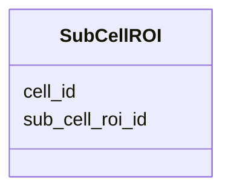

---
search:
  boost: 10.0
---

# Class: SubCellROI 


_A single sub-cellular structure ROI (e.g. nucleolus, nuclear lamina, PML body, chromosome domain) identified in a FOF-bas-CT experiment. Each instance of this class corresponds to one row in the TSV data section of the FOF-CT Sub-Cell ROI Data table. The sub_cell_roi_id field uniquely identifies each ROI and links to the core table, the Cell Data table, and the Cell/ROI Mapping table. This class accepts additional user-defined optional columns (e.g. ROI_Volume, ROI_Area). At least one such user-defined column MUST be present per submission._


<div data-search-exclude markdown="1">


URI: [fof_ct:SubCellROI](https://w3id.org/fof-ct/SubCellROI)





<!-- no inheritance hierarchy -->

## Slots

| Name | Cardinality and Range | Description | Inheritance |
| ---  | --- | --- | --- |
| [sub_cell_roi_id](sub_cell_roi_id.md) | 1 <br/> [Integer](Integer.md) | Unique integer identifier for this sub-cellular structure ROI | direct |
| [cell_id](cell_id.md) | 0..1 <br/> [Integer](Integer.md) | Identifier of the Cell to which this sub-cellular ROI belongs | direct |


## Usages

| used by | used in | type | used |
| ---  | --- | --- | --- |
| [SubCellROITable](SubCellROITable.md) | [sub_cell_rois](sub_cell_rois.md) | range | [SubCellROI](SubCellROI.md) |


## Identifier and Mapping Information


### Schema Source


* from schema: https://w3id.org/fof-ct/vol


## Mappings

| Mapping Type | Mapped Value |
| ---  | ---  |
| self | fof_ct:SubCellROI |
| native | fof_ct:SubCellROI |


## LinkML Source

<!-- TODO: investigate https://stackoverflow.com/questions/37606292/how-to-create-tabbed-code-blocks-in-mkdocs-or-sphinx -->

### Direct

<details>
```yaml
name: SubCellROI
description: A single sub-cellular structure ROI (e.g. nucleolus, nuclear lamina,
  PML body, chromosome domain) identified in a FOF-bas-CT experiment. Each instance
  of this class corresponds to one row in the TSV data section of the FOF-CT Sub-Cell
  ROI Data table. The sub_cell_roi_id field uniquely identifies each ROI and links
  to the core table, the Cell Data table, and the Cell/ROI Mapping table. This class
  accepts additional user-defined optional columns (e.g. ROI_Volume, ROI_Area). At
  least one such user-defined column MUST be present per submission.
from_schema: https://w3id.org/fof-ct/vol
slots:
- sub_cell_roi_id
- cell_id
slot_usage:
  sub_cell_roi_id:
    name: sub_cell_roi_id
    description: Unique integer identifier for this sub-cellular structure ROI. Sub_Cell_ROI_ID
      values are unique across the entire dataset, enabling unambiguous cross-referencing
      with the core table, the Cell Data table, and the Cell/ROI Mapping table.
    identifier: true
    range: integer
    required: true
  cell_id:
    name: cell_id
    description: Identifier of the Cell to which this sub-cellular ROI belongs. Conditionally
      required when this ROI can be associated with a Cell identified as part of this
      experiment and reported in a dedicated Cell Data table.
    range: integer
    required: false

```
</details>

### Induced

<details>
```yaml
name: SubCellROI
description: A single sub-cellular structure ROI (e.g. nucleolus, nuclear lamina,
  PML body, chromosome domain) identified in a FOF-bas-CT experiment. Each instance
  of this class corresponds to one row in the TSV data section of the FOF-CT Sub-Cell
  ROI Data table. The sub_cell_roi_id field uniquely identifies each ROI and links
  to the core table, the Cell Data table, and the Cell/ROI Mapping table. This class
  accepts additional user-defined optional columns (e.g. ROI_Volume, ROI_Area). At
  least one such user-defined column MUST be present per submission.
from_schema: https://w3id.org/fof-ct/vol
slot_usage:
  sub_cell_roi_id:
    name: sub_cell_roi_id
    description: Unique integer identifier for this sub-cellular structure ROI. Sub_Cell_ROI_ID
      values are unique across the entire dataset, enabling unambiguous cross-referencing
      with the core table, the Cell Data table, and the Cell/ROI Mapping table.
    identifier: true
    range: integer
    required: true
  cell_id:
    name: cell_id
    description: Identifier of the Cell to which this sub-cellular ROI belongs. Conditionally
      required when this ROI can be associated with a Cell identified as part of this
      experiment and reported in a dedicated Cell Data table.
    range: integer
    required: false
attributes:
  sub_cell_roi_id:
    name: sub_cell_roi_id
    description: Unique integer identifier for this sub-cellular structure ROI. Sub_Cell_ROI_ID
      values are unique across the entire dataset, enabling unambiguous cross-referencing
      with the core table, the Cell Data table, and the Cell/ROI Mapping table.
    examples:
    - value: '1'
    from_schema: https://w3id.org/fof-ct/vol
    rank: 1000
    identifier: true
    owner: SubCellROI
    domain_of:
    - Spot
    - RNASpot
    - SubCellROI
    - ROIMapping
    - SMLocalization
    range: integer
    required: true
  cell_id:
    name: cell_id
    description: Identifier of the Cell to which this sub-cellular ROI belongs. Conditionally
      required when this ROI can be associated with a Cell identified as part of this
      experiment and reported in a dedicated Cell Data table.
    examples:
    - value: '1'
    from_schema: https://w3id.org/fof-ct/vol
    rank: 1000
    owner: SubCellROI
    domain_of:
    - Spot
    - RNASpot
    - Cell
    - SubCellROI
    - ROIMapping
    - SMLocalization
    range: integer
    required: false

```
</details></div>