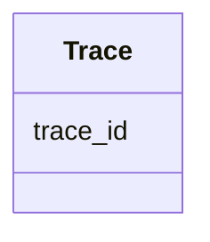

---
search:
  boost: 10.0
---

# Class: Trace 


_A single chromatin Trace representing global properties associated with an entire polymeric trace rather than with individual Spots. Each instance of this class corresponds to one row in the CSV data section of the FOF-CT Trace Data table. The trace_id links each Trace to the core table and to the RNA Spot Data table. IMPORTANT: this class MUST contain at least one user-defined optional column describing trace-level properties (e.g., Allele, RNA_Expression, Lamina_Distance). User-defined columns are accommodated via open schema._


<div data-search-exclude markdown="1">


URI: [fof_ct:Trace](https://w3id.org/fof-ct/Trace)





<!-- no inheritance hierarchy -->

## Slots

| Name | Cardinality and Range | Description | Inheritance |
| ---  | --- | --- | --- |
| [trace_id](trace_id.md) | 1 <br/> [Integer](Integer.md) | Unique identifier for a chromatin Trace | direct |


## Usages

| used by | used in | type | used |
| ---  | --- | --- | --- |
| [TraceTable](TraceTable.md) | [traces](traces.md) | range | [Trace](Trace.md) |


## Identifier and Mapping Information


### Schema Source


* from schema: https://w3id.org/fof-ct/vol


## Mappings

| Mapping Type | Mapped Value |
| ---  | ---  |
| self | fof_ct:Trace |
| native | fof_ct:Trace |


## LinkML Source

<!-- TODO: investigate https://stackoverflow.com/questions/37606292/how-to-create-tabbed-code-blocks-in-mkdocs-or-sphinx -->

### Direct

<details>
```yaml
name: Trace
description: 'A single chromatin Trace representing global properties associated with
  an entire polymeric trace rather than with individual Spots. Each instance of this
  class corresponds to one row in the CSV data section of the FOF-CT Trace Data table.
  The trace_id links each Trace to the core table and to the RNA Spot Data table.
  IMPORTANT: this class MUST contain at least one user-defined optional column describing
  trace-level properties (e.g., Allele, RNA_Expression, Lamina_Distance). User-defined
  columns are accommodated via open schema.'
from_schema: https://w3id.org/fof-ct/vol
slots:
- trace_id
slot_usage:
  trace_id:
    name: trace_id
    identifier: true
    required: true

```
</details>

### Induced

<details>
```yaml
name: Trace
description: 'A single chromatin Trace representing global properties associated with
  an entire polymeric trace rather than with individual Spots. Each instance of this
  class corresponds to one row in the CSV data section of the FOF-CT Trace Data table.
  The trace_id links each Trace to the core table and to the RNA Spot Data table.
  IMPORTANT: this class MUST contain at least one user-defined optional column describing
  trace-level properties (e.g., Allele, RNA_Expression, Lamina_Distance). User-defined
  columns are accommodated via open schema.'
from_schema: https://w3id.org/fof-ct/vol
slot_usage:
  trace_id:
    name: trace_id
    identifier: true
    required: true
attributes:
  trace_id:
    name: trace_id
    description: Unique identifier for a chromatin Trace. Used as a primary key in
      the Trace Data table and as a foreign key in the RNA Spot Data table and (mandatorily)
      in the FOF-vol-CT SM Localization Data table.
    examples:
    - value: '1'
    from_schema: https://w3id.org/fof-ct/vol
    rank: 1000
    identifier: true
    owner: Trace
    domain_of:
    - Spot
    - Trace
    - RNASpot
    - SMLocalization
    range: integer
    required: true

```
</details></div>