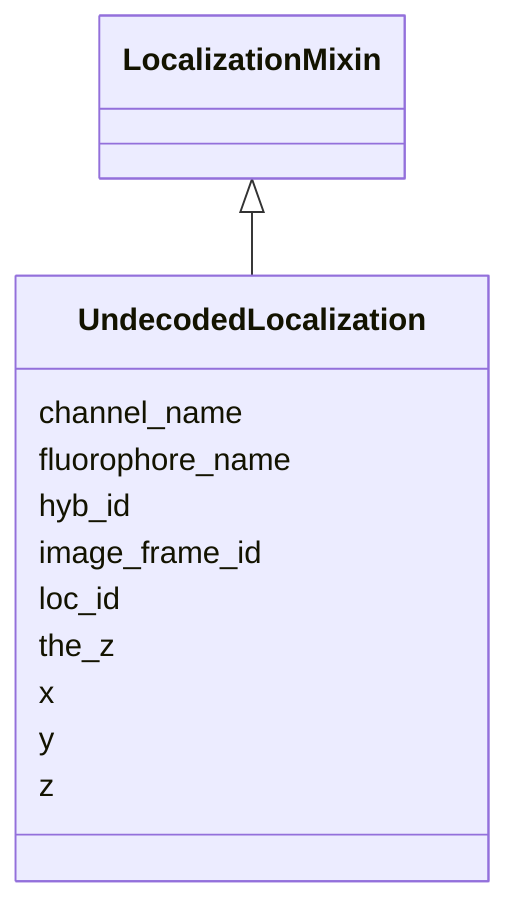

---
search:
  boost: 10.0
---

# Class: UndecodedLocalization 


_A single raw, undecoded SM localization event in a FOF-vol-CT dataset. Each instance corresponds to one row in the TSV data section of the Undecoded SM Localization Data table. This class uses LocalizationMixin for the shared loc_id, x, y, z slots. The 8 mandatory columns, in order, are: Loc_ID, Hyb_ID, Image_Frame_ID, X, Y, Z, Channel, Fluor. TheZ (the_z) is a reserved, conditionally-required column for the focal Z-plane identifier._


<div data-search-exclude markdown="1">


URI: [fof_ct:UndecodedLocalization](https://w3id.org/fof-ct/UndecodedLocalization)





## Inheritance
* **UndecodedLocalization** [ [LocalizationMixin](LocalizationMixin.md)]


## Slots

| Name | Cardinality and Range | Description | Inheritance |
| ---  | --- | --- | --- |
| [hyb_id](hyb_id.md) | 1 <br/> [Integer](Integer.md) | Unique identifier for the hybridization round in which this localization even... | direct |
| [image_frame_id](image_frame_id.md) | 1 <br/> [Integer](Integer.md) | Unique integer identifier for the imaging frame in which this undecoded local... | direct |
| [channel_name](channel_name.md) | 1 <br/> [String](String.md) | The wavelength characteristics of the emission channel used to image this Spo... | direct |
| [fluorophore_name](fluorophore_name.md) | 1 <br/> [String](String.md) | The name of the fluorophore whose emission was used to detect this Spot / RNA... | direct |
| [the_z](the_z.md) | 0..1 <br/> [Integer](Integer.md) | Identifier of the focal Z-plane in which this localization event was detected | direct |
| [loc_id](loc_id.md) | 1 <br/> [Integer](Integer.md) | Unique integer identifier for this undecoded localization event | [LocalizationMixin](LocalizationMixin.md) |
| [x](x.md) | 1 <br/> [Float](Float.md) | Sub-pixel X coordinate of this detected event (Spot or localisation) in the u... | [LocalizationMixin](LocalizationMixin.md) |
| [y](y.md) | 1 <br/> [Float](Float.md) | Sub-pixel Y coordinate of this detected event (Spot or localisation) in the u... | [LocalizationMixin](LocalizationMixin.md) |
| [z](z.md) | 1 <br/> [Float](Float.md) | Sub-pixel Z coordinate of this detected event (Spot or localisation) in the u... | [LocalizationMixin](LocalizationMixin.md) |


## Usages

| used by | used in | type | used |
| ---  | --- | --- | --- |
| [UndecodedLocalizationTable](UndecodedLocalizationTable.md) | [undecoded_localizations](undecoded_localizations.md) | range | [UndecodedLocalization](UndecodedLocalization.md) |


## Identifier and Mapping Information


### Schema Source


* from schema: https://w3id.org/fof-ct/vol


## Mappings

| Mapping Type | Mapped Value |
| ---  | ---  |
| self | fof_ct:UndecodedLocalization |
| native | fof_ct:UndecodedLocalization |


## LinkML Source

<!-- TODO: investigate https://stackoverflow.com/questions/37606292/how-to-create-tabbed-code-blocks-in-mkdocs-or-sphinx -->

### Direct

<details>
```yaml
name: UndecodedLocalization
description: 'A single raw, undecoded SM localization event in a FOF-vol-CT dataset.
  Each instance corresponds to one row in the TSV data section of the Undecoded SM
  Localization Data table. This class uses LocalizationMixin for the shared loc_id,
  x, y, z slots. The 8 mandatory columns, in order, are: Loc_ID, Hyb_ID, Image_Frame_ID,
  X, Y, Z, Channel, Fluor. TheZ (the_z) is a reserved, conditionally-required column
  for the focal Z-plane identifier.'
from_schema: https://w3id.org/fof-ct/vol
mixins:
- LocalizationMixin
slots:
- hyb_id
- image_frame_id
- channel_name
- fluorophore_name
- the_z
slot_usage:
  loc_id:
    name: loc_id
    description: Unique integer identifier for this undecoded localization event.
      Loc_ID values are unique across the entire dataset.
    identifier: true
    required: true
  x:
    name: x
    required: true
  y:
    name: y
    required: true
  z:
    name: z
    required: true
  hyb_id:
    name: hyb_id
    required: true
  image_frame_id:
    name: image_frame_id
    required: true
  channel_name:
    name: channel_name
    required: true
  fluorophore_name:
    name: fluorophore_name
    required: true
  the_z:
    name: the_z
    required: false

```
</details>

### Induced

<details>
```yaml
name: UndecodedLocalization
description: 'A single raw, undecoded SM localization event in a FOF-vol-CT dataset.
  Each instance corresponds to one row in the TSV data section of the Undecoded SM
  Localization Data table. This class uses LocalizationMixin for the shared loc_id,
  x, y, z slots. The 8 mandatory columns, in order, are: Loc_ID, Hyb_ID, Image_Frame_ID,
  X, Y, Z, Channel, Fluor. TheZ (the_z) is a reserved, conditionally-required column
  for the focal Z-plane identifier.'
from_schema: https://w3id.org/fof-ct/vol
mixins:
- LocalizationMixin
slot_usage:
  loc_id:
    name: loc_id
    description: Unique integer identifier for this undecoded localization event.
      Loc_ID values are unique across the entire dataset.
    identifier: true
    required: true
  x:
    name: x
    required: true
  y:
    name: y
    required: true
  z:
    name: z
    required: true
  hyb_id:
    name: hyb_id
    required: true
  image_frame_id:
    name: image_frame_id
    required: true
  channel_name:
    name: channel_name
    required: true
  fluorophore_name:
    name: fluorophore_name
    required: true
  the_z:
    name: the_z
    required: false
attributes:
  hyb_id:
    name: hyb_id
    description: Unique identifier for the hybridization round in which this localization
      event was detected. Written as the Hyb_ID column. Mandatory in the Undecoded
      SM Localization table.
    examples:
    - value: '1'
    from_schema: https://w3id.org/fof-ct/vol
    rank: 1000
    owner: UndecodedLocalization
    domain_of:
    - UndecodedLocalization
    range: integer
    required: true
  image_frame_id:
    name: image_frame_id
    description: Unique integer identifier for the imaging frame in which this undecoded
      localization event was detected. Written as the Image_Frame_ID column. Mandatory
      in the Undecoded SM Localization table.
    examples:
    - value: '1'
    from_schema: https://w3id.org/fof-ct/vol
    rank: 1000
    owner: UndecodedLocalization
    domain_of:
    - UndecodedLocalization
    range: integer
    required: true
  channel_name:
    name: channel_name
    description: The wavelength characteristics of the emission channel used to image
      this Spot / RNA Spot / localization event (e.g. '510/25', '695/81'). Mandatory
      in the Spot Demultiplexing, Spot Quality, RNA Spot Quality, SM Localization
      Quality, and Undecoded SM Localization tables. Written as the Channel column.
    examples:
    - value: 510/25
    - value: 695/81
    from_schema: https://w3id.org/fof-ct/vol
    rank: 1000
    owner: UndecodedLocalization
    domain_of:
    - Localization
    - SpotQualityRecord
    - RNASpotQualityRecord
    - SMLocalizationQualityRecord
    - UndecodedLocalization
    range: string
    required: true
  fluorophore_name:
    name: fluorophore_name
    description: The name of the fluorophore whose emission was used to detect this
      Spot / RNA Spot / localization event (e.g. AlexaFluor_488, Cy5). Mandatory in
      the Spot Demultiplexing, Spot Quality, RNA Spot Quality, SM Localization Quality,
      and Undecoded SM Localization tables. Written as the Fluor column.
    examples:
    - value: AlexaFluor_488
    - value: Cy5
    from_schema: https://w3id.org/fof-ct/vol
    rank: 1000
    owner: UndecodedLocalization
    domain_of:
    - Localization
    - SpotQualityRecord
    - RNASpotQualityRecord
    - SMLocalizationQualityRecord
    - UndecodedLocalization
    range: string
    required: true
  the_z:
    name: the_z
    description: 'Identifier of the focal Z-plane in which this localization event
      was detected. Reserved, conditionally-required column name (TheZ) in the Undecoded
      SM Localization table: optional to use, but if the focal Z-plane is reported
      this exact reserved column name MUST be used.'
    examples:
    - value: '10'
    from_schema: https://w3id.org/fof-ct/vol
    rank: 1000
    owner: UndecodedLocalization
    domain_of:
    - UndecodedLocalization
    range: integer
    required: false
  loc_id:
    name: loc_id
    description: Unique integer identifier for this undecoded localization event.
      Loc_ID values are unique across the entire dataset.
    examples:
    - value: '1'
    from_schema: https://w3id.org/fof-ct/vol
    rank: 1000
    identifier: true
    owner: UndecodedLocalization
    domain_of:
    - LocalizationMixin
    - SMLocalizationQualityRecord
    range: integer
    required: true
  x:
    name: x
    description: Sub-pixel X coordinate of this detected event (Spot or localisation)
      in the unit specified by xyz_unit. The reported value is the final position
      after all post-processing corrections (drift correction, chromatic correction,
      etc.).
    examples:
    - value: '14.43'
    from_schema: https://w3id.org/fof-ct/vol
    rank: 1000
    owner: UndecodedLocalization
    domain_of:
    - LocalizationMixin
    - Spot
    - RNASpot
    range: float
    required: true
  y:
    name: y
    description: Sub-pixel Y coordinate of this detected event (Spot or localisation)
      in the unit specified by xyz_unit. The reported value is the final position
      after all post-processing corrections.
    examples:
    - value: '41.43'
    from_schema: https://w3id.org/fof-ct/vol
    rank: 1000
    owner: UndecodedLocalization
    domain_of:
    - LocalizationMixin
    - Spot
    - RNASpot
    range: float
    required: true
  z:
    name: z
    description: Sub-pixel Z coordinate of this detected event (Spot or localisation)
      in the unit specified by xyz_unit. The reported value is the final position
      after all post-processing corrections.
    examples:
    - value: '1.23'
    from_schema: https://w3id.org/fof-ct/vol
    rank: 1000
    owner: UndecodedLocalization
    domain_of:
    - LocalizationMixin
    - Spot
    - RNASpot
    range: float
    required: true

```
</details></div>